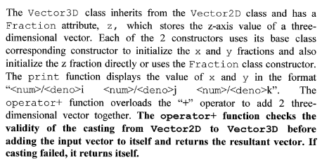

## UML Class Diagram

- use triangle tip (no fill) arrows to show inheritance
- use triangle tip (no fill) dashed arrows to show realisation / implementation of interface
- use diamond tip (no fill) to show aggregation, child class (diamond side) can exist independent of the parent class
- use diamond tip (fill) to show composition, child class (diamond side) can only exist when the parent class exists
- dashed arrow to show dependency (loosely linked) between classes
- interfaces will inherit from another interface, abstract classes will realise interfaces, concrete classes will inherit from abstract classes

## SOLID Principles

- Single Responsibility Principle (SRP) **reusability**
    - Each class should only assume one responsibility, and should only have one reason for it to change
- Open-Closed Principle (OCP) **extensibility**
    - A module (Class) should be open for extension but closed for modification
    - Abstraction is frequently used
- Liskov Substitution Principle (LSP)
    - Subtypes must be substitutable for their base types (pre-conditions are no stronger than base class method and post-conditions are no weaker than base class method)
    - rectangle and square problem / circle and ellipses
- Interface Segregation Principle (ISP) **maintainability**
    - Classes should not depend on interfaces that they do not use (Concrete classes have to implement all methods in the interface even if they do not use them)
    - Keep interfaces as small as possible
- Dependency Inversion Principle (DIP)
    - High level modules should not depend on low level modules, both should depend on abstractions (i.e. should depend on abstractions and not concrete classes)
    - Abstractions should not depend on details, but details should depend on abstractions

## Object Casting
- In java, use `ClassA instanceof ClassB` to check whether ClassA is a subtype of ClassB before downcasting
- In cpp, use `dynamic_cast<ClassA*> (ClassB variable)` to check whether casting of ClassB to ClassA is allowed, returns `NULL` if not allowed

## 2020 Sem 2

- creating an instance of an inherited class will call its parent constructor as well
- method overriding also occurs in inheritance
- dynamic binding - objects will be bounded at compile time to the declared variable type; at run time, it will instead be bounded to the class it is constructed from
    - methods called during compile time will refer to the declared variable type of the object; if method does not exist in the declared variable type, compile error will happen. Method will refer to the class the object is constructed from during run time
    - **dynamic binding only occurs when methods are overridden, else upcasted class' method will be called**
- always have `#include <iostream>` in cpp code

## 2019 Sem 1

- Inheritance is a feature to derive new classes from existing classes where the new classes will inherit all the attributes and methods from the parent class. This reduces the effort needed when implementing new classes.
- Polymorphism is when a program invokes a method call through a superclass variable, the correct subclass version is called based on the type of the reference called in the superclass variable. The same method name and signature can cause different actions to occur depending on the type of object on which the method is invoked.
    - Benefits
        1.  Simplicity - base class does not have to know the specifics of future derived classes
        2.  Extensibility - new class can inherit from the base class and use polymorphism to implement new methods / override base class' methods to suit its needs
- Abstraction is the concept that shows only the essential attributes and hides unnecessary information from the users and other classes
- Encapsulation refers to the bundling of attributes and methods into a single class, and each class has its own purpose to serve.
- Multiple inheritance issue - methods have the same name from both parent classes
    - Java solves this by using interfaces instead
- Concrete classes must implement **all abstract methods** (methods in an interface are always abstract)
    - cannot create objects from abstract classes / interfaces (compile error), but can upcast
- Downcasting must be explicit (e.g. `Dog d = (Dog) new Animal()`)
- Always remember to free (`delete`) your pointers / references you created using `new Class()`
- SOLID principles used: OCP and DIP

## 2018 Sem 2

- When a class implements an interface but does not implement one method from the interface, the class is either an interface, or abstract (if it implements at least one other method)
- if argument is `int` and there are no methods that take in `int` data type, next best data type `double` will be taken.
- for cpp code
    - `#include <string>` - to use string variables; `std::string strName`
    - `#include <vector>` - to use array; `std::vector arrName`
		- alternative to `ClassA **arrName = new ClassA * [size]`
- SOLID principles used: OCP and LSP

## 2018 Sem 1

- Public methods exposed to external classes form the Application Programming Interface (API)
- Static vs Instance
    - static variables can only be accessed by static methods, instance variables can be accessed by instance and static methods
    - static variables are created when the program starts and destroyed when the program ends, instance variables are created when the object is created, and only destroyed when the object is destroyed
    - only one copy of static variable exists per class, shared among all instances of the class
- Object Composition refers to an object's inclusion of another objects as its data member / attributes, and refers to the 'has a' relationship
- SOLID principles used: OCP and DIP

## 2017 Sem 1

- Method overloading is using the same method name but with different number of parameters / parameter types
- Method overriding is when a subclass inherits from a superclass and overrides the method implementation of the superclass's method by using the same method signature and name.
- Overloading vs Overriding
    - overloading is not a behaviour due to inheritance
    - overloaded methods can have different number of parameters
    - overloaded methods can have different parameter types
- if a class does not fully implement all methods of an interface, the class is abstract.
 
- SOLID principles used: SRP, OCP and ISP

## 2016 Sem 2

- An object is an entity that contains both the attribute that describe the state of a real-world object and the behaviour associated with the real-world object
- Key components of Object Oriented Model
    - Objects
    - Attributes - describes the properties of an object
    - Behaviour - defines the operations performed on objects
    - Class - encapsulates the data and behaviour of an object
    - Method - determines the behaviour of the class
- naming conventions of Java language
    - Lowercase - used for package names
    - Uppercase - used for constants and enums
    - CamelCase - used for classes and interfaces
    - mixedCase - used for methods / variable naming
- cpp code with operator overloading
    
    
    
- SOLID principles used: SRP, OCP and ISP

## 2016 Sem 1

- to demonstrate static binding, create instances of the subclass objects directly as you would (eg. `NormalAccount normalacc = new NormalAccount()`)
- to demonstrate dynamic binding, create instances of the superclass objects with upcasting of subclass (eg. `Account acc = new NormalAccount()`)
- role vs inheritance
    - deciding whether an instance of a class should be a subclass by itself or an instance of the class (e.g. student and lecturer are specialisation of person class, father and mother are roles)
    - both inheritance and role represent 'is-a' relationship. But inheritance is also about subclass specialisation via having additional attributes or methods with at least overriding
- try to smoke something up to violate the SOLID principles given
    - circle and ellipse problem was given in this paper to show violation of LSP