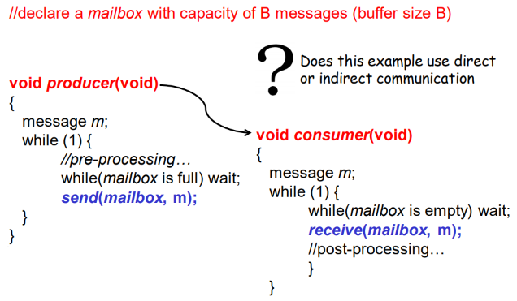
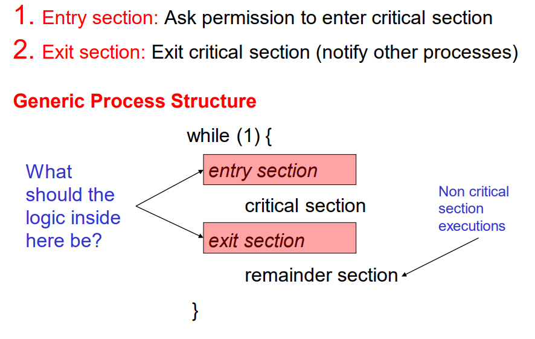
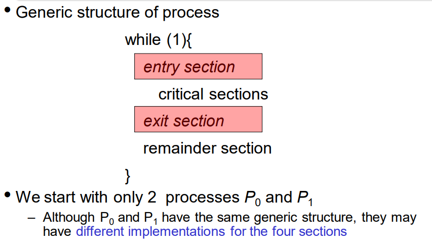
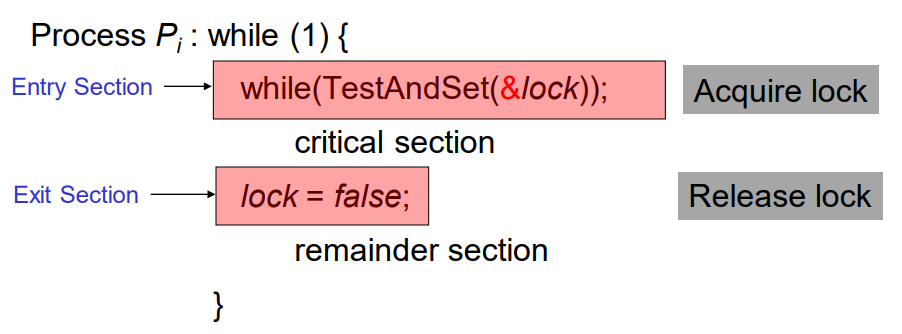
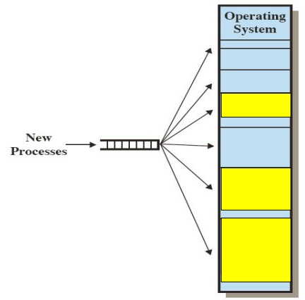
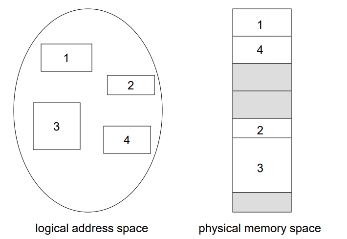
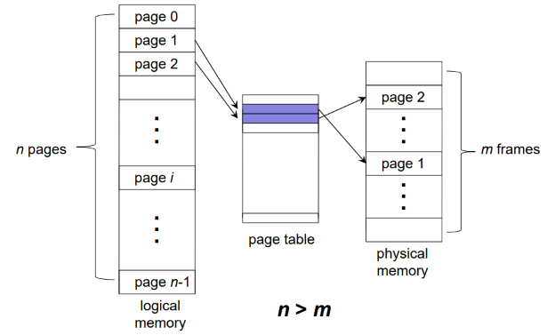
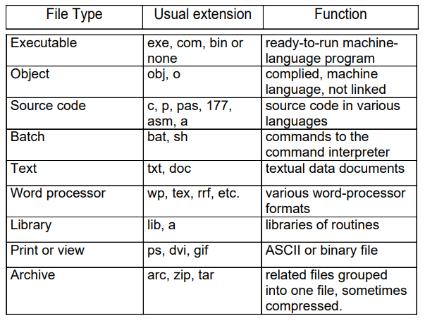
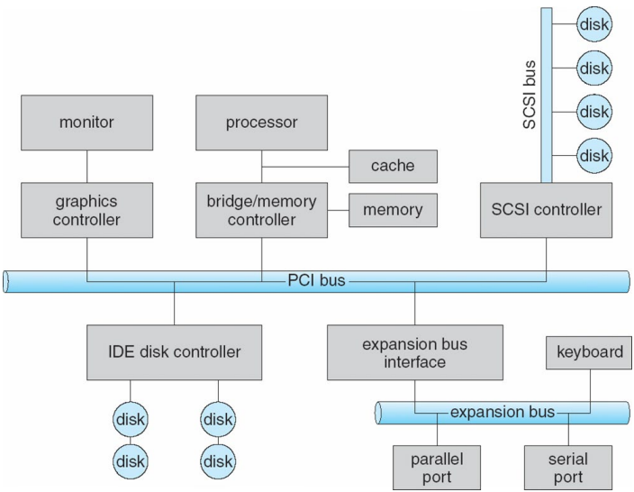
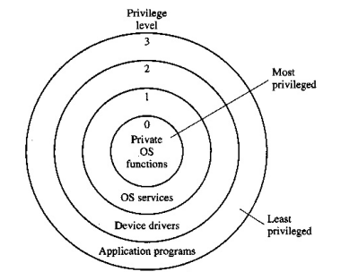

# 1\. Operating Systems Overview

- An OS is a program that acts as an intermediary between a user and the computer hardware
    - controls other user programs
    - allocates and manages hardware resources
    - always ready to accept new commands from users and hardware

## Computer System Components

1.  Hardware
    - Provides basic computing resources (CPU, memory, I/O devices)
2.  Operating Systems
    - Controls and coordinates the use of the hardware among various application programs for various users
3.  Application Programs
    - Defines the ways in which systems resources are used to solve computing problems for users (compilers, database, videogames, business programs)
4.  Users
    - People, machines, other computers

- Resource Allocator (manager) - manages & allocates hardware resources
- Control program - controls the execution of user programs and operations of I/O devices
- Kernel - 'Core' Program that is ready to accept new commands from users as well as hardware

## 1\. Batch Systems

- Reduces setup time by batching similar jobs
- Automatic <u>job sequencing</u>
    - Transfers control from one job to another
- Simple (one user job in memory at any point in time)
- Not efficient (CPU idles while job waits for I/O)
    

## 2\. Multi-Programmed (Time-Sharing) Systems

- Several jobs kept in main memory at the same time
    - CPU <u>acts as a multiplexer</u> among them
    - A job is swapped in and out of memory to the hard disk (time-division access)
        - Parallel execution of jobs depends on the hardware (multiprocessing); multiprogramming allows efficient switching between jobs for CPU access (time-division access), and hence it is also called time-shared system
- **3 OS features needed for multiprogramming**
    - Memory management
        - allocate memory to several jobs
    - CPU scheduling
        - to choose among several jobs ready to run
    - I/O device scheduling
        - allocation of I/O devices to jobs
            
- **Example**
    - When the CPU starts processing jobs, some jobs may require response from another Resource (e.g. I/O devices). During this waiting time, CPU is idle $\therefore$ CPU schedules the next job and start working on it while waiting for Resource's response to the previous job.
- Desktop Systems
    - personal computers
    - several I/O devices
    - main focus = user convenience + responsiveness
    - may run several different types of operating systems

## 3\. Embedded & Cyber Physical Systems

- Physical systems whose operations are monitored and controlled by a reliable computing and communication core
- Resource constrained
    - low power, small memory, low bandwidth
- Domain specific OS
    - real-time systems (e.g. Airbags)
        - used as a control device in a dedicated application such as industrial controls, automotive avionics, medical devices etc
        - well-defined fixed-time constraints
            - jobs must be completed within a fixed time
    - handheld systems (e.g. mobile phones / tablets)
        - limited memory, slow processors, small display screens

## 4\. Multiprocessor Systems // Multiprocessing

- Systems with more than one CPU / CPU with multiple cores
    
    
- Tightly coupled
    
    - Communication takes place through shared memory
- Advantages
    
    - increased system <u>throughput</u> (rate at which something is processed)
    - economical due to sharing of memory & I/O devices
    - increased reliability due to redundancy
- A computer can be both multiprogrammable and multiprocessible
    
- Even without multiprogramming, multiprocessing will ensure high CPU utilisation
    

## 5\. Computer System Operation

- I/O devices & CPU can execute tasks concurrently
    
- Each <u>device controller</u> is in charge of a particular device type
    
    - has a local buffer each
    - moves data between local buffer and memory
    - interrupts CPU to inform a completion of its operation
        
- Interrupts transfer control to the **interrupt service routine (ISR)** through the **interrupt vector** (contains the addresses of service routines) (recall CZ1106)
    
    - incoming interrupts disabled while processing an interrupt to prevent the loss of interrupts
- <u>Traps</u> are CPU-generated interrupts caused by software errors / requests (e.g. unhandled exceptions in user programs)
    
- An OS is typically interrupt driven
    
    - not required to poll for task / event completions $\implies$ more efficient
- Interrupt handling
    
    1.  OS preserves the state of the CPU by storing registers & program counter data (context switch)
    2.  Determine which type of interrupt has occurred
        - separate segments of code determines what action should be taken for each interrupt
    3.  Identify the appropriate ISR to execute (obtained from vector table)
        
        (when there is an I/O request, CPU pauses job1, CPU will do job2 while waiting for I/O to finish data transfer)
- Direct Memory Access
    
    - Used for highspeed I/O devices that are able to transmit information at close to memory speeds
    
    1.  OS sets up memory blocks, counters
    2.  Device controller transfers data blocks from buffer to main memory without CPU intervention
        $\therefore$ one interrupt is generated per block (rather than a byte)
        
- **Fetching Data**
    
    1.  CPU fetch instruction from memory > requests I/O for data
    2.  I/O Device responds with required data
        - **Interrupt Driven** \- Device will interrupt CPU, then transfer data directly to the CPU (usually small size)
        - **DMA** \- Device will send data **blocks**(larger size) straight to main memory and send interrupt to CPU, then CPU will retrieve data from main memory
- **System Call (syscall)**
    
    1.  CPU generates a trap
    2.  CPU switches to kernel mode and transfer control to OS
    3.  OS identifies the appropriate function for the system call and executes it
    4.  CPU switches back to user mode and transfer control to the user program

## 6\. Hardware Protection

- Dual-Mode Operation (Switching is done by the CPU)
    - Provides hardware protection by differentiating between at least 2 modes of operations
        1.  user-mode - execution of **user processes** (mode bit 1)
        2.  monitor-mode - execution of **OS processes** (mode bit 0) (or supervisor/system/kernel mode)
    - mode bit added to computer hardware to indicate current mode
        
    - **privileged instructions can only be used in monitor-mode**
    - kernel mode $\neq$ root/admin
        - kernel / user modes are hardware operation modes
        - root / admin is a user account $\implies$ jobs are executed in user mode (but can execute code in kernel mode indirectly by loading a kernel module)
- I/O Protection
    - User program may execute illegal I/O operations $\therefore$ I/O must be protected
    - All I/O instructions are privileged instructions (monitor mode)
        - operations must go through OS to verify correctness + legality
        - CPU generates a trap for I/O operations that try to bypass the OS
- Memory Protection
    - Must at least provide memory protection for interrupt vector and ISR (interrupts should not be loss)
    - Two CPU registers are used to determine the range of legal addresses a program may access (only one pair overall)
        1.  Base Register - holds the first legal **physical memory address**
        2.  Limit Register - contains the size of legal range
            
            load instructions for the base and limit registers are privileged instructions
            \- CPU issues a trap to the OS if above check fails (i.e. in user-mode or accessing illegal memory)
            - There is only **one base and one limit register overall in the hardware for each process**, which are loaded with appropriate values by the OS before executing the user program.

## 7\. System Calls

- Provide the interface between a user program and the OS
    - available as ASM instructions
    - possible for direct calls to be made using C/C++ by replacing assembly language for systems programming
- Execution of a system call requires switching from user-mode to kernel/monitor-mode
- **API** $\to$ **System Call** $\to$ **OS Relationship**
    

# 2\. Processes and Threads

## 1\. Process Concept

- a **process** is a program in execution
    - Process execution must progress in a sequential fashion
- an OS executes a variety of processes
    - batch system - jobs
    - time-sharing system - user programs & commands
- How a process (e.g. code execution) is stored in memory
    
- Processes have different states w.r.t. its execution stage
    1.  **New** \- Process is being created
    2.  **Running** \- Instructions are being executed
    3.  **Waiting** \- Process is waiting for I/O or event response
    4.  **Ready** \- Process is ready to run, but is waiting to be assigned to the CPU
    5.  **Terminated** \- Process execution has completed
        
        Timer interrupt is used in multiprogramming systems to switch between ready processes
- a process context is comprised of **all registers required to execute/resume the process (PC, SP, BR, LR, etc.)** and it is stored in the PCB
- There is no transition from the waiting state to the running state because:
    - A process in the waiting state is unable to execute even if it is given access to the CPU
    - Once a process in the waiting state is ready to execute, it would first move to the ready state and then to the running state when scheduled for execution by the OS
    - This allows the OS to methodically select the process to execute from among all processes that are ready to execute on the CPU
- **Process Control Block (PCB)**
    - Stored in the kernel memory(space) and can be accessed only by the OS
    - Keeps information associated with each process(snapshot of everything)
        - Pointer to other PCB (PCBs are maintained in a queue structure)
        - Process State
        - Process Number (id)
        - Program Counter (CZ1106)
        - CPU Registers (CZ1106)
        - Process Priority
        - Memory Management Information (e.g. base + limit register values)
        - Information regarding files
            

## 2\. Process Scheduling

- ### Context Switching
    
    - 
    - When execution of $P_0$ is interrupted (maybe due to time slice), its current context is saved and OS switches to execute $P_1$
    - OS is accessing the ISR between saving state into PCB$_0$ and reloading state of PCB$_1$
    - System must save context of the previous process before loading the saved context for the new process (context switching brought up in previous chapter under interrupt handling)
    - System does no useful work (from the perspective of the user) **it is not idling**
- ### Queues
    
    - **Job Queue** is the set of all the processes with the same state in the system
        - **Ready Queue** (processes in **ready state**)
        - **Device Queue** (processes in **waiting state**)
    - All queues stored in main (kernel) memory space
    - When a process changes states, it moves between queues (example has a ready queue and multiple I/O queues)
        
        (PCB pointer points to the text section)
- Multiple schedulers are needed for different purposes
    
    - **long-term (job) scheduler** \- selects processes from disk and loads them into main memory for execution
        - invoked infrequently (seconds / minutes)
    - **short-term (CPU) scheduler** \- select from among the processes that are ready to execute and allocates the CPU to one of them
        - invoked frequently in a multiprogrammed system for responsiveness and efficiency purposes
    - **medium-term scheduler** \- continuously swap out processes according to system load (heavy load $\to$ swap out partially executed process from memory to hard disk)

## 3\. Operation on Processes

- ### Process Creation
    
    - Parent processes create children processes, which create more children processes, forming a **fork** (tree of processes)
    - Two possible execution orders
        1.  Parent and children execute concurrently and independently
            - Tabs in internet browser
        2.  Parent waits until all children terminate before continuing operation
- ### Process Termination
    
    - Two possible ways to terminate a process
        - **Exit** (syscall) - Process and executes last statement and asks the OS to delete it (like free() in C)
        - **Abort** (syscall) - Parent may terminate execution of children processes at any time
    - When parent processes are terminated, children processes are also terminated

## 4\. Inter-process Communication

- ### Cooperating Processes
    
    - An **independent process** cannot affect or be affected by the execution of other processes
    - **Cooperating processes** can affect or be affected by the execution of other processes
        - have to communicate with each other to share data
        - **Message Passing** vs **Shared Memory** (inter-process communication methods)
            
        - In message passing, the communication is handled by the OS; in shared memory, the communication is handled directly by the processes through a common memory space
- ### Message Passing
    
    - Processes communicate and synchronize their actions without resorting to shared variables
    - Two syscalls are required - Send(message) & Receive(message)
    - **direct** (Processes must name each other explicitly)
        - communication occurs between specific processes
    - **indirect** (Messages are sent to / received from ports)
        - any process with access to a 'mailbox' can send / receive messages to / from that mailbox
- ### Producer-Consumer Process Paradigm
    
    - Classical paradigm for cooperating processes
        - <u>Producer process</u> produces information that is consumed by <u>consumer processes</u>
        - Shared buffer used for storing information (unbounded-buffer / bounded-buffer)
            
            (this example uses indirect communication (there is a mailbox (port) involved in the sending / receiving of messages))

## 5\. Threads

- A thread is a **basic unit of CPU utilization** consisting of:
    - Thread id
    - Program Counter
    - Register Set
    - Stack space
- **Text, Data, Heap, OS resources (e.g. files) are shared between threads in the same processes, stack and registers are not**
- A traditional or heavyweight process is an executing program with a single thread of control
- Single Thread vs Multi Thread
    
    - (in a multithreaded process) while one thread is blocked and waiting, a second thread can run $\to$ higher throughput (more jobs completed)

### Thread Implementation Models

- Two layers of abstraction
    - User thread (logical) - Created in **user space**
        - allows users to create as many threads as they want
    - Kernel threads (physical) - Created in **kernel space**
        - slower to create and manage
        - resources are eventually allocated in kernel threads
- OS maintains the mapping from user to kernel threads

### Multithreading Models

- Defines the mapping between user threads and kernel threads
    - Many-to-One
        - Maps multiple user threads to one kernel threads
        - A blocked user thread due to system or I/O calls will also block other threads mapped to the same kernel thread
    - One-to-One
        - Each user thread maps to a unique kernel thread
        - Provides more concurrency than Many-to-One model
        - Creating a user thread requires creating the corresponding kernel thread $\to$ burden on system
    - Many-to-Many
        - Multiple user threads map to multiple kernel threads
        - OS is able to create a sufficient number of kernel threads
        - Not easy to decide on the mapping

## 6\. Process Scheduling

- **CPU-I/O Bursts** \- Process execution alternates between CPU executions and I/O operations
    - CPU burst - Duration of one CPU cycle
    - I/O burst - Duration of one I/O operation (wait time of CPU)
- Main objective is to keep the CPU busy as much as possible
    - using multiprogramming etc.
- a process that is in the 'ready' state is in a CPU burst cycle

### Alternating Sequence of CPU and I/O bursts

### Short-Term (Ready Queue) Scheduler

- Selects one or more of the processes in the ready queue and allocate it to the CPU (one process per core)
- may run whenever a process changes state
    
    To keep the CPU cores busy, the CPU scheduling have to occur in the **'I/O or event wait'** and **'exit'** states
- CPU burst is the time taken by a set of instruction executed by a process **two successive I/O requests**

### Types of CPU Schedulers

- **Nonpreemptive** \- once the CPU has been allocated to a process, the process keeps the CPU until it <u>voluntarily releases the CPU</u> by terminating or requesting for I/O event
    - <u>**scheduling happens at 'I/O or even wait' and 'exit' states ('admitted' state if CPU core is idle)**</u>
- **Preemptive** \- CPU can be taken away from a running process <u>**at any time**</u> by the scheduler
    - scheduling happens at any time instance

### Scheduling Objectives (System-wide)

- **Maximise CPU Utilisation**
    - Given by the Percentage of time during which the CPU cores are busy executing processes (Sum of execution time on each core divided by total time multiplied by number of cores)
- **Maximise Throughput**
    - Given by the number of 'exit' transitions per unit time

### Scheduling Objectives (Individual Processes)

- **Minimise Turnaround Time** \- Time taken to execute a particular process (from time of creation to time of termination)
    - average over all processes is denoted as **average turnaround time**
- **Minimise Waiting Time** \- Duration a process stayed in the 'ready' state (i.e. wasted time)
    - 'waiting' state is not considered because time is not being wasted (waiting for event / I/O)
    - Turnaround time components: **CPU burst (running), I/O burst (waiting) and waiting time (ready)**
    - If all processes have a single CPU burst (no I/O), then
        - waiting time = turnaround time - CPU burst
- **Minimise Response Time** \- Time from a request submission ('admitted' transition) until the first response is produced

## Scheduling Algorithms (Uniprocessor)

### First-Come, First-Serve (FCFS)

- Queue Algorithm
    
    (Waiting time for $P_1 = 0; P_2 = 24, P_3 = 27$; Average waiting time = $\frac{0+24+27}{3} = 17$)
- Processes are done in the order they arrive in, regardless of CPU burst length
- **FCFS scheduling is nonpreemptive**
    - processes have to voluntarily release the CPU once allocated
    - CPU will only execute when either a running process completes or moves to the "waiting" state, or when there is no running process when the new process is admitted
- **Convoy effect** (Main problem)
    - short processes suffer increased waiting times if long processes arrive first

### Shortest Job First (SJF)

- Give shorter processes a higher priority
    - handles the convoy effect presented in FCFS scheduling
    - **minimises average waiting time for all processes**
- **SJF scheduling has two schemes**
    - **Nonpreemptive** \- processes still have to voluntarily release the CPU once allocated
        
        (average waiting time = $\frac {0+6+3+7}{4} = 4$)
    - **Preemptive (Shortest Remaining Time First)** \- Preemption occurs if a newly added process has a shorter CPU burst time compared to the currently running process
        
        (average waiting time = $\frac {9+1+0+2}{4} = 3$)

### Priority-based Scheduling (PB)

- Priority number is associated with each process (usually smaller number = higher priority)
- CPU is allocated to the process with the highest priority
- **PB scheduling has two schemes**
    - **Nonpreemptive (FCFS & SJF)**
    - **Preemptive (SRTF)**
- **Starvation** (Main problem)
    - Lower priority processes may never execute in heavily loaded system
    - **Solution = Aging** \- increase priority of processes that are not able to execute as time progresses

### Round Robin Scheduling (RR)

- Have a fixed time quantum (q) for scheduling
    - each process has only q time to finish processing before being moved to the back of the 'ready' queue
- **Performance**
    - n processes in 'ready' queue = waiting time no more than (n-1)q time
    - Having a large q degenerates RR to FCFS
    - Having a small q leads to many context switches $\to$ high overhead
    - **turnaround time has no direct correlation with time quantum**
        

### Multilevel Queue Scheduling (MLQ)

- 'Ready' queue is partitioned into several queues with each having its own scheduling algorithm
    - Two Schemes for **interqueue scheduling**
        - **Fixed Priority Scheduling**
            - Queues are served in priority order
            - Starvation occurs
        - **Time-slice based scheduling**
            - Each queue gets a fixed time quantum on the CPU (can have different time for each queue)
- interactive processes will prefer RR scheduling (time-slice based scheduling)
- less interactive processes will prefer FCFS scheduling with higher overhead

## Scheduling Algorithms (Multiprocessor)

### Partitioned Scheduling (Asymmetric Multiprocessing - AMP)

- Processes are partitioned a priori (at process creation time) among CPU cores
    - each process is mapped to one core
    - separate uniprocessor CPU scheduling on each core (asymmetric scheduling)
- Advantages
    - Core-specific scheduling strategy is feasible (Previous Section)
    - Easy and simple extension of uniprocessor CPU scheduling
- **Mapping is a problem**
    - Poor mapping can lead to unequal loads
        - Results in reduced system/process performance
        - **NP-Hard** problem

### Global Scheduling (Symmetric Multiprocessing - SMP)

- One or more 'ready' queues for the entire system (mapping is not required)
    - CPU scheduler runs whenever a core becomes idle and allocates the next process to execute
    - Process selection based on strategy applied symmetrically across all calls
        - **i.e. a strategy is chosen beforehand to determine which uniprocessor scheduling method to use**
    - The same process can execute over different cores **at different times**
- No core-process mapping problem
    
- **Issues**
    - High Implementation Complexity compared to partitioned scheduling
        - Need to synchronise clocks across cores
    - High Overhead compared to partitioned scheduling
        - Process could context switch from one core and be scheduled on another (cache data needs to be migrated which leads to unuseful time spent)

# 3\. Process Synchronization

- **access to shared data from concurrent processes may result in data inconsistency**
    - data value depends on the order of instruction executions from concurrent processes
    - i.e. value depends on **when context switches occur between the concurrent processes**
- Maintaining data consistency requires mechanisms to ensure the orderly execution of concurrent processes
    - causal ordering / sequencing of reads and writes to the shared data from concurrent processes

## 1\. Race Condition

- Producer process increments counter: `counter++`
- Consumer process decrements counter: `counter--`
    - May create inconsistent value for variable counter due to race condition
        
        **Instead of the intuitive value of counter = 5, counter instead has the value 4**
    - to fix this:
        - not run context switch on line 3
        - not let process after context switch touch counter
- **When multiple processes are updating the same file concurrently this will cause a race condition. It is however handled by the OS because file updates occur through system calls**

## 2\. Critical Section Problem

- n processes all competing to use some shared data
- each process has a **critical section** in which shared data is being accessed
    - process may change shared variables / updating shared table / writing a shared file
    - **at least one process modifies the shared data**
- **Problem** \- design protocol to ensure that when one process is executing in its critical section, no other process is allowed to execute in its critical section
    

### Desired Properties of Solutions

- Assumptions of critical and remainder sections
    - Each process is guaranteed to make progress over time in these sections
    - No assumption about relative execution speed of different processes in these sections
- Properties to be satisfied
    - **Mutual Exclusion** \- if a process is executing in its critical section, then no other process can be executing in its critical section at the same time.
    - **Progress** \- if no process is executing in its critical section and other processes wish to enter their critical section, then the selection of the next process to enter the critical section cannot be postponed infinitely
    - **Bounded Waiting** \- after a process has requested to enter its critical section and before that request is granted, other processes are allowed to enter their critical section only a bounded number of times

## 3\. User-Level Solutions

### Algorithm 1

- Variable shared between processes - `int turn;` (initially 0)
    - turn $= i \implies P_i$ can enter critical section, else wait 
        
- **There is mutual exclusion but no progress**
    - turn = 0 and $P_0$ is in a long remainder section and $P_1$ wants to enter critical section
    - i.e. for $P_0$ to access critical section, turn = 0 (wait while turn = 1) so for $P_1$ to set turn = 0, $P_1$ has to run its remainder section first which is a bottleneck

### Algorithm 2

- Variable shared - `boolean flag[2]`
- Initially flag\[0\] = flag\[1\] = false
- flag\[i\] = true $\implies P_i$ ready to enter critical section

**There is mutual exclusion but no progress again**

### Algorithm 3

- Variables are a combination of Algorithms 1 and 2
    - flag\[i\] = true $\implies P_i$ ready to enter critical section
    - turn $= i \implies P_i$ can enter critical section

**Satisfies all three properties but hard to extend to more than 2 processes**

## 4\. OS-Level Solutions

### Synchronization Hardware

- Modern processors provide special atomic hardware instructions
    - Atomic instructions (uninterruptible) (**no context switch during execution of instruction**)
- **TestAndSet** \- Test and modify the content of a main memory word (data in address) atomically
- Variable shared: `boolean lock`
    - Initially lock = false
    - If TestAndSet on lock returns false, then process can enter critical section
    - i.e. when lock true, process waits until previous process 'unlocks' after exiting critical section where process will then 'lock' the access to critical section by other processes inside `TestAndSet`
    - in TestAndSet, if lock = false, sets lock = true and return false value, else just return true.
        - process can then enter critical section and will set lock = false once it exits critical section

**Bounded Waiting fails with purely TestAndSet**

- after the first iteration of $P_0$'s while loop, $P_0$ will reach while loop before $P_1$ tests to see if access to critical section is unlocked
    - if it's lock, the process goes back to ready state and CPU starts processing $P_0$ for 10ms before the same thing happens again in an endless loop
    - $P_1$ is unable to enter its critical section as a result $\implies$ fails to satisfy property of bounded waiting

## 5\. Semaphores

- shared **Integer variable managed by the OS**
- Only accessible by two **atomic** system calls: *Wait* and *Signal*
    - Wait(S) - if S>0, S--; else wait();
    - Signal(S) - S++;
- Wait() and Signal() system calls must be atomic to prevent race condition in the updates to the value of the semaphore, ensure mutual exclusion by guaranteeing semaphore updates and conditional checks in each system call
- Two types of semaphores:
    - **Counting Semaphore** \- integer value can range over an unrestricted domain (but still only allows a finite number of processes)
    - **Binary Semaphore** \- value of semaphore can never be greater than 1
- **Busy waiting implementation**
    - Semaphore mutex initialised to 1
    - in a sense, mutex = number of available resources
        - if number of available resources <= 0, process needs to wait
        - else, allocate resource to process which the process will then release after exiting its critical section
    - if mutex = 1 and process executes Wait(mutex), then it can enter critical section
        
    - **Advantages**: no context switch overhead (busy waiting)
    - **Disadvantages**: inefficient if critical sections are long (busy waiting wastes CPU cycles)
    - Busy waiting implementation of semaphores is infeasible only on single-core CPUs because to release the semaphore the busy waiting must be interrupted on a single-core CPU which then leads to wait() system call being non atomic
    - **Property Analysis**:
        
        (reason why Wait() and Signal() must be atomic (completed in one instruction))
- **Blocking implementation**
    - define a semaphore as a record of a semaphore struct
        
    - two operations to modify L
        - block() - blocks current process
            1.  dequeue current process from ready queue
            2.  enqueue the process to L
            3.  change state of process to waiting (context switch happens here)
        - wakeup() - resumes the execution of a blocked process in L
            1.  dequeue a process from L
            2.  enqueue the process to ready queue
            3.  change state of process to ready
    - a value of $S = -n$ means that there are currently $n$ processes being blocked on the semaphore, with one running
        
        (if wait() and signal() are not atomic, also violates mutual exclusion due to ++ and --)
    - **why S-- at the start of Wait(S)?**
        - if S-- is at the end, it requires a context switch between block() and S.value--; if the process blocks. If this context switch is allowed, mutual exclusion will be violated.
        - i.e. this would imply the possibility of a context switch between the if() condition and the decrement, which can lead to mutual exclusion violation
            - if S.value = 0, and $P_0$ executes block() and context switches to $P_1$
            - $P_1$ uses Signal(S) to increment S.value to 1 and executes wakeup($P_0$);
                - $P_0$ is in ready queue with $P_2$
            - Scheduler takes $P_2$ instead of $P_0$
            - $P_2$ executes Wait(S), locks S, enter critical section
            - Context switch from $P_2$ to $P_0$
            - $P_0$ executes S.value--; and enters critical section

## 6\. Best practices for semaphores

1.  Understand the application scenario and identify the following:
    - shared variables / data
    - shared resources
2.  Protect shared variables
    - identify critical section
    - use binary semaphore and add entry section (wait()) and exit section (signal())
3.  Protect shared resources
    - identify each kind of resource - one semaphore for one kind
    - initial value: number of resource instances
    - when resource requested / consumed: wait()
    - when resources is released: signal()
        

- **Incorrect semaphore use can lead to Deadlocks**
    - Two or more processes are waiting indefinitely for an event that can be caused by only one of the waiting processes
- **Incorrect semaphore use can also lead to Starvation**
    - Indefinite postponement (no progress)
        - a process may never have a chance to be removed from the semaphore queue (L) due to queue discipline (Priority based and Last-In-First-Out policies)

## 7\. Problems of Synchronization

- **Producer-Consumer with Bounded-Buffer**
    - Consider multiple producers / consumers
        - we use `counter`, `in`, `out` for a producer-consumer pair
        - `in`, `out` are shared variables (`in` \- producer, `out` \- consumer)
    - Shared data and resources (**step 1**)
        - item buffer\[n\];
        - buffer is a shared data structure
        - slots in buffer are shared resources
    - Semaphores to be used
        - semaphore `full=0`, `empty=n`, `mutex=1`
        - `mutex` \- binary semaphore for mutual exclusion to update buffer
        - `full` \- counting semaphore for consumers to identify full buffer to consume
        - `empty` \- counting semaphore for producers to identify empty buffer to fill
    - `in` is replaced with `empty`
    - `out` is replaced with `full`
    - `counter` is not used because we already have two counting semaphores `in` and `out`
    - `mutex` is introduced to control access to the buffer
    - **Step 2**
        
    - **Step 3**
        
        (**wait(empty) / wait(full) is done before wait(mutex) prevents deadlock when the buffer is empty / full because to add / remove items in the buffer the mutex semaphore must be acquired**)
        
- Examples to consider:
    - **Dining-Philosophers Problem**
    - **Reader-Writers Problem** (reading / writing to a database / file)

# 4\. Deadlocks and Starvation

- **Deadlocks** are a set of blocked processes (threads) each holding a resource and waiting to acquire a resource held by another process in the set

## 1\. System Model

- Resource types $R_1, R_2, ...R_n$ (Memory space, I/O devices, semaphores etc)
- Each $R_i$ has $W_i$ identical instances
- Each process will utilise a resource by
    1.  requesting for a specific number of instances
    2.  use
    3.  release requested instances
- Graph Visualisation:
    
    **(usually when there are no cycles in the graph, deadlocks should not occur. However, having a cycle does not imply a deadlock)**
    
- **Basic Facts**
    - If graph contains no cycles, there are no deadlocks
    - If graph contains a cycle,
        - and only one instance ($\bullet$) per $R_i$, then there will be a deadlock
            - denotes circular wait and hold and wait conditions which cannot be broken by any process outside the cycle
        - if several instances per $R_i$, then there is a possibility of deadlock
            - circular wait and hold and wait conditions can be broken by a process outside the cycle

## 2\. Deadlock Conditions

- Deadlock may arise if the following **four** conditions hold **simultaneously** (necessary but not sufficient)
    1.  **Mutual Exclusion** \- only one process at a time can use a resource instance
    2.  **Hold and Wait** \- process holding at least one resource is waiting to acquire additional resources held by other processes
    3.  **No preemption** \- a resource can only be released **voluntarily** by the process holding it, after that process has completed its execution
    4.  **Circular Wait** \- There exists a set of waiting processes such that $P_0$ is waiting for a resource that is held by $P_1$, $P_1$ is waiting for $P_2$ …, $P_n$ is waiting for $P_0$.

## 3\. Deadlock Prevention

- Ensure the system will never enter a deadlock
- Allow the system to enter a deadlock state and then recover
- Ignore the problem and pretend that deadlocks never occur in the system
    - used by most operating systems
- Prevent one of the four deadlock conditions (dining philosophers problem)
    - **Mutual Exclusion** \- chopsticks are not shareable (cannot be eliminated)
    - **Hold and Wait** \- must guarantee that whenever a process requests a resource, it does not hold another resource
        - Solution - allow philosopher to pick up chopsticks if both the required chopsticks are available
    - **No preemption**
        - Solution - If a philosopher cannot get the second chopstick, then preempt and release the chopstick that is being held
    - **Circular Wait**
        - Solution 1 - allow at most 4 philosophers to be hungry simultaneously
        - Solution 2 - chopsticks can only be acquired in order (smaller number first)
            

## 4\. Deadlock Avoidance

- deadlock-avoidance algorithm dynamically examines (active monitoring) the resource-allocation state to ensure that the system never goes into unsafe mode
    - when a process requests an **available resource**, system must decide if immediate allocation leaves the system in the safe state (deadlock will not occur)
    - if safe, the request is granted, otherwise process must wait
- **System is in safe state if there exists a safe completion sequence of all processes without deadlock**
- **Safe state** \- a process completion sequence is safe if for each $P_i$, the resources that $P_i$ requests can be satisfied by currently available resources + resources held by all the $P_j, j<i$
    
- if a system is in safe state, there will be no deadlocks
    - OS is able to find a sequence which guarantees no deadlocks and uses a CPU scheduler to schedule the processes
- if a system is in unsafe state, there is a **possibility** of deadlock
    - OS is unable to find a sequence which guarantees no deadlock
    - if a process releases resources much before its completion, then deadlock may not occur (up to the processes, OS cannot force processes to release)

### Banker's Algorithm

- An algorithm to check whether satisfaction of a resource request would lead to an unsafe state
    - for multiple instances of each resource type
- when a process requests a resource it may have to wait (if allocation leads to unsafe state)
- **Assumptions**
    - each process must declare maximum instances of each resource type that it needs
    - when a process gets all its resources it must return them in a **finite amount of time**

(do not need Max after this part)
Allocate processes ($P_1/P_3$) that can finish with the available resources

(order of execution does not matter, any process that can be completed now can be completed in the future)

(system is safe)

- Banker's algorithm is usually implemented within the wait(S) sequence
- Completion sequence only checks if the system will be a safe state, does not allocate priority for processes
- **when a process requests for additional resources, it is added to the process' allocation matrix and removed from the available vector and needed matrix before running the first process (unless otherwise stated)**

## 5\. Deadlock Detection (not tested)

# 5\. Real-Time OS and Virtualisation

## 1\. Real-Time Systems

- Cyber-Physical Systems
    - physical / engineered systems whose operations are monitored, coordinated and controlled by a reliable computing and communications core (i.e. computing systems that connect to the physical world)
    - e.g. Automotive Systems / Avionics / Manufacturing Systems / Medical Systems
- **Functions - Collect data / Execute control law(s) / Send actuator commands**
- All the above needs to be done within reasonable time dependent on:
    - **functionality** \- collision avoidance in automotive / pacemaker / robotic surgeries
    - **environment constraints** \- available computing and communication resources
    - **failure-mitigation** \- time to detect and recover from failures
- Reasonable bound on response / turnaround time depends on:
    - the mechanical properties of the sensors, actuators, and other physical devices in the system
    - timing requirements of the target functionality / application
    - strategies implemented for detecting and handling of failures in the system
- Real-time systems require response / turnaround time from processes that are bounded in the worst-case.

### Definition

- System whose correctness depends not only on the logical / functional aspects, but also on the temporal aspects
- Key performance measures:
    - timeliness / predictability on timing constraints
    - significance of worst case over average case

## 2\. Real-Time Process (RTP) Specification

### Definition

- Specified as $\text{<R,C,D>}$ where $\text{R}$ = process release time, $\text{C}$ = execution requirement (time needed) and $\text{D}$ = relative deadline (from release time)
    - requires $\text{C}$ time units of CPU in the interval $[\text{R, R+D})$

### Recurrent RTP

- executes some RTP functions repeatedly over time with each instance being a RTP $\text{<R,C,D>}$

1.  **Periodic RTP** \- Processes generated by a **time-triggered phenomena** with each process specified as $\text{<T,C,D>}$ where $\text{T}$ is process period (i.e. each release strictly separated by $\text{T}$ units), released at $\text{R}$ = 0 or otherwise stated
    
2.  **Sporadic RTP** \- Processes generated by an **event-triggered phenomena** with each process specified as $\text{<T,C,D>}$ where $\text{T}$ is minimum release-separation time (i.e. each release at least separated by $\text{T}$ units)
    

## 3\. Real-Time CPU Scheduling (short term scheduler)

### Fixed-priority scheduling

- Priorities are fixed across instances of recurrent processes
- i.e. suppose instance of $\text{P}_1$ (R=0) has higher priority than instance of $\text{P}_2$ (R=0), then
    - $\text{P}_1$ (R=10) has higher priority than $\text{P}_2$ (R=0)
    - $\text{P}_1$ (R=10) has higher priority than $\text{P}_2$ (R=19)
    - $\text{P}_1$ (R=20) has higher priority than $\text{P}_2$ (R=19)
- **Rate Monotonic Scheduler**
    - assigns priorities based on process periods / minimum release-separation time (T)
        - shorter T = higher priority
        - ties are broken arbitrarily
    - basically a preemptive scheduling with T determining priority (i.e. when a higher priority process comes (releases), execution of current process pauses and switches to the higher priority process)
        - refer to lecture recording at around 1h 10min in for clearer explanation
    - **does not always prioritise urgent processes since it prioritises T (separation time between process deadline and release) instead of D (deadline)**
- **Deadline monotonic Scheduler**
    - assigns priorities based on process deadlines (D)
        - shorter D = higher priority
        - ties are broken arbitrarily
    - also preemptive, similar idea to RM scheduling just that we are using values of D instead of T
    - **better than RM, but it cannot change priorities across process instances**

### Dynamic-priority scheduling

- **Earliest Deadline First Scheduler**
    - instances with shorter deadline are given higher priority (**not the same as parameter D**)
    - ties are broken arbitrarily
    - the idea is that more urgent (earliest deadline) instances will be given higher priority
        - priority is reassigned every time a new instance gets added

### RM/DM vs EDF

- (**Explanation for easier implementation**) A separate queue can be maintained for each priority level under fixed-priority scheduling (RM/DM) leading to a O(1) complexity implementation. Whereas under dynamic-priority scheduling (EDF), online sorting of the queue is required whenever a new process instance is released in the system (can be done in O(log n) complexity using tree data-structure where n is the number of process instances).
- (**Key differences**) Under fixed-priority real-time scheduling priorities are fixed between recurrent processes (all the instances of one recurrent process will have higher or lower priority than all the instances of another recurrent process), whereas under dynamic-priority real-time scheduling no such restrictions exist.

- $\text{P}_3$ has overload in the above example, pushes back all upcoming processes which have deadline later than $\text{P}_3$
- overload implies a miscalculated C (a process ends up taking more time than indicated) $\to$ deadline misses will occur

## 4\. Virtualisation

### Definition

- Technique in which the underlying hardware is abstracted into virtual and independent computing systems called virtual machines, each of which could run its own OS and applications.
- Uses software, called **Hypervisor** (Virtual Machine Manager) to create abstraction of hardware
    - hardware divided into multiple virtual computers called VMs (each runs its own OS called **Guest OS**)
    - each VM uses a portion of the actual hardware
- Virtualisation **does not** reduce the overhead for applications to use hardware resources.

### Functions of Hypervisor

1.  Creation and management of VMs
    - allocating hardware resources for VMs
    - executing instructions on the hardware on behalf of VMs
2.  Communication between VMs
    - mechanisms for VMs hosting on the same hardware to be able to communicate securely with each other
3.  VM migration
    - migrating VMs from one hypervisor/hardware to another almost instantaneously
    - flexible and portable

### Virtualisation

- Virtualisation allows for more efficient utilisation of hardware
    - cost-effective hardware deployment and sharing
    - low latency and agile execution-environment deployments (VM creation and flexibility)
    - hardware failure mitigation
- Key technology that is driving cloud computing
    - dynamically and cost-effectively scale hardware allocations based on user requirements

### Challenges

- Requires management layer: Hypervisor
    - two orders of magnitude smaller than general purpose OS
    - requires more disk space and RAM
    - must ensure that instructions can be executed on hardware
- Real time Cyber Physical Systems require different solutions than server virtualisation
    - real-time
    - minimal memory footprint and overhead

### Type-1 Virtualization

- Hypervisor interacts directly with hardware
    - bare-metal hypervisor
    - highly secure and has low latency
- Under Type-1 virtualisation, the hypervisor interacts directly with hardware. Since the hypervisor is also para-virtualised, not all of the hardware instructions are virtualised. Therefore, the guest OS needs to be modified to interact with the hypervisor and this interaction will use the virtual call API

### Type-2 Virtualization

- Hypervisor interacts with host OS, which in turn interacts with hardware
    - hosted hypervisor
    - higher latency, less popular, mostly for end-user virtualisation
- A **Host OS** abstracts hardware and provides an interface between hardware and hypervisor under type-2 virtualisation. The guest OS interacts with the hypervisor and provides services to the applications running on it

### Virtualization Levels

1.  Full Virtualization
    - complete abstraction of the actual hardware
    - guest OS runs unmodified on the hypervisor
    - (i.e. guest OS does not know it's going through a hypervisor to interact with hardware)
2.  Para-virtualisation
    - unique API between guest OS and VM
    - **guest OS needs to be modified to adapt to the new API**
    - VM does not virtualise hard-to-implement parts of the hardware instruction set $\to$ more efficient (advantage)

# 6\. Memory Organization

## 1.Binding Code and Data to Memory

- To run a program, a process image (below) must be created and loaded into memory
    

(Load Module = Executable Code)

- OS fetches instructions from memory where each instruction may again require to access memory, therefore we need to understand **address binding**

### Address Binding

- Address Binding can happen at **three different states**
    - **Compile time** \- if memory location known a priori, **absolute code** can be generated; must recompile code if starting location (of process) changes
        - i.e. memory space bound in process image will contain the same address given in code
    - **Load time** \- compiler generates **relocatable code**; binding is performed by loader (between disk and memory)
        - i.e. memory space bound in process image will contain the relative memory address given in code (if instruction = XXX 400, **referenced address** allocated in memory will be 400 from the start address of process image) **Note: actual address format is used in process image**
        - Logical address does not need to be translated to physical address during execution if address binding is done in load time
    - **Execution time** \- if process can be moved during its execution from one memory segment to another, binding is delayed until run time
        - same as address binding done in load time, except **Memory Management Unit** is used, which keeps track of the base address of the process image and allocates referenced memory based on the relative memory address given in code. **Note: relative address format is used in process image** (i.e. XXX 400 is used instead of XXX 1824 (start + 400))
        - if address generated by CPU $\geq$ limit (recall base and limit registers), there will be error

## 2\. Logical and Physical Address Space

**Address Space** \- all addresses accessible by a process
**Logical Address** \- address used in code, generated by CPU when executing an instruction, **seen by CPU**

- Viewed as linear / 1D continuous address space consisting of a sequence of bytes, always start from 0 (base)
    

**Physical Address** \- address used to access physical memory, **seen by memory unit**

- Two approaches to allocate memory among processes
    - **Contiguous Allocation** \- Logical address space of process remains contiguous in physical memory (process image is not chopped) (**fixed partitioning and dynamic partitioning**)
    - **Non-contiguous Allocation** \- A process logical address space is scattered over different regions in physical memory (recall Comp Org Arch Virtual memory)

### Contiguous Allocation

- **Fixed Partitioning**
    
    - Memory is partitioned into regions with pre determined fixed boundaries
        
- **Dynamic Partitioning**
    
    - memory not partitioned
    - **Hole** \- block of available memory; holes of various size are scattered throughout memory
    - OS allocates a hole large enough to accommodate the process image when it arrives
        - OS needs to maintain information about allocated partitions (memory space used) and free partitions (holes)
    - when a process terminates, the memory space occupied by it will become available, if there are no holes large enough to accommodate process image, then the process image has to wait
- **Dynamic Storage Allocation Problem**
    
    - I.e. how to satisfy a request of size n from a list of free holes
    - **First Fit** \- allocate first hole that is big enough
    - **Best Fit** \- allocate the **smallest hole** large enough to satisfy memory requirements of process image (must search entire list if not sorted)
    - **Worst Fit** \- allocate the **largest hole** (must search entire list if not sorted)

### Fragmentation

- **External Fragmentation** \- when enough total memory space exists to satisfy a request, but it is not contiguous, happens outside a partition (**happens for Dynamic Partitioning**)
    - Reduced by **compaction**
        - shuffling memory contents to place free memory together in one large block
        - only possible if **relocatable address format** is used in process image and binding is done during execution time
- **Internal Fragmentation** \- allocated memory may be slightly larger than requested memory, size difference is memory internal to a partition but not being used (**happens for Fixed Partitioning**)

## 3\. Paging

- Memory space allocated to a process can be non-contiguous; process is allocated physical memory whenever the latter is available
- physical memory is divided into **frames** size is power of 2
- logical memory is partitioned into the same size as frames but called **pages**
- OS needs to keep track of all free frames
    - running a program of size n pages requires n free frames and load program
    - **page table** is set up to translate logical to physical address
- external fragmentation is **eliminated**
- internal fragmentation is still possible, last page of the process to be inserted may not occupy the entire frame / address space (padding is required)
- Logical addresses are filled with pages
    - number of pages = size of logical address / page size
- Page table keeps track of the pages
    - page table size = size of page table entry * number of pages

### Address Translation Scheme

- Logical address contains
    - **Page Number (p)** \- used as an index into a page table entry which contains frame number in physical memory
    - **Page Offset (d)** \- combined with frame number to define the physical memory address that is sent to the memory unit
        
        (e.g. 0111 = first page(01), we refer to page table to lookup the corresponding physical address frame, then get offset of 3(11) to get actual address)
- **Page table is kept in physical memory**
    - Page table base register (PTBR) points to the page table
    - Page table length register (PTLR) indicates size of page table
    - both register values will be stored whenever there is a context switch
- **Every instruction / data access requires two memory accesses; one for page table, one for instruction / data**
    - effective memory access time = 2$\mu$ where memory cycle time is $\mu$ time unit
- Memory access time can be reduced by the use of caches like **Translation look-aside buffers (TLB)** (refer to Comp Org Arch for how it works)
    - essentially, TLB caches the frequently accessed values from the page table and has a much smaller size compared to page table
        
    - let TLB lookup time = $\epsilon$ time unit and memory cycle time = $\mu$
    - let hit ratio = $\alpha$ (probability of page number being found in TLB)
    - Effective Access Time (EAT) = $(\mu+\epsilon)\alpha + (2\mu+\epsilon)(1-\alpha) = (2-\alpha)(\mu +\epsilon)$
        - (TLB + memory access)$\times$probability of page hit + (TLB + access page table + access memory) $\times$ probability of page miss

### Shared Pages

- Sharing pages reduces memory usage
    
- When more than one processes requires execution of the same editor but on different data, each of those processes can have their own logical address space, but they can contain the same address space for the editor which is shared among themselves
    - **only possible if code is read-only code (re-entrant codes)**

(recall logical address space = process image)

- **Shared Code**
    - One copy of re-entrant code shared among processes (e.g. text editors, compilers, window systems) and appears in the same location in the logical address space of all processes
- **Private code + Data**
    - Each process keeps a separate copy of the private code and data and can appear anywhere within the logical address space

### Two-Level Page Table Scheme

- A large page table is divided up to be easier to allocate in physical memory, with a small increase in EAT
    
- essentially a page table for a split up page table and store it non contiguously, therefore we need another page table to keep track of the old page table
- since page table is paged, page number is further divided into
    - p1 - index to the outer page table (second layer)
    - p2 - index to the page of the inner page table (first layer)
        
    - for two level page table you can see it as the outer page table is a page table and the inner page table is the memory space of the initially bigger page table that you split up then the data you get from the inner page table will help you get the data you want from the physical memory

### Inverted Page Table

- A single table with one entry for each physical frame as `(process_id, page_no)`
- Logical Address: `(process_id, page_no, offset)`
- Increases search time - table sorted by physical address but lookups occur on logical address

- To access instruction / data stored in physical memory, `(process_id, page_no)` is used to search for a match in the **inverted page table**, if a match is found (page hit) at the $i^{th}$ entry, then the **physical address** `(i, offset)` is obtained, where the offset is from the **logical address**

### Useful link for Two-Level Page Table Scheme and Inverted Page Table

https://www.youtube.com/watch?v=R-WgaQQHSPw

## 4\. Segmentation

- Segmentation is a memory management scheme that breaks programs up into its logical segments (logical segments include stack, main program code etc and each segment cannot be split up)
    - segments can have different size and may not be allocated contiguously

- Segmentation makes sharing data among different processes easier

### Address Translation

- Each segment has a segment no. and offset in the format &lt;segment-no, offset&gt;
- **Segment Table** has entries consisting of
    - base - contains the starting physical address where the segments reside in memory
    - limit - specifies the length of the segment
- **Segment Table Base Register** \- points to the segment table's location in memory
- **Segment Table Length Register** \- indicates number of segments used by a program

### Fragmentation

- Memory allocation allocated dynamically (using best-fit or first-fit)
    - therefore suffers from external fragmentation since processes leaves holes in the memory as it leaves the system

# 7\. Virtual Memory

## 1\. Swapping

- A process can be swapped temporarily out of memory to a <u>backing store</u> (hard disk) and then brought back to continue execution
    - a backing store is large enough to accommodate copies of all memory images for all users and **must provide direct access to those memory images**
- used to make space available for process that require more memory and increases the degree of multiprogramming
    
- when a process is being swapped back in, it may be allocated a different address it initially had before being swapped out
- swapping of processes are controlled by mid-term scheduler (according to priority etc)
- recall

## 2\. Virtual Memory Support

- Virtual memory removes the restriction of having the whole program loaded into physical memory for it to execute (which is restricted to the size of physical memory)
    - Virtual memory is limited by the address scheme of the computer instead of the size of physical memory

- size of program can be much larger than size of physical memory
- only part of the program needs to be in memory for execution $\to$ greater degree of multiprogramming (increased CPU utilization)
- implemented using **demand paging** (and demand segmentation)

## 3\. Demand Paging

- A page is in demand if a reference is generated for the page (i.e. a page is required)
- A page table is used to track pages in physical memory / backing store
    - using a valid/invalid bits (**v** indicates page is in memory, and page table entry contains location of page in **memory**; **i** indicates page is not in memory, page table entry contains the address of page in **hard disk (backing store)**)
    - if valid/invalid bit in page entry is **i**, a page fault occurs and page needs to be brought into memory from backing store

### Paging Sequence (Page Fault)

1.  If there is a reference to a page, page table is checked to determine if the page is in the memory
2.  If page is not in memory (invalid bit), trap is generated to the OS to bring in the page from backing store with the state of interrupted process saved
3.  OS uses the page table entry to locate the page in backing store (recall an invalid bit page table stores the address of page in the backing store)
4.  OS finds a free frame using free frame list or page replacement algorithm and schedules a disk operation to read desired page into allocated frame (I/O operation) **Contributes most to the overhead of handling page faults**
5.  Page table entry is modified after disk operation
6.  State of interrupted process is restored and the instruction is called again

**Context switch occurs at steps 2 and 6**

### Performance

p = probability of page fault
EAT = (1-p) x Memory Access Time + p x Time to handle page fault

## 4\. Page Replacement

- Page replacement needs to be done when there are no free frames in the physical memory
- Page to be removed will be copied to the paging store and replaced with requested page (main bulk of time to handle page fault since two page transfers may be necessary)
    - essential if page has been modified in memory; therefore page out is only necessary when page has been modified (dirty page)

**swapping in/out is not the same as paging in/out**
(page in/out is only for a specific page)\

- Pages that have been modified are identified using a **modify** or **dirty** bit

## 5\. Page Replacement Algorithm

- Tries to minimise page-fault rate (p)

### FIFO

- Replaces the page that has been loaded in the memory for the longest period of time
- Time in memory does not reset when page is requested again
- Suffers from **Belady's anomaly: more frames** $\neq$ **less page faults**

### Optimal Algorithm

- Replaces the page that **will not be used** for the longest period of time
- Infeasible to implement even though it is the best algorithm
    - used as a benchmark to measure how well other algorithms perform
- Does not suffer from Belady's anomaly: adding a frame $\implies$ more look ahead
    - **an algorithm does not suffer from Belady's anomaly when inclusion property is satisfied**
        - i.e. if there are no page faults using n frames, there should be no page faults using n+1 frames

### LRU

- Replace the page that has not been used for the longest period of time
- Not susceptible to Belady's anomaly
- **Counter Implementation**
    - each page has a `time-of-use` field
    - CPU clock increments for every memory reference
    - whenever a page is referenced, the value of clock is copied to `time-of-use` of the referenced page
    - when page fault occurs, page with the smallest `time-of-use` value is replaced
- **Stack (but not stack) Implementation**
    - Keep a stack of page numbers in a doubly linked list
    - When page is mentioned move page to top of stack
        - bottom of stack is Least Recently Used page
    - Computationally expensive to update list, but no search is needed unlike in counter implementation
- There are multiple overheads in the LRU algorithm, hardware support required generally not available

### Second-Chance Algorithm (LRU Approximation) (Clock Algorithm)

- Makes use of a hardware settable reference bit
    - when a page is referenced, hardware sets its R to 1
    - page to be replace has R = 0 but exact order cannot be determined by R
- Chooses the oldest page as candidate to be replaced
- If reference bit R of a targeted page is set (R=1), page is given a second chance
    - R is cleared (R=0)
- If reference bit R is cleared (R=0), page is replaced
- **Clock Algorithm**
    - Frames are in a circular queue, clock moves in a circular fashion along the queue
    - When a page is to be added and there are available positions, the clock will not move, if referenced page is already in the queue, R for that page is set and but clock does not move
    - When there is a page fault, clock checks if the page it is pointing to has R set, if R is set, then R is cleared and clock moves to the next element in queue. If R is not set, the page that the clock is pointing to is replaced, then the clock moves to the next page in the queue

## 6\. Frame Allocation

- OS needs to decide how many pages of a process to bring into physical memory
    - more processes can reside in memory if each process is allocated a small piece of memory (however leads to increased page faults)

### Fixed Allocation

- gives a process a fixed number of frames in physical memory within which to execute
- page fault $\implies$ one of the page needs to be replaced (using any of the algorithms above)

### Variable Allocation

- allows the number of page frames allocated to process can be varied over the process' lifetime.

### Global Replacement

- Selects a replacement frame from the set of **all** frames; one process can take a frame of another process

### Local Replacement

- Each process selects only from its own set of allocated frame
- Chance to bottleneck other processes since less used frames are not made available to other processes
    

## 7\. Thrashing

- **Definition** \- a process is busy bringing pages in and out (no work is being done)
- If OS does not bring in enough pages for a process, rate of page-fault is high (leads to low CPU utilization since there is a constant need to get referenced page from the main storage to physical memory)
- **multiprogramming** does not increase CPU utilization in this case since more processes are added to the system
    
- use **working-set model** and **page-fault frequency** to combat thrashing

### Working-Set Model (Recall CZ1106)

- Observation of Locality of Reference led to the Working Set Model
    - **Temporal Locality** \- locations referred to just before are likely to be referred to again
    - **Spatial Locality** \- code and data are usually clustered physically
        
- working-set window$\Delta$= fixed number of page references
    - i.e. set of referenced pages before time t
        
    - when a working set changes locality (e.g. changing from execution of one loop to another), page fault rate will peak near the start, and will then decrease
- $WSS_i$ (working set size of Process P) = total number of pages referenced in the most recent $\Delta$ (varies in time) e.g. {1,2,5,6,7}, $\sum WSS_i=5$
- $D$ = $\sum WSS_i \equiv$ total demand for frames
- $m$ = total number of frames available
- if $D > m$, thrashing occurs - **Policy**: suspend one process

### Page-Fault Frequency

- Establishes an 'acceptable' page-fault lower and upper bound
- If page fault rate goes above upper bound, OS will increase number of frames allocated to the process, otherwise it decreases the number of frames allocated to the process
- May have to suspend process if page fault rate increases and no free frames are available

# 8\. File Systems

## 1\. File System Structure

- File systems are composed of many layers:
    - **Logical File System** \- manages metadata, directory structure, responsible for file creation, access, deletion, protection and security
    - **File Organisation Module** \- allocates storage space for files, translate logical block addresses to physical block addresses and manages free disk space
    - **Basic File System** \- manages buffers and caches; issues generic commands to the appropriate device driver to read and write physical blocks on the disk
    - **I/O Control** \- consists of device drivers and interrupt handlers to transfer information between memory and the disk system
- Files can also be unstructured (sequence of bytes); each byte is individually addressable from the beginning of the file

### File attributes

- All files **may have** the following attributes
    - Name - human-readable information
    - Type - needed for systems that support different file types
    - Location - pointer to file location on device
    - Size - size of file
    - Protection - controls RWX
    - Time, Date, User Identification - data for protection, security and usage monitoring
        

### File Structure

- Each file consists of a collection of records which can be organised or structured to facilitate file access
    
- **Unstructured**
    - each file is a stream of bytes with each byte individually addressable from beginning of the file

### File Access Methods

- Sequential Access - Information in a file is processed in order from the beginning of the file, one byte after the other
- Direct Access - Bytes can be read in any order by referencing byte number

### File Operations

## 2\. Logical File System

### Directory Structure

- Directory usually contains a number of entries (one per file). Directory and files will reside on disk
- Can be structured in two ways
    - each entry contains a file name and other attributes
    - each entry contains a file name and a pointer to another data structure where file attributes can be found

- Can be implemented using
    - **linear list** \- directory entries are arranged as linear list
    - **hash table** \- directory entries arranged as linear list with a hash table to facilitate file look-up

### Directory Organisation

-Path Name
\- **absolute path name :** begins at root, follows a path down to specific file
\- **relative path name :** defines a path from the current directory (absolute path name without path to current directory)

- Characteristics
    - files can be easily located according to file name
    - files can have same name under different directories (folders)
    - files can be grouped logically according to properties

### Acyclic Graph Directory

- Important for file sharing
    1.  Symbolic Link
        - create directory entry link which contains absolute / relative path name of file
        - resolve link by using path name in Symbolic link to locate real file
        - slower access than with hard link
        - i.e. indirect access of a file using symbolic link
    2.  Hard Link
        - duplicate all information about a file in multiple directories
        - user goes through a hard link which contains the path to the actual file directly (no need to resolve links)
- Problems with file sharing
    - shared files may be visited more than once during traversal of file system
        - Solution: Ignore link entry when traversing (i.e. going straight to the file)
    - deleting shared file may leave pointers that point to non-existent file
        - e.g. file a shortcut is pointing to gets deleted in windows, when shortcut is used again, windows notifies user and asks to remove shortcut
        - Solution: search and remove dangling links / only delete links when used again / preserve file until all references deleted

### In Memory File System Data Structure

- Each file data structure consists of
    - file permissions (RWX)
    - file dates (create date, last accessed, last written)
    - file owner, group, ACL
    - file size
    - file data blocks / pointers to file data blocks
- **Open System Call**
    - when `open` syscall is used on a file name, the OS will refer to the cached directory structure to retrieve the file contents from the file control block in secondary storage (hard disk) pointed to by the corresponding file name in the cached directory structure
    - when multiple processes want to use the same file, each process will have its own open-file table, which will have a dedicated space pointing to that specific file's information located on a system-wide open-file table (more than 1 pointers from different process open-file table pointing to one data block in the system-wide open-file table)
    - returns an index of the file in the open-file table
- **Read System Call**
    - takes a parameter index returned by open system call
    - kernel takes entry and locate entry in process's open-file table, which points to a system-wide open-file table
        - process's open-file table will contain current (process specific) position pointer and permissions of the file
        - system-wide open-file table contains file open count, and copy of file control block
        - current position pointer + amount of data to read determines the logical file blocks to be accessed
        - information in file control block + file allocation method determines where the blocks required are on the hard-disk

### File Protection in UNIX

- Permissions required for files: **read, write, execute (rwx)**
- read $\to$ ability to list (ls) directory
- write $\to$ ability to create / delete files in directory
- execute $\to$ ability to access directory (execute command on directory / access file in directory)
    
    - each permission is represented by a bit (1 = has permission; 0 = no permission); each has 3 bits = maximum value of 111 (binary) = 7 (decimal)
    - each class can be called with a decimal value (5 (101) represents class has R X but no W permission)

## 3\. File Organisation Module

- Similar to memory allocation, file allocation also has logical and physical addresses
- Allocation Methods
    - **Contiguous Allocation**
    - **Linked Allocation**
    - **Indexed Allocation**

### Contiguous Allocation

- Each file occupies a set of contiguous blocks on the disk
    - block # and length required
    - supports random access
    - **Problems**
        - Wastes space
        - Finding hole big enough using First-Fit / Best-Fit may result in external fragmentation
        - File space constricted by size of hole, may later have to move to a bigger hole
        - overestimated file space $\to$ internal fragmentation
- **Logical to Physical Address Mapping**
    - Take block size as 512 Bytes
    - Logical Address = Q x 512 + R
    - Block to be accessed = Q + starting address indicated by directory
    - Displacement into block = R
        
        - assuming logical address of file is 2333, we see from the directory that starting address of mail is at index 19, with a length of 6 indexes, using the start address and block size, we find the Q (quotient) and R (remainder) by dividing start address and block size. R gives the position of the byte and Q + (starting index) gives the block number.

### Linked Allocation

- Each file is a linked list of disk blocks, may be scattered anywhere on the disk
    - only requires starting address
    - no waste of space
    - no constraint on file size (since blocks can be allocated as needed)
    - **Problem**
        - random access is not supported
        - very inefficient for direct access
- **Logical to Physical Address Mapping**
    - Take block size as 512 bytes with **first 4 bytes reserved as pointer to the next block in list**
    - Logical Address = Q x 508 + R
    - Block to be accessed = (Q + 1)th block in the linked chain of blocks
    - Displacement into block = R + 4 (recall first 4 bytes)
        

### Indexed Allocation

- Each file has an index block which contains all pointers to the allocated blocks. Directory entry contains the block number of the index block.
    
    - supports random access
    - dynamic storage allocation without external fragmentation
    - **Problem**
        - overhead of keeping index blocks and address mapping
- **Logical to Physical Address Mapping**
    
    - Take block size as 512 bytes and maximum file size is 128K bytes
    - 2 blocks are needed for index table (4 bytes used for each pointer) (same as linked allocation)
        - index block needs to keep track of (maximum file size) number of bytes
        - for 128K bytes, need 256 pointers (128K / 512), since pointers are 4 bytes each, need 1024 bytes to store all 256 pointers. Therefore, need two blocks for index table
    - Logical Address = Q x 512 + R
    - Displacement into index table = Q
    - Displacement into block = R
        
        - using Q, we get the Qth index in the index block (this case 25), which will give us the block number of the physical address
- **UNIX inode**
    
    - there is an inode (index block) for each file / directory and it contains
        - file attributes
        - 12 pointers point to direct blocks (data blocks)
        - 3 pointers point to indirect blocks (index blocks)
            - single indirect
            - double indirect
            - triple indirect
                
        - for a very small file (size less than 12 blocks), we can locate them using direct blocks, if not we need to use indirect blocks to locate them
- Assume 4-byte block pointer and 4K bytes block
    
- Maximum file size:
    
    - direct pointers
        - $12 \times 4\text{K} = 48\text{K}$ bytes
    - direct + single indirect pointers
        - $48\text{K} + 2^{22}$ bytes (total size of blocks that can be pointed)
            
        - single indirect pointer points to block size of 4K bytes, containing 4K / 4 pointers, which each points to another block of size 4K bytes
    - direct + single indirect + double indirect pointers
        - $48\text{K} + 2^{22} + 2^{32}$ bytes > 4 gigabytes
            
        - similar logic, each block from the first layer will have 4K / 4 pointers, and each of these pointers will have 4K / 4 pointers in the second layer
- each directory entry contains an inode number and file name
    
- inode has **fixed location in disk**
    
- file look-up is straightforward
    

## 4\. Disk-Space Management

- Block size affects both data rate and disk space utilisation
    - big block size: file fits into few blocks; leads to wasted space if file does not occupy entire last block
    - small block size: file may consist of many blocks; leads to slow data rate
        
- Two ways to keep Track of Free Blocks
    - **Bit Map or Bit Vector**
        - each block is represented by 1 bit
        - 0 = free block; 1 = allocated block
        - Bit map requires extra space
            - block size = $2^9$ bytes
            - disk size = $2^{34}$ bytes (16GB)
            - total bit map size = (disk size) / (block size) / 8
                - divide 8 because each bit is used to track block allocation, so $(2^{34}/2^9) = 2^{25}$ bits are used to keep track
                - $(2^{34}/2^9)/8 = 2^{22}$ bytes
        - Bit map usually kept in **fixed place on disk**
            - brought into memory for efficiency $\to$ write back to disk occasionally for consistency and security
                - means 8 bits (8 blocks) are accessed each time to check for free blocks, then first free block is allocated
        - Easy to locate free blocks, but inefficient unless entire map kept in memory
    - **Linked List**
        - links together all the free disk blocks, keeping a pointer to the first free block in a special location on the disk and caching it in memory
        - no extra space required but not efficient

# 9\. I/O System & Disk

## 1\. I/O Hardware

### PC Bus Structure

- PCI Bus connects processor-memory subsystem to fast devices
- Expansion Bus connects relatively slower devices

## 2\. I/O System Design and Implementation

### Design Objectives

- Efficiency
    - I/O operations often form bottleneck (overhead)
    - Most I/O devices extremely slow compared to main memory and processor (**Disk I/O**)
- Generality
    - Best to handle all devices in a uniform manner
    - Applies to the way processes view I/O devices and the way the operating system manages I/O devices and operations

### Kernel I/O

- I/O Scheduling
    - Schedule I/O request through rearranging the order of service (disk scheduling)
    - can improve system efficiency
- Buffering
    - Store data in memory while transferring between devices to cope with
        - device speed mismatch
        - device transfer size mismatch
- Caching
    - Fast memory holding copy of data to improve I/O efficiency for files that are being written and reread rapidly
    - Holds a copy of the data that resides elsewhere
- Spooling
    - Hold output for device, used in device that can serve only one request at a time (e.g. printers)

### Performance Consideration

- Application I/O interface
    - Blocking I/O
        1.  A process makes an I/O request and the request is sent to the I/O device where it is processed.
        2.  The process is in the waiting state while the request is being processed by I/O device.
        3.  The process is put back to the ready queue when the I/O request is completed
    - Asynchronous I/O
        1.  A process makes an I/O request and the request is sent to the I/O device where it is processed.
        2.  The system call returns after the request is queued at I/O device.
        3.  The requesting process continues to execute its code while the request is being processed by I/O device.
        4.  When the I/O completes, the requesting process is signalled.
- We can make use of asynchronous I/O and double buffer to improve performance
    
    
- I/O is a major factor in system performance
    - demands CPU to execute device driver code
    - context switches due to interrupts may stress CPU
    - data copying between I/O controllers and physical memory also affects system performance

## 3\. Disk

### Disk Structure & I/O

- Disk drives are addressed as 1-D arrays of physical blocks (smallest unit of transfer, 512 bytes)
- To read data, disk drives needs to position disk head and perform data transfer
    - Seek Time ($T_S$) \- time taken for head to move to correct track
    - Rotational Delay (latency) ($T_R$) \- time taken for platter to rotate until the read/write head reaches the starting position of the target sector
    - Access Time ($T_A = T_S + T_R$) \- time from request to the time head is in position
    - Transfer Time ($T_T$) \- time required to transfer (read / write) the required data after head is in position
        - can also have the formula $\\\frac{\text{N}}{\text{Number of Sectors per Track}}\times \text{Full Rotation Time}$
    - e.g.
        - Seek time: 10 ms
        - Full rotational time: 8 ms, latency 4 ms (half of full rotation time)
        - Sector Size: 512 bytes
        - Track size 1 K sectors per track
        - Time taken to write one sector $\\T_S + T_R + T_T = 10+4+\left(\frac{1}{1024}\times 8\right) \approx 14ms$
        - Time and Bandwidth for **random request** of size:
            - 4 KB = 8 Sectors = 8 * 14 ms = 112 ms
            - 128 KB = 256 Sectors = 256 * 14 ms = 3.5 s
            - 1MB = 2048 Sectors = 2048 * 14 ms = 28 s
        - Time and Bandwidth for **sequential request** (data stored in contiguous sectors) of size:
            - 4 KB = 8 Sectors < 1 Track
                - positioning time = 14 ms
                - transfer time (8 sectors) = (8/1024) * 8 = 0.0625 ms
                - total = 14 + 0.0625 = 14 ms
            - 128 KB = 256 Sectors < 1 Track
                - positioning time = 14 ms
                - transfer time (256 sectors) = (256/1024) * 8 = 2 ms
                - total = 14 + 2 = 16 ms
            - 1 MB = 2048 Sectors = 2 tracks at best
                - one track (1024 sectors) = positioning time + transfer time = 14 + (1024/1024) * 8 = 22 ms
                - two tracks = 44 ms

### Disk Scheduling

- OS responsible for using hardware efficiently (fast access time + high disk bandwidth)
    
    - disk bandwidth = total number of bytes transferred / total time between 1st request and completion of last transfer
- Minimise seek time ($T_S$)
    
- **FCFS**
    
    
    - each movement is calculated by |final pos - initial pos|
    - total head movement = |98-53| + |183-98| + |37-183| + … + |67-65| = 640
    - **issue** \- may have wild swings back and forth
- **Shortest-Seek-Time-First (SSTF)**
    
    - selects the request with the minimum seek time from the current head position
        - a form of SJF scheduling, **may lead to starvation under heavy load** (recall: further requests may never be serviced)
        - **requests can be from different processes executing concurrently**
    
    
    
    - total head movement = 236
- **Scan / Elevator algorithm**
    
    - Head starts at one end of the disk, move towards the other end, servicing requests until it gets to the other end of the disk, and then head starts moving back to the starting position
    - **minimises starvation but servicing requests may be delayed**
    - starvation occurs when new requests that requires data from the same cylinder are queued
    
    
    
    - total head movement = 236
    - **after the head reverses the direction, it needs to serve requests in the reversed direction immediately**
- **Circular-Scan (C-Scan)**
    
    - Head moves from low end to high end of the disk, servicing requests along
        - head returns to beginning of disk after reaching high end (no servicing done)
    
    
    
    - total head movement = 382
    - provides a more uniformed waiting time compared to SCAN
        - better response time even though total head movement is larger than SCAN
- **Circular-Look (C-Look)**
    
    - Head moves from low end to high end of the disk, servicing requests along
        - head returns to immediately to the lowest cylinder # request after servicing last request towards the high end of the disk and continues moving towards the high end
    
    
    
    - total head movement = 322
- **How to choose**
    
    - SSTF is common and has natural appeal
    - SCAN C-SCAN LOOK C-LOOK for systems that place heavy load on disk (starvation is unlikely but still may happen)
        - SCAN / LOOK provides higher throughput
        - C-SCAN / C-LOOK provides better response time
    - overall performance depends on the number and types of requests and can be influenced by file allocation method
        - program reading a contiguously allocated file will generate requests that are close together (less head movement)
        - linked / indexed files generate requests that are wide apart (greater head movement)

### Disk Management

- Low-level formatting (physical formatting)
    - dividing disk into sectors that disk controller can read and write
- OS needs to record its own data structures on the disk
    1.  **Partition** the disk into one or more groups of cylinders
    2.  **Logical Formatting** / making a file system
        

### Disk Reliability

- Disk striping - a group of disks is used as one storage unit
    - each block broken into several sub-blocks (one stored on each disk)
    - transferring blocks to memory is faster since all sub-blocks are transferred in parallel
        
- Disk mirroring - keeps duplicate of each disk
    - **logical disk** consists of two **physical disks**, if one of the physical disks fail, the data can be read from the other
        
- RAID (redundant-array-of-independent-disks) - stores redundant data to improve performance and reliability of storage system
    - RAID 0: non-redundant striping
    - RAID 1 (mirroring): keeps duplicate of each disk
    - RAID 0+1 (mirror of strip) / RAID 1+0 (strip of mirror): provides high performance and high reliability
        

# 10\. Protection and Security (not in concept quiz)

## 1\. System Security Basis

- Cloud computing allows multiple users all over the world to run on the same OS
    - **Trade-offs:** efficiency vs security
- Simple real-time systems only run **one specific app** / verified apps from trusted parties while modern PCs and smartphones run multiple apps from third-party developers
    - **Trade-offs:** functionality vs security
- Hard to share resources safely
    - reading private data
    - using too much shared resources
    - interfering with other programs

### OS Securities

- System is secure if resources used and accessed as intended under all circumstances

### Security Properties

- **Confidentiality, Integrity, Availability, Accountability, Non-repudiation**

## 2\. Security Protection Stages employed by OS

### Authentication

- A user is authenticated based on what they **know, have, are**
    
- System conducts authentication by
    
    - Comparing input credentials (password) with the stored one and allowing entry when credential matches
- **Hash Function** is a one way function which takes an input $x$ of arbitrary length and produces an out put $f(x)$ of fixed length
    
    - resistant to pre-image (hard to get $x$ back from $f(x)$)
    - resistant to collision (two different $x$ will generate two completely different $f(x)$ given the same hash function)
- **Password Storage** makes use of hashing to hash the plaintext password, user's input will be passed through the hash function and compared with the stored password (hashed) in the password table
    
    - hashed passwords make it hard for attackers to recover the plaintext password even if they are able to access the password table
- **Dictionary attack** makes use of commonly used passwords and their corresponding hash values to identify matching hashed values in the password table
    
    - **Password salting** is used to prevent dictionary attacks where a salt (random string) is added to a password before applying the hash function
        - each password has its own unique salt $\to$ same passwords will have different salts $\to$ different hash values
            
- **Password Complexity**
    
    

### Access Control (preventive)

- **Security Policy**
    - Specifies (subject, verb, object) triples
    - Subject = (user, program) pair
    - Verb = action
    - Object = resources
- **Monitor**
    - Checks whether action should be allowed
        
- Policies are set by Users with some system restrictions
- Access control list is a column of the access control matrix, which shows each user's permissions for an object
- OS exposes API to apps, with privileged operations, and will check access control list when API functions are called
- **Access Control Matrix**
    - Each column represents an object, row represents subject, ACM\[row\]\[col\] shows allowed actions
        
    - Owner of object can grant rights to other users, subjects can revoke rights from others
    - **Commands for ACM (M)**
        - create subject s: new subject (user, program) s created
        - create object o: new object o created
        - enter r into Ms,o: adds right r(read) to cell Ms,o
        - delete r from Ms,o: removes right r from cell Ms,o
        - destroy subject s: deletes subject s. Column (objects owned by s) and row for s in M also deleted
        - destroy object o: deletes object o. Column for o in M also deleted
    - **ACL** \- which user has which permissions to the object (column of ACM)
        - used for opening an object
    - **Capability** \- which objects a user has access to (row of ACM)
        - used for performing operations
- **Data Sharing**
    - Happens when multiple users want to access the same file / data
    - use **Groups**
        - set permissions for group instead of for individual users
        - user joins group will have group's permission

### Audit (reactive)

- **Audit Trail**
    - Records all protection-orientated activities to understand what happened and why; catches things that should not happen
        

## 3\. Security Threats in OS

### Privileged Rings

- Kernel mode has highest privileges and runs the critical functions and services
- **Entities with higher privilege levels cannot call the functions and access the objects in the lower privilege levels directly**
- Status flag allows system to work in different modes (recall user mode and kernel mode)

### Malware (malicious software)

- **Virus** \- Code segments that attach to existing program and take control of access to the targeted computer.
    - a program that piggybacks on other executable programs
    - not structured to exist by itself (needs a host)
        - Virus is executed together with the host
    - Spread to other programs/disks; delete files; cause systems to become unusable
- **Worms** \- Replicate themselves until they completely fill available resources such as memory and hard drive space
    - program that crawls itself from system to system without any assistance of its victims
    - spreads and replicates on its own
    - **system vulnerabilities** get the worm started
- **Trojan** \- Disguised as helpful, interesting or necessary pieces of software
    - program that hides malicious nature behind a facade of something useful
    - complete and self-contained program
    - may contain mechanism to spread itself
- **Rootkit** \- hides other malware from detection and maintains root-level access to computer
- **Backdoor** \- allow a remote party to gain access to the computer
- **Bot** \- inserted into a computer and lies dormant until invoked remotely to perform a function
- **Spyware** \- inserted into the computer to capture users' data
- **Ransomware** \- locks up data using encryption, demands payment to unlock it

### How to inject malware

- Code-injection
    - bugs in system code allows executable code to be added / modified
- Buffer overflow
    - overwriting into the function's return address by sending user input larger than intended such that executable code (entered by user as input) is called instead of the return address
        

### How to propagate malware

- A virus tries to copy itself to other programs and propagate it to other systems (many types of virus, refer to EE8084 notes for virus types)
    

### How to hide malware

- Rootkits hook the function called by the anti-malware, removing their existences
    

## 4\. Hardware Protection

### Hierarchic View of System layers

- lower layers have higher privileges and can protect higher levels
- lower layers need to be better protected
- each layer is vulnerable to attack from below if the lower layers are not secured appropriately
    
- bottom layers validate integrity of top layers
    - verification passes $\to$ safe to launch

### Integrity Verification

- Only execute code signed by entity trusted by you
    - load bootloader in firmware
    - reads and verifies kernel
    - kernel loaded if signature is verified
        

### Trusted Execution Environment

- OS has large code base size and complex functionalities
    - untrusted OS can compromise all applications
- Intel Secure Guard Extension is used
    - Security critical code isolated in enclave
    - Only CPU is trusted
    - Memory is encrypted
    - Supports remote attestation

