# Relations

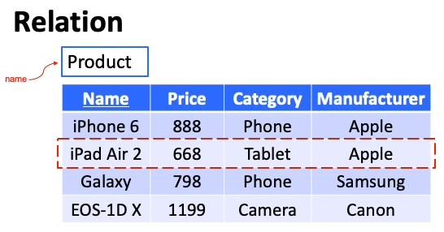

- Relation is often referred to as a **table**
- Each row is called a **tuple** or a **record**
- Each column is called an **attribute**
- A database may have a large number of tables/relation

# Designing a DB for an App

1.  Model the requirements of the application
    - What needs to be stored?
    - What are the interactions?
2.  Translate the conceptual model into a set of tables
    - Using **Entity-Relationship Diagrams**
3.  Construct the tables with a DBMS

# ER Diagram

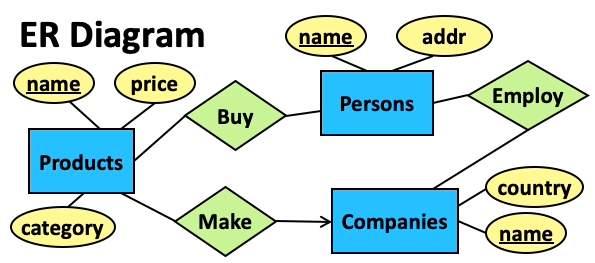

- Rectangle = **Entity Set**
    - Collection of real-world objects
- Oval = **Attribute**
    - Property of an Entity Set/Relationship
- Diamond = **Relationship**
    - Connection between two Entity Sets (i.e Persons `Buy` Products, Companies `Make` Products)
    - A relationship can have its own attribute

# Types of Relationships

## 1\. Many-to-Many

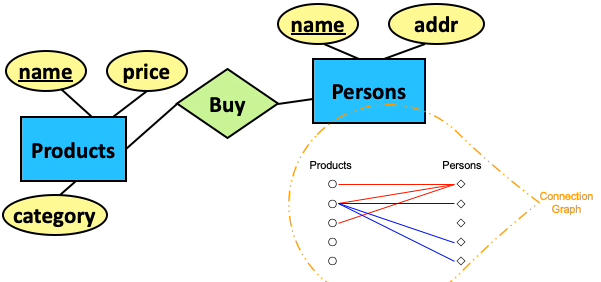

- One `Person` can buy multiple `Products`
- One `Product` can be bought my multiple `Persons`
- Connection Graph helps us to visualise all the relationships between Entity Sets

## 2\. Many-to-One

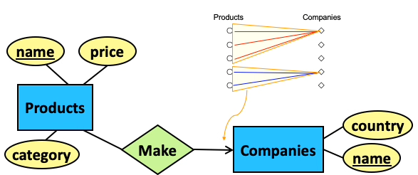

- One `Company` can make multiple `Products`
- But one `Product` can only be made by one `Company`
- An arrow is used to depict a **Many-to-One** relationship with the arrow pointing towards the 'One-Side' Entity (`Company`)

## 3\. One-to-One

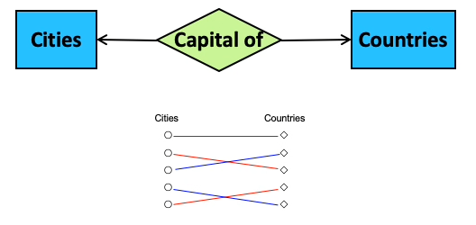

- A `City` can be the capital of only one `Country`
- A `Country` can have only one `City` capital

## 4\. Multi-Way

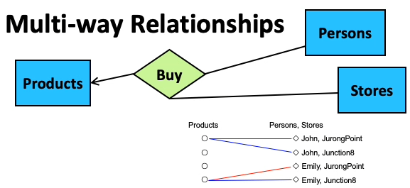
(Many-to-One + Multi-way)

- One `<Person, Store>` pair can correspond to one `Product`
- But one `Product` can correspond to many `<Person, Store>` pairs
- i.e. a `Person` only buys one `Product` at one `Store`
    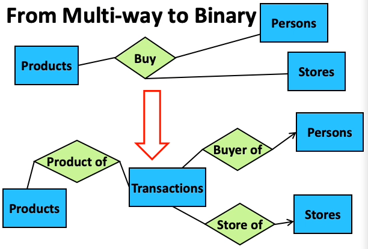
    (Convert to Binary for easier implementation)

# Roles

- Sometimes an entity set may appear more than once in a relationship
    - `Persons`(entity set) $\to$ `Marry`(relationship) $\to$ `Persons`(entity set)
- The role of the person is specified on the edge (arrow) connecting the entity set to the relationship
- Without the roles, it is unclear whether it is Many-to-One from one Entity to another

# Constraints

## 1\. Key Constraints

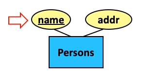
(`name` is the primary key)

- Underlined attributes uniquely represent each entity in the entity set (e.g. names) (i.e. each person must have a unique name)
- A key in an entity set can contain more than **one** attribute
    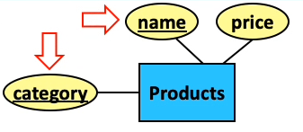
    (`<name, category>` is the primary 'key')
- Each product has a unique `<name, category>` combination and there can be products with the same name or category but not both
- Every entity set should(must) have a key

## 2\. Referential Integrity

- Required when two entity sets must have a relationship with each other (e.g. Every `Product` must be made by a `Company`)
- Cannot be used in a Many-to-Many relationship
- Depicted using a rounded arrow (similar to a Many-to-One relationship)

## 3\. Degree (not required in quiz/exam)

(Each `Company` must at least make 1 `Product`)

(Each `Company` can make at most 1000 `Product`)

# Subclasses

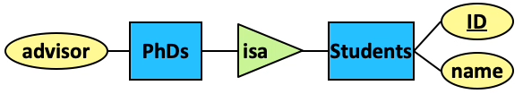

- The connection between a subclass and its superclass is captured by the `isa` (is a) relationship, which is represented using a triangle
- Key of a subclass is inherited from the Key of a superclass
    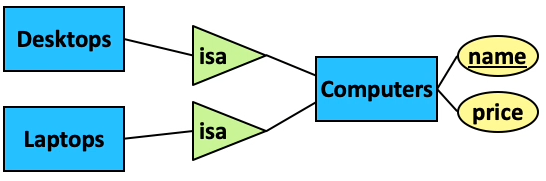
- An entity set can have multiple subclasses
    - Superclass: Computers
    - Subclass1: Desktop
    - Subclass2: Laptop
- When to use subclasses
    - When a subclass has some attribute that is absent from the superclass
    - When a subclass has its own relationship with some other entity set

# Weak Entity Sets

- Cannot be uniquely identified by their own attributes
- Needs attributes from other entities to identify themselves; always has referential integrity with the supporting entity set
    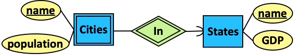
- Example: Cities with identical names so we cannot use name as key
- Relationship `In` is called the supporting relationship of `Cities`
    - Weak Entity set depicted using double-lined rectangle
    - Supporting relationship depicted using double-lined diamond
- Key of `Cities` is now `(State.name, Cities.name)`

# ER Diagram Design Principles

- From applications to ER Diagrams
    1.  Identify the objects involved in your application
    2.  Model each type of objects as an entity set
    3.  Identify the attributes of each entity set
    4.  Identify the relationships among the entity sets
- **Principles**
    1.  **Be Faithful**
        - Be faithful to the specifications of the application
        - Capture the requirements as much as possible
    2.  **Avoid Redundancy**
        - Avoid repetition of information
            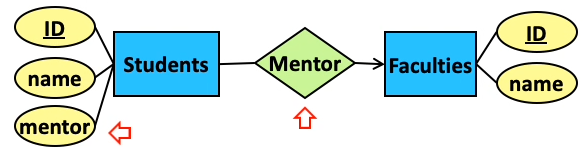
        - Waste of space + possible inconsistency
    3.  **Keep Things Simple**
        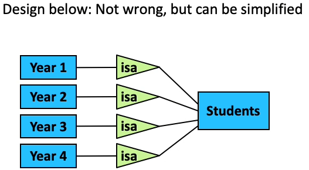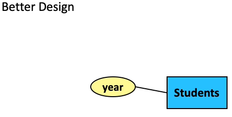
    4.  **Don't Over-use Weak Entity Sets**
        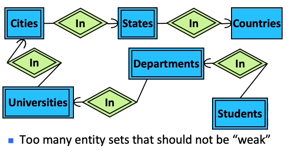

# ER diagram $\to$ Relational schema

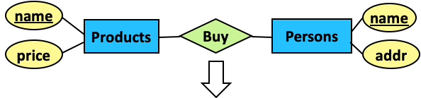

- Products(<u>name</u>, price)
- Persons(<u>name</u>, addr)
- Buy(<u>product_name</u>, <u>person_name</u>)
- Terminology
    - A relation schema = name of a table + names of its attribute
    - A database schema = a set of relation schema

## Entity Set $\to$ Relation

- Each entity set is converted into a relation that contains all its attributes
    - Key of the relation = key of the entity set
        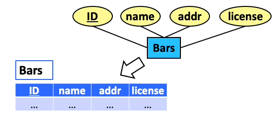

## Many-to-Many Relationship $\to$ Relation

- Converted into a relation that contains
    - all keys of the participating entity sets
    - the attributes of the relationship (if any)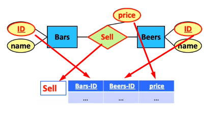
    - Key of Relation = Keys of the participating entity sets (<u>Bars-ID</u>, <u>Beers-ID</u>) (composite key)
    - If an entity is involved multiple times in a relationship
        - Its key will appear in the corresponding relation multiple times $\therefore$ we re-label key using the roles of the entity (e.g. (<u>husband-ID</u>, <u>wife-ID</u>))

## Weak Entity Set $\to$ Relation

- Each weak entity set is converted to a relation that contains
    - **all** of its attributes
    - the key attributes of the supporting entity set
- Supporting relationship is ignored (i.e. label is the Name of the weak entity set)
    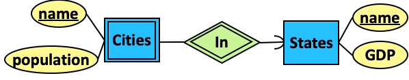
    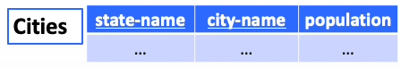

## Subclass $\to$ Relation

- 3 different ways
    - ER Approach (Each record may appear in **multiple** relations)
    - OO Approach (Each record will appear in **one** relation; potentially many multiple relations since we need to generate a relation for each combination)
    - NULL Approach (One big relation, may have a lot of NULL entries)
- Subclasses can be converted into a relational schema using all 3 approaches

### 1.ER Approach

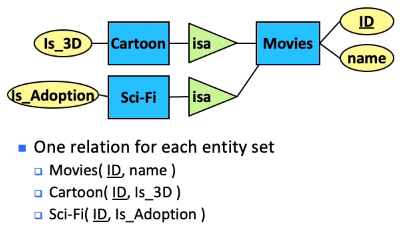

- A **Movie** which has genre **Cartoon** and **Sci-Fi** will be placed in all 3 relation tables (Movies, Cartoon and Sci-Fi)

### 2\. OO Approach

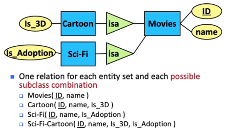

- Subclass will inherit all the attributes from the superclass $\therefore$ a **Cartoon** **Movie** will only be placed in the **Cartoon** relation table

### 3\. NULL Approach

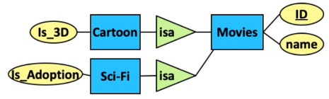

- For a **Movie** that is **not Cartoon** or **not Sci-Fi**, it will be recorded as **NULL** under those attributes in the relation table
- All records will only appear in one relation

### Which is best?

- Depends
    - NULL approach
        - Advantage - Only needs 1 relation
        - Disadvantage - May have many NULL values
    - OO approach
        - Advantage - Good for searching subclass combinations
        - Disadvantage - May have too many tables (need to account for all the combinations)
    - ER approach
        - Middle ground between OO approach and NULL approach

## Many-to-One Relationship $\to$ Relation

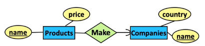

- Intuitive translation:
    - Products(<u>Pname</u>, price)
    - Companies(<u>Cname</u>, country)
    - Make(<u>Pname</u>, <u>Cname</u>)
- Observation: in `Make`, each Pname has only one Cname $\implies$ Cname is already unique $\implies$ we can re express `Make` schema as Make(<u>Pname</u>,Cname)
- Simplification: Merge `Make` and `Products` schema since they share the same key attribute
- Results
    - Products(<u>Pname</u>, price, Cname)
    - Companies(<u>Cname</u>, country)
- **In general, we do not need to create a relation for a many-to-one relationship**
    - Only need to put the key of the "one" side into the relation of the "many" side as an ordinary (not key) attribute

## One-to-One Relationship $\to$ Relation

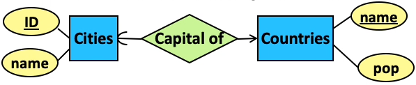

- Similar to Many-to-One $\to$ Relation
    - No need to create a relation for a one-to-one relationship
    - Only need to put the key of one side into the other
- Translation 1 (Key of `Cities` in `Countries`)
    - Cities (<u>CityID</u>, Cityname)
    - Countries(<u>Countryname</u>, pop, CityID)
    - CityID in `Countries` schema will not be NULL since there is a referential integrity (i.e. every Country will have a City as capital)
- Translation 2 (Key of `Countries` in `Cities`)
    - Cities (<u>CityID</u>, Cityname, Countryname)
    - Countries(<u>Countryname</u>, pop)
    - Countryname in `Cities` schema may be NULL since there is no referential integrity (i.e. not every City will be the capital of a Country)
- **Translation 1 is preferred**