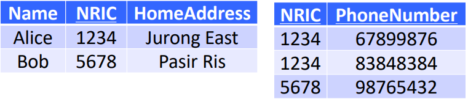

# Data Anomalies

- Anomalies occur in tables due to
    - bad combination of attributes
    - correlations among attributes
    - functional dependencies among attributes
- **Redundancies**
    - Data appearing more than once
- **Update anomalies**
    - Updating one entry without changing the other $\to$ corrupted table
- **Deletion anomalies**
    - Primary key attributes cannot be NULL
- **Insertion anomalies**
    - Inserting entries with NULL for some primary key values will lead to problems
- if a relational schema is not properly formulated, certain attributes may have duplicate values in the table

## 1\. Normalization (Decomposing)

**Before Decomposing**

**After Decomposing**

(NRIC and PhoneNumber are Primary Keys)

- Alice's address is no longer duplicated (no more redundancies)
- Address of Alice can be updated without changing changing another row (no more update anomalies)
- We can freely delete Bob's phone number without any problems (no more deletion anomalies)
- Inserting entries without a phone can be done now (no more insertion anomalies)

# Functional Dependencies

## Intuition

- Table is **bad** because it has a lot of anomalies
- Table contains a bad combination of attributes
- To know if a combination of attributes is bad, we need to check the correlations among those attributes **(Functional Dependencies)**
- Example:
    - Given an NRIC we can determine a person's name, but given a person's name, we cannot determine their NRIC
    - Functional dependency - NRIC $\to$ Name, but **not** Name $\to$ NRIC

## Definition

- Given attributes $A_1, A_2, ...\space A_m$ and $B_1, B_2, ...\space B_n$
    - $A_1, A_2,...\space A_m \to B_1, B_2, ...\space B_n$
    - i.e. There do not exist two records that have the same values on $A_1, A_2, ...\space A_m$ but different values on $B_1, B_2, ...\space B_n$
    - i.e. For some $A_i$ and $A_j$, if $A_i \to B_x$ and $A_j \to B_x$, $A_i = A_j$

## How to determine Functional Dependencies

- Common sense, Application's requirements

# Armstrong's axioms

## Axiom of Reflexivity

- A set of attributes $\to$ a subset of the attributes
    

## Axiom of Augmentation

- Given $A \to B$, we will always have $AC \to BC$, for any $C$
    

## Axiom of Transitivity

- Given $A \to B$ and $B \to C$, we can deduce $A \to C$ (transitive nature)
    

## Reasoning with Functional Dependencies

- Given $A \to B$ and $BC \to D$ show $AC \to D$
    - $A \to B \implies AC \to BC$ (Augmentation)
    - $AC \to BC$ and $BC \to D \implies AC \to D$ (Transitivity)
- Given $A \to B$ and $D \to C$ show $AD \to BC$
    - $A \to B \implies AD \to BD$ (Augmentation)
    - $BD \to B$ (Reflexivity) $\therefore AD \to B$ (Transitivity)
    - $D \to C \implies AD \to AC$ (Augmentation)
    - $AC \to C$ (Reflexivity) $\therefore AD \to C$ (Transitivity)
    - $AD$ determines $B$ and $C$, i.e. $AD \to BC$
- Given $A \to C$, $AC \to D$, $AD \to B$, show $A \to B$
    - Given $A \to C$ and $A \to A$, we get $A \to AC$ (Augmentation)
    - $A \to D$ is trivial (Transitivity)
    - Similarly, $A \to AD$ (Augmentation)
    - $A \to B$ is trivial (Transitivity)
- **Intuitive Solution**
    
    (If there is a path from $B$ to $C$, then we can show that $B \to C$)
    (the final set is known as the **closure** of $B$)

# Closure

- let $S = \{A_1, A_2, ..., A_n\}$ be a set $S$ for attributes
    - Closure of $S$ i.e. $\{A_1, A_2,..., A_n\}^+$is the set of attributes that are reachable from $A_1, A_2, ..., A_n$
    - e.g. given $A\to B, B\to C, C\to, D$
        - $\{A\}^+ = \{A, B, C, D\}$
        - $\{B\}^+ = \{B, C, D\}$
        - $\{C\}^+ = \{C, D\}$
        - $\{D\}^+ = \{D\}$
            
            (note that $C \notin \{B\}^+$ in the first example and position of $F$ does not matter for the last example)
- To prove that $X \to Y$ holds, we only need to show that $Y \in \{X\}^+$
    
- Similarly, to prove that $X \to Y$ does not hold, we only need to show that $Y \notin \{X\}^+$

# Keys

## Superkeys

- A set of attributes in a table that decides all other attributes
    
- {NRIC} is a superkey
    - NRIC $\to$ Name, Postal, Address and {NRIC, Name} $\to$ Postal, Address
        - {NRIC, Name} is also a superkey

## Keys

- **A Key is a superkey that is minimal** (removing any attribute from the superkey causes it to lose its status as a superkey)
- **A minimal set of attributes that decides all other attributes**
    - {NRIC, Name} is a superkey but it is not minimal
    - NRIC is a **key** but {NRIC, Name} is **not a key**
    - all keys are superkeys but not all superkeys are keys
- Keys in a table $\neq$ Keys in an entity set

## Candidate keys

(NRIC, StudentID are keys in this table)

- Each key in a table with multiple keys is referred to as a candidate key
    - both NRIC and StudentID are candidate keys

## Primary / Secondary keys

- For a table with multiple keys (candidate keys), we **choose one of them as the primary key** and the others are referred to as **secondary keys**

# Finding keys

- We need to find the keys of the table to check whether a table is 'good'
    

## Algorithm

1.  Check all possible combinations of attributes in the table
2.  Compute closure for each combination
3.  If a closure contains all attributes, then the combination is a superkey and **might be a key**
    - always check smaller combinations first

- if an attribute does not appear in the RHS of any functional dependencies, then it must be in every key

# Normal forms

- A method to detect 'bad tables' like this (i.e. conditions for a 'good' table)

## 4 normal forms in this course

1.  First normal form \[least strict\]
2.  Second normal form
3.  Third normal form (3NF)
4.  Boyce-Codd normal form (BCNF) \[strictest\]