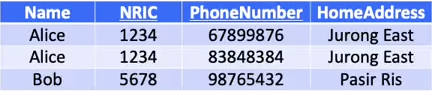
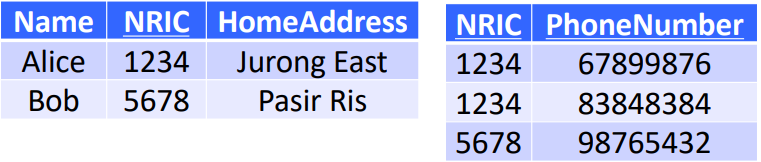
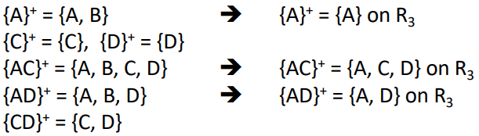

# BCNF

- A table R is in BCNF if and only if
    - LHS of **every** <u>non-trivial Functional Dependencies</u> contains a key of R
        - A non-trivial FD is not implied by the axiom of reflexivity
            - i.e. the RHS is not a subset of the LHS
        - $A\to B$ \-\- non-trivial
        - $AC\to BC$ \-\- non-trivial
        - $AC\to A$ \-\- trivial

- Key for this table is {NRIC, PhoneNumber}
- NRIC $\to$ Name, Address (non trivial)
    - NRIC is not a key $\therefore$ table is not in BCNF
        - found to contain anomalies

## Straightforward checking

Given a table $R$ & a set of FDs on $R$

1.  Derive Keys of $R$
2.  Derive all non-trivial FDs on $R$
    - too time consuming
    - check the FDs **given**
3.  For each non-trivial FD, check if its LHS contains a key
4.  if **ALL non-trivial** FDs pass the check, then $R$ is in BCNF, otherwise $R$ is not in BCNF

## Rationale

- A table $R$ is in BCNF if and only if for **every** FD on $R$
    - FD is trivial or
    - LHS of the FD contains a key
- we just need to check the given FDs
    - if the given FDs passes the check, the hidden FDs derived from these given FDs will also pass the check
    - use the three axioms to prove
        - Reflexivity: yields trivial FD
        - Augmentation: LHS of new FD will have more attributes than given; if LHS in given has key, new LHS will also contain a key
        - Transitivity: LHS of new FD is same as one of the given FD

**BCNF requires that there cannot be any non-trivial $X\to Y$ such that $X$ does not contain a key**

- NRIC determines Name, Address
- NRIC is not a key $\to$ NRIC can appear multiple times in the table $\to$ Name, Address will also appear repeatedly
- **Leads to redundancies**
- BCNF prevents this

# BCNF Decomposition

- If a table violates (not in) BCNF, we decompose / normalise it
    *before normalising*
    
    *after normalising*
    
    (for the table on the right side, {NRIC, PhoneNumber} $\to$ (NRIC, PhoneNumber) \[trivial FD\] $\to$ satisfies condition for BCNF)
    **decompose all sub-tables until all are in BCNF**

## Decomposition Algorithm

Given a table $R$

1.  Find a FD $X\to Y$ on $R$ that violates BCNF
    - stop if FD does not exists (i.e. if $R$ is in BCNF)
2.  Compute the closure of the LHS ($X$): $\{X\}^+$
3.  Break $R$ into two tables $R_1, R_2$
    - $R_1$ contains all attributes in $\{X\}^+$ ($R_1$will be in BCNF)
    - $R_2$ contains $X$ and all attributes **not in** $\{X\}^+$
4.  Repeat steps 1-3 on $R_2$

**The BCNF decomposition of a table may not be unique**
**If a table has only two attributes, then it MUST be in BCNF**
\- no need to check tables with only two attributes

# Tricky Case of BCNF Decomposition

- When there is an FD $X\to Y$ for a table $T$ such that
    - $X$ contains some attributes in $T$, but
    - $Y$ contains some attribute **not** in $T$
- e.g. a half-decomposed $R_2(A,C,D,E)$ has FDs $A\to B, BC\to D$, key $ACE$
    - $A$ is in $R_2$ but $B$ is not
    - $\therefore$ we have to use closure to check if $R_2$ is in BCNF
        - from FDs, $\{A\}^+ = \{A,B\}$ but $B$ is not in $R_2$ so $\{A\}^+ = \{A\}$, similar for $\{C\}^+,\{D\}^+,\{E\}^+$ (all are trivial FDs since RHS is a subset of LHS)
        - for 2-attribute closure, we start from $\{AC\}^+$ which is $\{A,C,D\}$ since from FD we get $AC\to BC\to D$ (axiom of transitivity)
            - this is a non trivial FD which does not satisfy condition of BCNF (LHS is not key) so we need to decompose $R_2$
        - we get $R_3(A,C,D), R_4(A,C,E)$ $R_{n-1}$will always take all the attributes in the FD, $R_n$ will take all the attributes in the LHS and the attributes not in the FD but in $R_{n-2}$
            - from here, we know $R_4$ is in BCNF because $ACE$ is the key
            - but tricky case still exists in $R_3 \to$ we need to use closure again
                
            - For the non trivial FDs, the RHS are either a subset of the LHS or the LHS contains a key in $R_3 (AC)$
            - Therefore $R_3$ is in BCNF
- a table $T$ is not in BCNF if there is a closure $\{X\}^+ = \{Y\}$ such that $Y$ does not contain all attributes in $T$ but contains more attributes than $X$
    - if $Y$does not contain an attribute in $T$, it means that that attribute is part of the key in $T$
    - $Y$ containing more attributes than $X$ means $Y$ is not a subset of $X$ (non-trivial)

# Properties of BCNF decomposition

## Good Properties

- no update / deletion anomalies
- very small redundancy
- original table can always be reconstructed from decomposed tables (**lossless join**)
    - decomposition guarantees lossless join whenever the common attributes in $R_{n-1}$ or $R_{n}$ constitutes a superkey of either table

## Bad Properties

- It may not preserve all functional dependencies
    - given table $R(A,B,C)$, FDs $AB\to C, C\to B$, keys $AB, AC$
    - $R$ violates BCNF ($C\to B$)
        - $R_1(B,C)$, non trivial FD: $C\to B$ (but 2 attributes so satisfies BCNF conditions)
        - $R_2(A,C)$, non trivial FD: none
        - FD $AB\to C$ is 'lost'