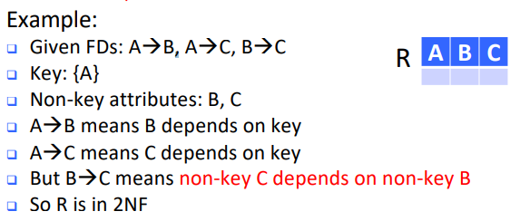
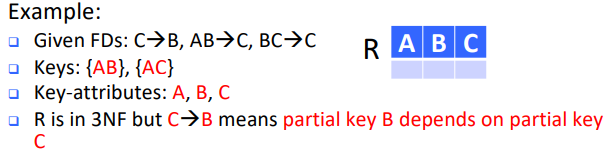
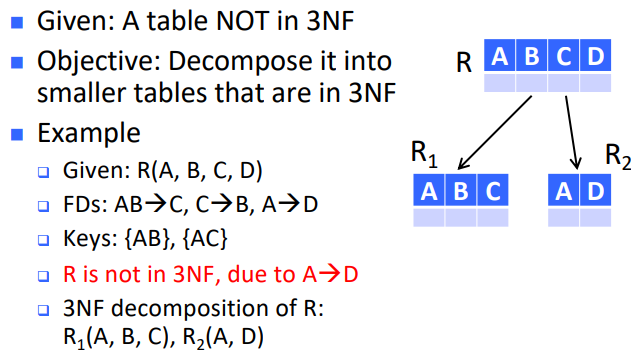

**Key attribute** \- an attribute in a multi-attribute key
\- e.g. $A$ is a key attribute in $AB$ key

# First Normal Form (1NF)

- All attributes must have atomic values
    - atomic values = single values

# Second Normal Form (2NF)

- Every non-key attribute is dependent on the **whole of every candidate key** but may still have non-key attribute $\to$ non-key attribute
    

# Third Normal Form (3NF)

- **A table satisfies 3NF iif for every non-trivial $X\to Y$**,
    - Either $X$ contains a key (implies $Y$ is dependent on key)
    - Or each attribute in $Y$ is contained in a key (also implies $Y$ is dependent on key)
- i.e. **All attributes depends on candidate keys**
    - candidate keys can have overlapping attributes
    - may result in key-attribute(s) of one key depending on key-attribute(s) of another key
        

# 3NF Decomposition

- for FD $A\to D$, LHS does not contain a key, and RHS is not in any key

## Algorithm

1.  Derive minimal basis of set of FDs ($S$)
    - e.g. $S=\{A\to BD, AB\to C, C\to D, BD\to D\}$ becomes $S=\{A\to B, A\to C, C\to D\}$
2.  In the minimal basis, combine the FDs whose LHS are the same
    - e.g. combine $A\to B$ and $A\to C$ to get $A\to BC$
3.  Create a table for each remaining FD ($C\to D$)
    - $R_1(A,B,C), R_2(C,D)$
4.  If none of the tables contain a key of the original table R, create a table that contains a key of R
5.  Remove redundant tables

## Minimal Basis

- The minimal basis of $S$ is a 'simplified' version of $S$ which has to satisfy 3 conditions
- **For any FD in the minimal basis, its RHS has only one attribute.**
- **No FD in the minimal basis is redundant**
    - i.e. no FD in the minimal basis can be derived from other FDs
- **For each FD in the minimal basis, none of the attributes on the LHS is redundant**
    - i.e. removing an attribute from the LHS of an FD will result in a new FD that cannot be derived from the other FDs

#### Algorithm for minimal basis

1.  Transform the FDs so that each RHS only contains one attributes
    - $S=\{A\to BD, AB\to C, C\to D, BC\to D\} \to S=\{A\to B, A\to D, AB\to C, C\to D, BC\to D\}$
2.  Remove redundant FDs
    - without $A\to D, S=\{A\to B, AB\to C, C\to D, BC\to D\}$
    - $\{A\}^+ = \{A,B,C,D\}$ so $A\to D$ is implied by other FDs and is redundant
    - result: $S=\{A\to B, AB\to C, C\to D\}$
3.  Remove redundant attributes on the LHS of each FDs (do not have to care about LHS with one attributes)
    - result: $S=\{A\to B, A\to C, C\to D\}$ (minimal basis)