# Relational Algebra

- A mathematical way to formulate queries on relations / tables
- Has numeral **operators** for query formulation
    - **Selection, Projection, Union, Intersection**

# Selection $\sigma$ (row-wise operator)

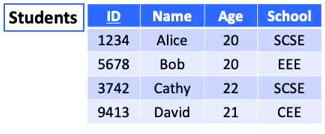

- Query: "Find me the student named Alice"
    - $\sigma_{\text{Name = 'Alice'}}\text{Students}$
    - database will look at every single **row** to check for 'Alice' in Name and returns results:
        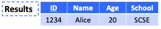
- Conditional Operations (AND / OR) can also be used in selection
- Example 2:
    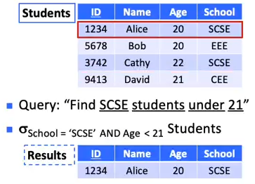

# Projection $\Pi$ (column-wise operator)

- Query: "Find the IDs and Names of all students"
    - $\Pi_{\text {ID,Name}} \text{Students}$
    - database will look at every single **column** to get desired columns
        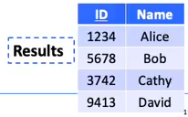
    - creates a subtable containing the queried columns

# Combination of Operators

- Query: "Find the IDs and Names of all students in SCSE"
    - $\Pi_{\text{ID, Name}}(\sigma_{\text{School = 'SCSE'}} \text{Students})$
        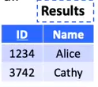
- **Order of operation matters**, if we do projection first, the intermediate subtable will not contain a School attribute

# Union $\cup$ Operator

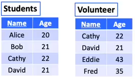

- Query: "Find people who are either students or volunteers"
    - $\text{Students} \cup \text{Volunteer}$
        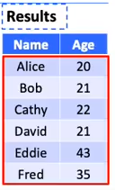
    - **duplicates are automatically removed** (same like union of sets in set theory)

## Combining Projection and Union

- Query: "Find the names of people who are either students or volunteers"
    - $\Pi_{\text{Name}}(\text{Students} \cup \text{Volunteer})$
    - ($\Pi_{\text{Name}}\text{Students}) \cup (\Pi_{\text{Name}}\text{Volunteer})$
    - both methods work in this case
        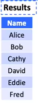
- **The two sides of a union must have the same schema (i.e. same set of attributes)**
    - if Volunteer Schema does not contain Age, then the union operator will not work
    - we can instead use a projection to get the name of students and perform the union operation on the subtable with the Volunteer Schema

# Intersection $\cap$ Operator

- Query: "Find people who are both students and volunteers"
    - $\text{Students} \cap \text{Volunteer}$
        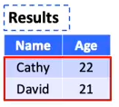
    - **similar to union operator, identical / duplicates are removed**

## Combining Projection and Intersection

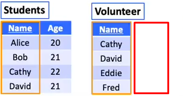

- Query: "Find people who are both students and volunteers"
    - $(\Pi_{\text{Name}}\text{Students}) \cap \text{Volunteer}$
    - we get an intermediate table which has the same schema with Volunteer and intersect both tables
- **similar to union, two sides of an intersection must have the same schema**

# Difference $-$ Operator

- Query: "Find people who are students but not volunteers"
    - $\text{Students} - \text{Volunteer}$
        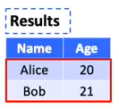
    - **Duplicate rows are automatically removed**
    - returns what the LHS have that the RHS doesn't have
- **Both sides of a difference operation must have the same schema**
    - can use a projection of the main attribute

# Natural Join $\bowtie$ Operator

- Combines two tables into one table
    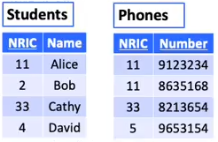
- Query: "Find the NRIC, Name, and Phone of each student"
    - $\text{Students} \bowtie \text{Phones}$
        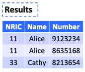
    - for every NRIC in Students, we try to find corresponding NRIC in Phones and combine all attributes in Students and Phones (with duplicate attributes automatically removed) (tuples that do not have a match will not be in results)
- **Join is performed based on the common attributes (column) of the two relational schema**
- **Each common attribute (column) appears only once in the result**
- Example 2:
    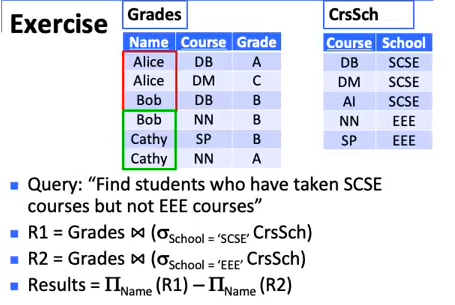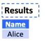
- Example 3:
    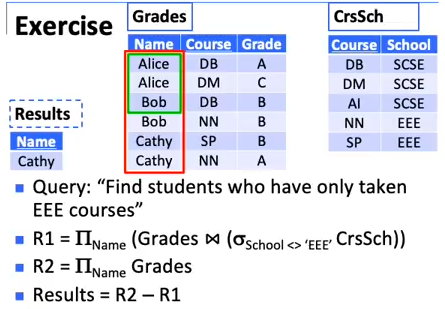

# Theta Join $\bowtie_{condition}$ Operator

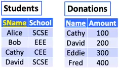
(note there are no common attributes)

- Query: "For those students who have made donations, find their names, schools, and amounts of their donations"
    - $\text{Students} \bowtie_\text{SName=Name}\text{Donations}$
        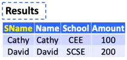
- **'Duplicate' attributes (columns) will not be removed from the results unlike in Natural Join**
    - Project attributes that we need from the results table
- Join condition can also be an inequality:
    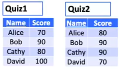
- Query: "Find students who scored higher in Quiz 2 than Quiz 1"
    - $\text{Quiz1}\bowtie_{\text{Quiz1.Name = Quiz2.Name AND Quiz1.Score < Quiz2.Score}}\text{Quiz2}$
        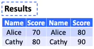
        (note that duplicated attributes are not removed)
    - **We need to prefix table name (Quiz1.Score / Quiz2. Name) to eliminate ambiguity whenever there are ambiguous attribute names (Score and Name in this case)**

# Cartesian Product $\times$ Operator

- Theta join without a condition
    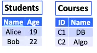
- Query: "Create a table that provides all possible student-course combinations"
    - $\text{Students} \times \text{Course}$
        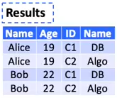
    - each record in the first table will be merged with all the records in the second table

# Assignment $:=$ Operator

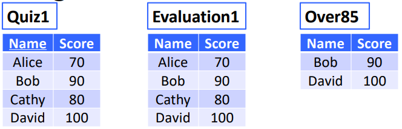

- Query / Concept: "Make another copy of the table and give it a new name"
    - $\text{Evaluation1} := \text{Quiz1}$
    - $\text{Over85} := \sigma_\text{Score > 85}\text{Quiz1}$
- **all attributes are copied**
- useful for breaking down steps
    - ($\Pi_{\text{Name}}\text{Students}) \cup (\Pi_{\text{Name}}\text{Volunteer})\newline =\text{R1} \cup \text{R2}$
    - $\text{R1} := \Pi_{\text{Name}}\text{Students}$
    - $\text{R2} := \Pi_{\text{Name}}\text{Volunteer}$

# Rename $\rho$ Operator

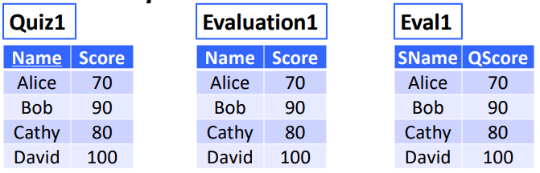

- Query / Concept: "Change the name of table"
    - $\rho_\text{Evaluation1}\text{Quiz1} \to$ $\text{Quiz1}$ has name changed to $\text {Evaulation1}$
    - $\rho_\text{Eval1(SName, QScore)}\text{Quiz1} \to$ change $\text{Quiz1}$'s name as well as attribute names

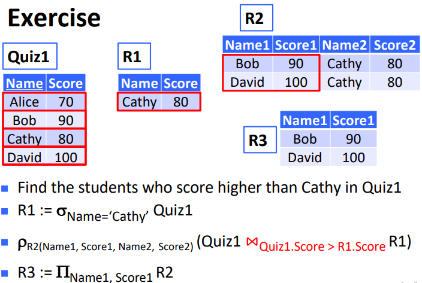

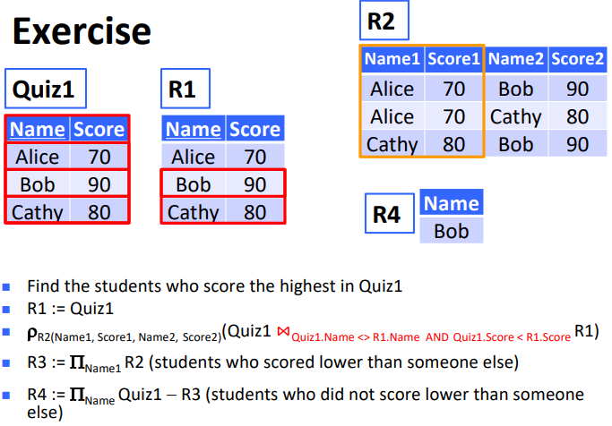

- **$<>$ means not equals to**

# Duplicate Elimination $\delta$ Operator

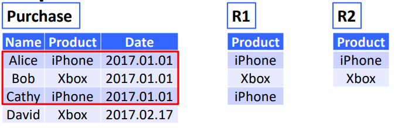

- Query: Find the list of products sold on 2017.01.01
    - $\text{R1} := \Pi_\text{Product}(\sigma_\text{Date='2017.01.01'}\text{Purchase})$
    - $\text{R2} := \delta(\text{R1})$

# Extended Projection $\Pi$ Operator

- **similar to ordinary projection but allows the creation of new attributes via arithmetic**
    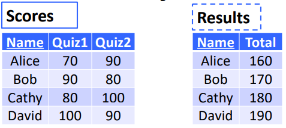
- Query: "For each student, find his/her total score in Quiz 1 and 2"
    - $\Pi_{\text{Name, Quiz1+Quiz2} \to \text{Total}}\text{Scores}$
    - $\to$ gives the arithmetic performed with the RHS giving an attribute name to the result

# Grouping and Aggregation $\gamma$ Operator

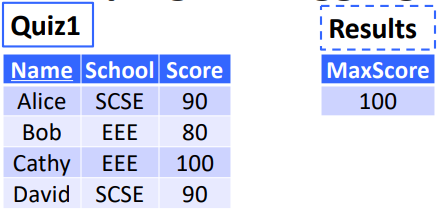
**Aggregation only**

- Query: "Find the highest score in Quiz1"
    - $\gamma_{\text{MAX(Score)}\to\text{MaxScore}}\text{Quiz1}$
    - Attribute name on RHS of $\to$ can be arbitrary
- Aggregate Functions:
    - MAX(...) - returns maximum entry in column
    - MIN(...) - returns minimum entry in column
    - AVG(...) - returns average of column
    - SUM(...) - returns total sum of column
    - COUNT(...) - returns number of entries (tuples)
- **Aggregate Functions can only be used with the aggregation operation $\gamma$**
    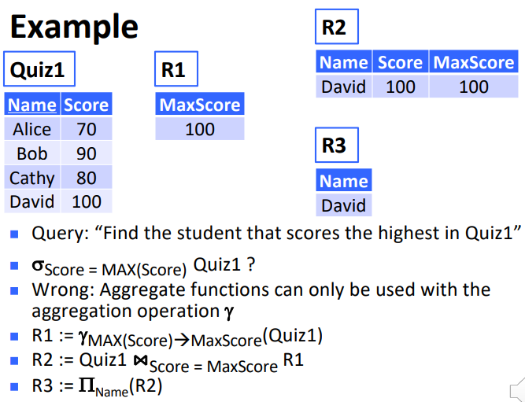

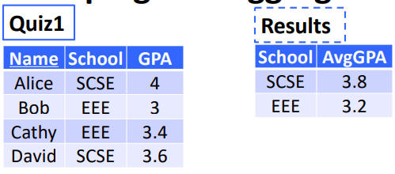
**Aggregation + Grouping**

- Query: "Find the average GPA in each school"
    - $\gamma_{\text{School, AVG(GPA)}\to\text{AvgGPA}}\text{Quiz1}$
    - Grouping of records occur before the aggregate functions (can have more than 1 grouping operations)
        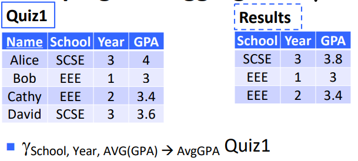

# Division $\div$ Operator

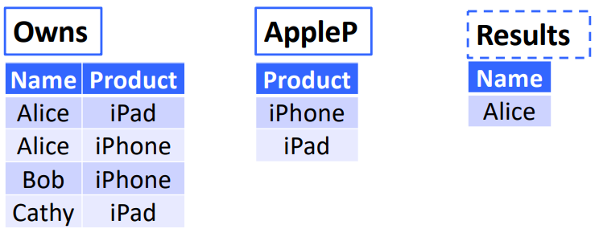

- Query: "Find each person that owns **all** Apple products"
    - $\text{Owns} \div \text{AppleP}$
    - $R_1(A,B) \div R_2(B)$ returns a table that contains only attribute A $\therefore$ above query returns $\text{Name}$
        - The table will only contain each A value in $R_1$ that is associated with **every** B value in $R_2$
        - **A values can contain multiple attributes but this also means values of each attribute in the combination must be the same**
            - e.g. for a table $R_1(A, B)$ where $A_i = \{X_i, Y_i, B_a\} \text{ and }\newline A_j = \{X_i, Y_j, B_b\}, A = \{X_i, Y_i\}$ will not be in $\text{Results}$

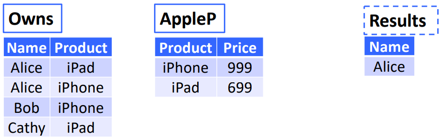

- Query: "Find each person that owns all Apple products"
    - $\text{Owns}$ does not contain $\text{Price}_\text{AppleP}$ so we have to do a projection of $\text{AppleP}$
    - $\text{Owns}\div (\Pi_\text{Produdct}\text{AppleP})$

# Left Outerjoin $\mathring\bowtie_{L\text{ condition}}$ Operator

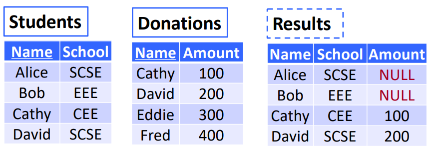

- Query: "For each student, find the amount of his/her donation"
    - $\text{Students }\mathring\bowtie_L\text{ Donations}$
    - All entries in the LHS of the operator are retained in $\text{Results}$
    - in natural join, all none common attributes will be removed from $\text{Results}$

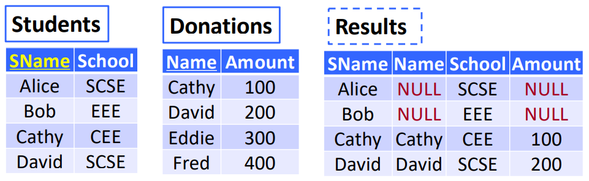(note that Name attribute of Students have changed)

- we use the same method we did in theta join where we compare the attribute names directly
    - $\text{Students }\mathring\bowtie_{L\text{ Sname = Name}}\text{ Donations}$
    - All attributes (SName, Name, School, Amount) will be retained
        - since Alice and Bob do not have Name in Donations, their Name attribute will be set to NULL in Results

# Right Outerjoin $\mathring\bowtie_{R\text{ condition}}$ Operator

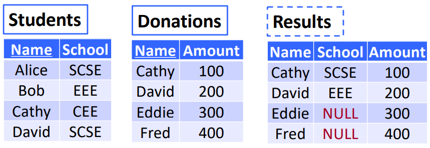

- Query: "For each donor, find the school he/she is in"
    - $\text{Students }\mathring\bowtie_R\text{ Donations}$
    - All entries in the RHS of the operator are retained in the results
- we can add conditions to follow when attribute names are different, similar to the example in Left Outerjoin

# Full Outerjoin $\mathring\bowtie_{\text{ condition}}$ Operator

- Combination of Left and Right Outerjoin
    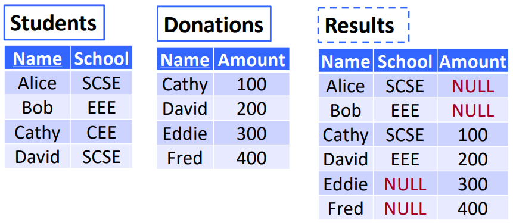
- Query: "Get the entries of everyone in the Students Table and the Donations Table"
    - $\text{Students }\mathring\bowtie\text{ Donations}$
    - All entries in BOTH tables will be retained in the results
- We can add conditions to follow similar to the example in Left Outerjoin

## Example

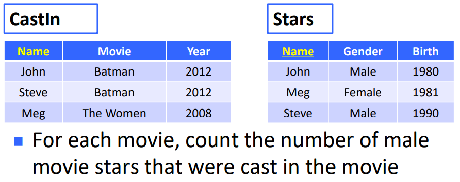

### Method 1: Using natural join, naive and incorrect method

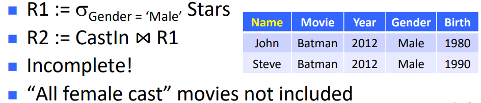

1.  Select Male records from Stars and assign to R1
2.  Do a natural join between CastIn and R1

- **Meg entry is lost**

### Method 2: Using Left Outerjoin, incorrect aggregation

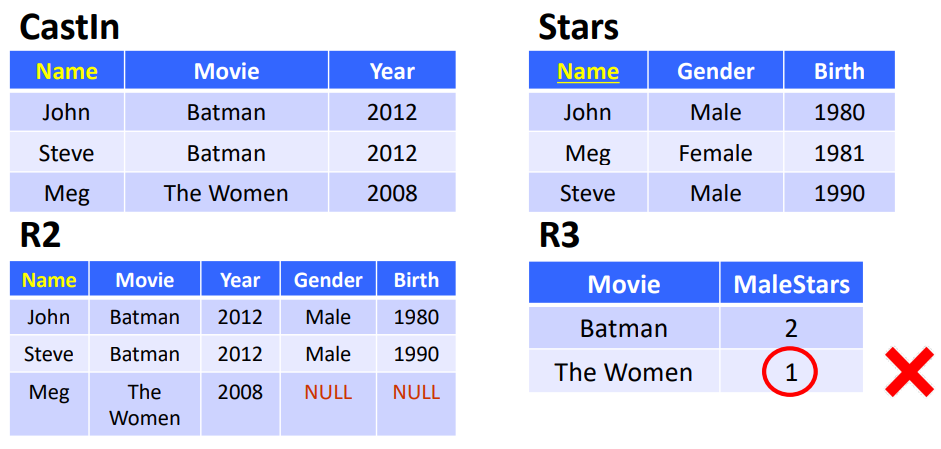
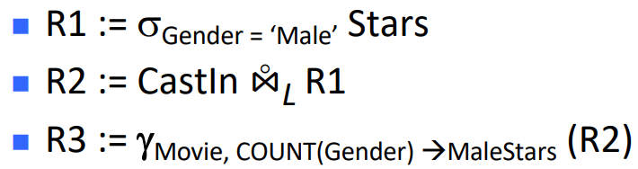

1.  Select Male records from Stars and assign to R1
2.  Do a left outerjoin to bring attributes from CastIn and corresponding attributes from R1 together and assign to R2
3.  Create a new table R3 with Attributes Movie, MaleStars (with count of gender assigned to it)

- **NULL is counted as 1 count**

### Method 3: Using Left Outerjoin, correct aggregation

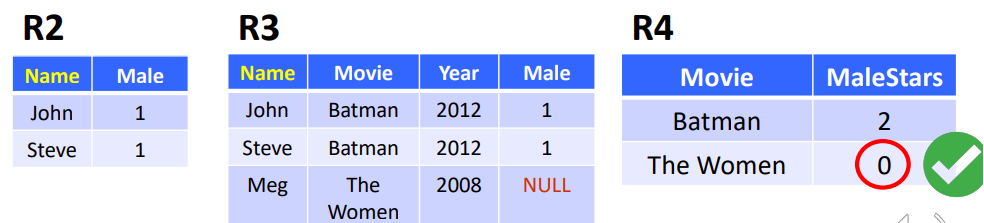
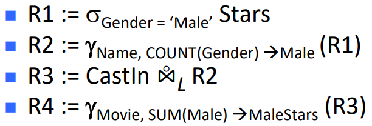

1.  Select Male records from Stars and assign to R1
2.  Create new table R2 with Attributes grouped by Name, Male (Count of different gender entries) from R1
3.  Do a left outerjoin to bring attributes from CastIn and corresponding attributes from R1 together and assign to R3
4.  Create new table R4 with Attributes grouped by Movie, MaleStars (Sum of Male entries in R3)