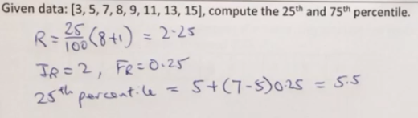
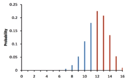
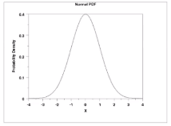
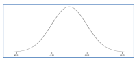
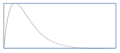
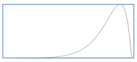
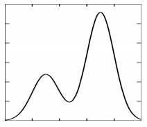
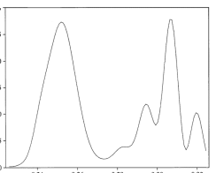

## Descriptive & Inferential Statistics

- Descriptive (just describing the sample)
    - Summarise and describe important features of the data collected, does not generalise beyond data collected
- Inferential (using the sample to infer the bigger picture)
    - Collection of sample to draw inferences about the population

## Types of Variables

- Qualitative
    - Labels/Names with no numerical values
- Quantitative
    - Labels with numerical values

## Percentile

- Comparison score between a particular score and the scores for the rest of a group (i.e. the ranking of a score among the rest)
- Calculation of $P^{th}$ Percentile for a set of N data:
    1.  Compute the rank R = $\frac{P}{100} \times (N + 1)$
    2.  Let IR = Integer part of R and FR = Fractional part of R (e.g. 5 and 0.25)
    3.  $P^{th}$ Percentile = Data at rank IR \+ (Data at rank (IR \+ 1) - Data at rank IR) $\times$ FR
        

## Types of Measurement Scale

- Nominal - **Categories** (= or !=); Names or labels with no specific order
- Ordinal - **Ordered Categories** (\> / <); Variables in a specific order
- Interval - **Differences between measurements** (+/-); Numerical scales in which intervals have the same interpretation throughout, but no true zero
- Ratio - ($\times$ / $\div$); Include all the characteristics of interval scale, plus it has zero position indicating the absence of the quantity being measured.

## Distributions

- Frequency Distribution
    - Discrete Variables
    - Continuous Variables
- Probability Distributions
    - Probability Mass Function (for discrete variables)
        
    - Probability Density Function (for continuous variables)
        
- Shapes of distributions
    - Symmetric
        
    - Positive skew (to the right)
        
    - Negative skew (to the left)
        
    - Bimodal
        
    - Multi-modal
        

## Linear Transformation

- Transforms data from one measurement scale to another
    
- Eg: Convert temperature in Fahrenheit to Centigrade:
    
    C = 0.5556F - 17.778
    
- Resultant graph is still a linear graph