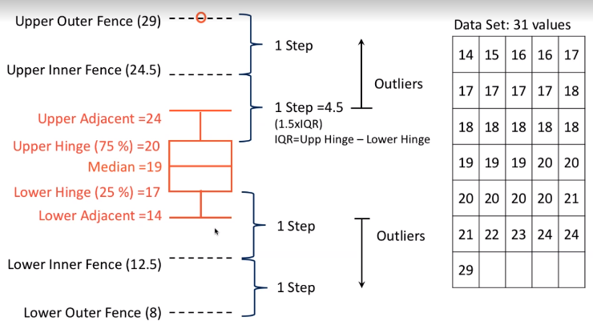

# Presenting Discrete Data

## Frequency Table

- Relative Frequency = Frequency / Total

## Bar Chart

## Pie Chart

## Stem and Leaf

- Useful when there are not a lot of data
    

# Presenting Continuous Data:

## Data range is divided in class intervals or bins

(Histogram $\neq$ Bar Chart)

- Interval size affects the visual presentation $\therefore no.\space of\space intervals \approx \sqrt{no. \space of\space data}$

## Box Plot

(IQR = Inter Quartile Range = Upper Hinge - Lower Hinge)
(Upper Adjacent = Highest Value equal to or less than Upper Inner Fence)
(Lower Adjacent = Lowest Value equal to or more than Lower Inner Fence)
(Outliers = values that lie outside the Upper/Lower Adjacent Boundaries)