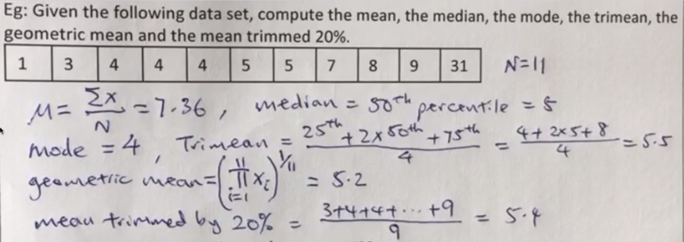
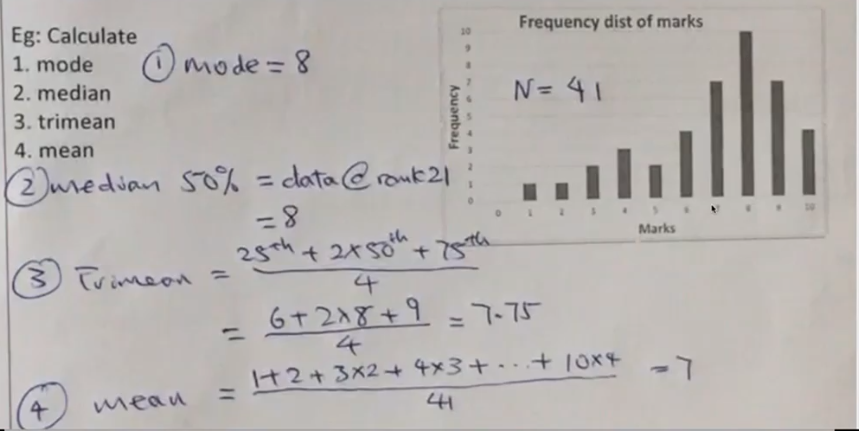
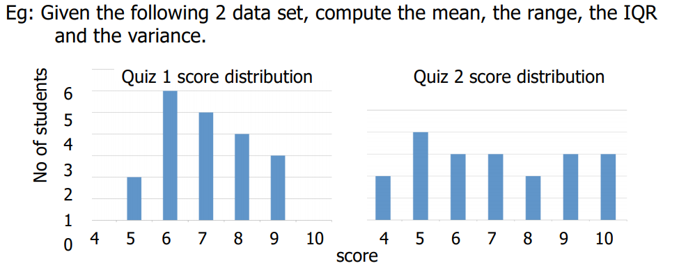

# Central Tendency

- Summarises a distribution of size $N$ by its central location (multiple ways)
    - **Mean** = $\mu = \frac{\sum X}{N}$
    - **Median** = $50^{th}$ Percentile (Average of both middle elements for evenly-sized array)
    - **Mode** = highest occuring value
    - **Trimean** = $\frac{25^{th}percentile + 2 * Median + 75^{th}percentile}{4}$
    - **Geometric mean** = $(\prod X)^{\frac{1}{N}}$, where $\prod$ means to multiply
        - $\prod_{i=1}^{5} X_i = X_1 \times X_2 \times X_3 \times X_4 \times X_5$
    - **Trimmed mean** = mean for data with some higher and lower values removed
        - having a mean trimmed 20% means trimming 10% from the high end and 10% from the lower end
- 
- For symmetric distributions
    - Mean = Median = Trimean = Trimmed mean = Mode (except bimodal distr.)
- For skewed distributions
    - Different measures can give different values (tendencies) (e.g. mean is typically higher than median for a positive skewed distribution vice versa)
    - **Negative skewed distribution**
        

# Measures of Variability

- Indication of how spread out the distribution is
    - **Range** = Highest value - Lowest Value
    - **Interquartile Range (IQR)** = $75^{th} - 25^{th}$ Percentile
    - **Variance** = $\sigma^2 = \frac{\sum (X-\mu)^2}{N}$ (mean squared error)
    - **Std Dev.** = $\sqrt{Variance} = \sqrt{\sigma^2} = \sqrt{\frac{\sum (X-\mu)^2}{N}}$
        
    - Mean
        - $\mu_1 = \frac{2\times 5 + 6 \times 6 + ... + 3\times 9}{20} = 7\newline \mu_2 = \frac{2\times 4 + 4\times 5 + ... + 3\times 10}{2} = 7$
    - Range
        - $R_1 = 9-5 = 4 \newline R_2 = 10-4 = 6$
    - IQR
        - $IQR_1 = 75^{th} - 25^{th} = 8 - 6 = 2 \newline IQR_2 = 75^{th} - 25^{th} = 9-5=4$
    - Var
        - $Var_1 = \sigma^2 = \frac{\sum (X-\mu_1)^2}{20}=1.5\newline Var_2 = \sigma^2 = \frac{\sum (X-\mu_2)^2}{20}=3.9$
- Estimating mean and variance of population of size N from a **sample of size n**
    - **Sample Mean** = $\bar x = \frac{\sum X}{n}$
    - **Sample Variance** = $s^2 = \frac{\sum (X-\bar x)^2}{n-1} = \frac{\sum X^2 - \frac{(\sum X)^2}{n}}{n-1}$ **(use n-1 as denominator, proof in slide 49 not required for exams)**

# Linear Transformation of Variable

- Transforms data from one measurement scale to another
    - e.g. Fahrenheit to Centigrade, pounds to kilograms
    - Mean and Variance of resulting data will change
- for a transformation $y=0.5x+3$,
    - **mean of y**, $\mu_y = 0.5 \times \mu_x + 3$
    - **variance of y**, $\sigma_y{^2} = 0.5^2 \times \sigma_x{^2}$

# Variance Sum Law I

- Linear combination of 2 independent variables (similarly, mean and variance will change)
- for a transformation $t=5x+10y$ where x and y are independent,
    - **mean of t**, $\mu_t = 5(\mu_x) + 10(\mu_y)$
    - **variance of t**, $\sigma_t{^2}=5^2(\sigma_x{^2}) + 10^2(\sigma_y{^2})$

### Combining sample data

e.g two samples of data, $X, Y$ sized $N_X, N_Y$ respectively

- combined mean $= \frac{\sum X + \sum Y}{N_X + N_Y}$
- combined std.dev $=\sqrt{\frac{\sum X^2 + \sum Y^2 - \frac{(\sum X + \sum Y)^2}{N_X + N_Y}}{N_X+N_Y-1} }$
    - $\sum X^2 = \sigma_x^2 (N_X-1) + \frac {(\sum X)^2}{N_X}$
    - $\sum Y^2 = \sigma_y^2 (N_Y-1) + \frac {(\sum Y)^2}{N_Y}$

http://www.obg.cuhk.edu.hk/ResearchSupport/StatTools/CombineMeansSDs_Pgm.php