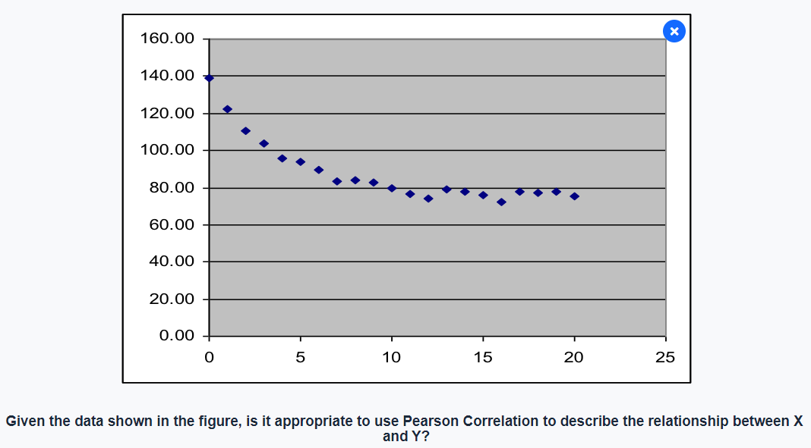
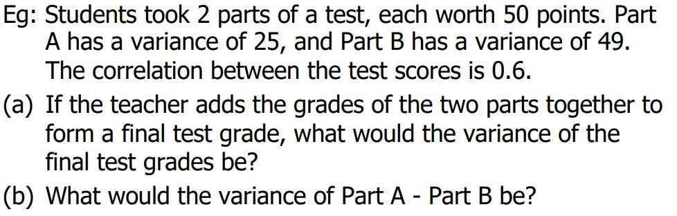

# Bivariate Data

- A dataset with a pair of variables which may be correlated to one another

# Correlation (similar to CZ1115)

### Correlation close to +1

### Correlation close to 0

### Correlation close to -1

## Pearson Correlation $\rho$

- An indicator on the <u>strength of the **linear relationship between two variables**</u> where:
    - $\rho = \frac{E[(X-\mu_X)(Y-\mu_Y)]}{\sigma_X \sigma_Y}$ where $E[(X-\mu_X)(Y-\mu_Y)]$ is the covariance of $X$ and $Y$ denoted as $cov(XY)$ $\newline = \frac{E[XY]-\mu_X \mu_Y}{\sqrt {E[X^2]-(\mu_X)^2} \sqrt {E[Y^2]-(\mu_Y)^2}} \newline = \frac {\sum XY - \frac{\sum X \sum Y}{N}}{\sqrt{\sum X^2 - \frac {(\sum X)^2}{N}}\sqrt{\sum Y^2 - \frac {(\sum Y)^2}{N}}}$
    - If $\mu_X = \mu_Y = 0$ then $\rho = \frac {\sum XY}{\sqrt{\sum X^2}\sqrt{\sum Y^2}}$
        
    - X and Y do not have a linear relationship therefore usage of Pearson Correlation to describe the relationship is inappropriate

## Computation of Correlation based on sample size of $n$

- $r = \frac {E[(X-\bar X)(Y-\bar Y)]}{s_X s_Y}$ where $E[(X-\bar X)](Y-\bar Y)] = cov(XY) = \frac {1}{n-1}\sum {(X-\bar X)(Y-\bar Y)}$ $\newline = \frac {\sum XY - \frac{\sum X \sum Y}{N}}{\sqrt{\sum X^2 - \frac {(\sum X)^2}{N}}\sqrt{\sum Y^2 - \frac {(\sum Y)^2}{N}}} \newline = \frac {\sum XY}{\sqrt{\sum X^2}\sqrt{\sum Y^2}}$ (if $\bar X = \bar Y = 0$ since $\bar X / \bar Y = \frac {\sum X}{N} / \frac {\sum Y}{N}$)

- $\mu_x = \frac {30}{5} = 6\space,\space \mu_y = \frac {20}{5} = 4$
- $\sigma_x{^2}= \frac {\sum (x-\mu_x)^2}{N} = \frac {(-4)^2+(-1)^2+0+2^2+3^2}{5} = 6\newline \therefore \sigma_x = \sqrt 6$
- $\sigma_y{^2}= \frac {\sum (y-\mu_y)^2}{N} = \frac {(4)^2+(1)^2+(-2)^2+0+(-3)^2}{5} = 6\newline \therefore \sigma_y = \sqrt 6$
- cov(X,Y) $= \frac {\sum {(x-\mu_X)(y-\mu_Y)}}{N} = \frac {-26}{5}$
- $\rho = \frac {cov(X,Y)}{\sigma_x \sigma_y} = \frac{-5.2}{6} \approx -0.86667$

## Properties of Correlation

- ranges from \[-1, 1\]
- **symmetric** (i.e. correlation of X with Y = correlation of Y with X; **cov(X,Y) = cov(Y,X)**)
- **unaffected by linear transformations** (correlation of Y with X = correlation of Y with AX + B where A and B are constants)
    

# Variance Sum Law II

- Linear combination of 2 <u>independent variables X and Y</u>
    - Variance of X $\pm$ Y: $\sigma_{x\pm y}^2 = \sigma_x^2 + \sigma_y^2$ (always `+`)
- If X and Y are <u>correlated</u>
    - Variance of X $\pm$ Y: $\sigma_{x\pm y}^2 = \sigma_x^2 + \sigma_y^2 \pm 2\rho \sigma_x \sigma_y$
- For computation based on a sample size
    - $s_{x\pm y}^2 = s_x^2 + s_y^2 \pm 2rs_xs_y$

- (a) $Var(A+B) = 25 + 49 + 2(0.6)(\sqrt{25})(\sqrt{49}) = 116$
- (b) $Var(A-B) = 25 + 49 - 2(0.6)(\sqrt{25})(\sqrt{49}) = 32$