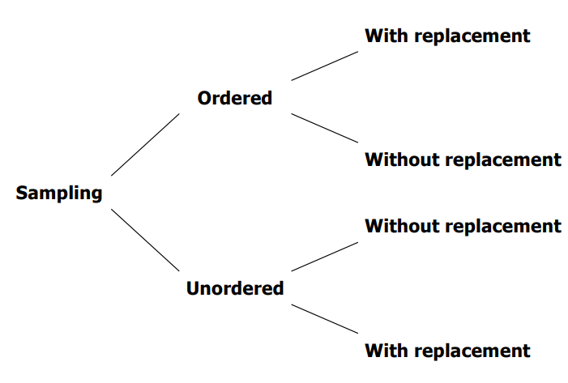
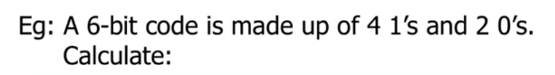

# Counting

- Counting may be involved when solving probability problems
- Different scenarios
    - sampling with replacement
    - sampling without replacement
    - data drawn are ordered
    - data drawn are unordered
- General Scenario
    
    - ordered sampling with replacement (choosing one by one and replacing)
        - no. of possible arrangements = $n^k$
    - ordered sampling without replacement (choosing one by one without replacing)
        - no. of possible arrangements = $n\times (n-1) \times (n-2) \times ... \times (n-1)$
        - i.e. number of $k$ permutations of $n$ elements = $^nP_k = \frac {n!}{(n-k)!}$
    - unordered sampling without replacement (choosing one bunch without replacing)
        - choosing $k$ elements from a set of $n$ elements and ordering does not matter
        - no.of possible ways = $^nC_k = \binom{n}{k} = \frac {n!}{k!(n-k)!} = \binom{n}{n-k}$
    - unordered sampling with replacement (choosing one bunch and replacing)
        - choosing $k$ elements from a set of $n$ elements one at a time with replacement and ordering does not matter
        - no. of possible ways = $\binom{n+k-1}{k}$
            
            **i) no. of distinct 6-bit code:** $\binom{6}{4}$ or $\binom{6}{2}$
            - once you choose 4 places to put the 1s, the other places will be 0s, so you don't have to multiply both together

# Probability Theory

- **A sample space is the set $S$ of all possible outcomes of an experiment**
- An <u>event</u> is a set of one or more (favourable) outcomes in the sample space
    - two events are mutually exclusive if they have no outcomes in common (i.e. $A \cap B = \emptyset$)
    - two events are exhaustive if they cover all possible outcomes
    - two events are independent if the probability that one occurs is not affected by whether or not the other has occurred

## Axioms of Probability

- Probability of any outcome or event $X$ is non-negative
    - $P(X) \ge 0$
- Probability of sample space $S$ is 1
- **If $X_1, X_2, X_3, ...$ are mutually exclusive events,** $\newline P(X_1$ or $X_2$ or $X_3 ...) = P(X_1) + P(X_2) + P(X_3) + ...$

## Conditional Probabilities (not included in quiz 1)

- The probability of an event $A$ given that event $B$ has occurred
- $P(A|B) = \frac{P(A \cap B)}{P(B)}$, where $B > 0$
- Example: Given $P(A) = 0.5$ and $P(B) = 0.8$, determine:
    - $P(A|B)$ if A and B are mutually exclusive
        - $P(A\cap B) = 0 \to P(A|B) = 0$
    - $P(A|B)$ if A is a subset of B
        - $P(A\cap B) = P(A)$
        - $P(A|B) = \frac{P(A \cap B)}{P(B)} = \frac{P(A)}{P(B)} = \frac{0.5}{0.8} = 0.625$
    - $P(B|A)$ if A is a subset of B
        - B will always happen if A occurs $\to P(B|A) = 1$
- Example: A jar contains 10 blue, 5 red, 4 green and 1 yellow marbles. Two marbles are randomly picked. What is the probability that one will be blue and the other yellow?
    - case 1: Blue then Yellow $\newline = P(\text{first blue, second yellow}) = P(B) \times P(Y|B) = \frac{10}{20} \times \frac{1}{19} = 0.0263$
    - case 2: Yellow then Blue $\newline = P(\text{first yellow, second blue}) = P(Y) \times P(B|Y) = \frac{1}{20} \times \frac{10}{19} = 0.0263$
    - $P(\text{one yellow, one blue})$ = case 1 + case 2 $= 0.0263 + 0.0263 = 0.0526$

## Bayes Theorem (not included in quiz 1)

- Given two events A and B, where $P(A) > 0$, we have:
    - $P(B|A) = \frac{P(A\cap B)}{P(A)} = \frac{P(A|B)P(B)}{P(A)}$
    - note: $P(A) = P(A\cap B) + P(A\cap B')$
    - note: $P(A\cap B) = P(A|B)\times P(B)$
    - similarly, $P(A|B) = \frac{P(A\cap B)}{P(B)} = \frac{P(B|A)P(A)}{P(B)}$
- Example: A test correctly identifies a disease in 95% of people who have it. It correctly identifies no disease in 94% of people who do not have it. In the population, 3% of the people have the disease. What is the probability that one has the disease if tested positive?
    - let $D$ = event that the person has disease
    - let $T$ = event that the test is positive
    - Given: $P(T|D) = 0.95 \implies P(T'|D) = 1-0.95 = 0.05$
    - Given: $P(T'|D') = 0.94 \implies P(T|D') = 1-0.94 = 0.06$
    - Given: $P(D) = 0.03 \implies P(D') = 0.97$
    - Find: $P(D|T) = \frac{P(D\cap T)}{P(T)} = \frac{P(T|D) P(D)}{P(T)} \newline = \frac{P(T|D) P(D)}{P(T\cap D) + P(T\cap D')} \newline = \frac{P(T|D) P(D)}{P(T|D)P(D) + P(T|D')P(D')} = 0.329$