# Random Variables

A random variable is a variable that has a numerical value which is defined on or determined by the outcomes or events of an experiment. The numerical value cannot be predicted exactly but can be described by its probability

- random variables can be discrete / continuous
    - discrete = distinct and countable
    - continuous = not distinct, hard to count (e.g. between 24 and 26, there are infinite values)

## Expected value of a R.V

For a given set of observed data $\{X_1, X_2, X_3, ... X_n\}$, one of the central tendency measure is the arithmetic average:

- $\bar X = \frac{X_1+ X_2 + X_3 + ... + X_n}{n}$

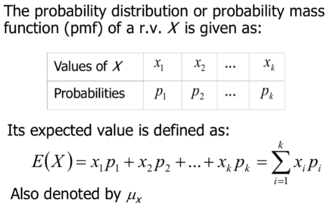

- i.e. expected value = the sum of all values multiplied by the probability of it happening

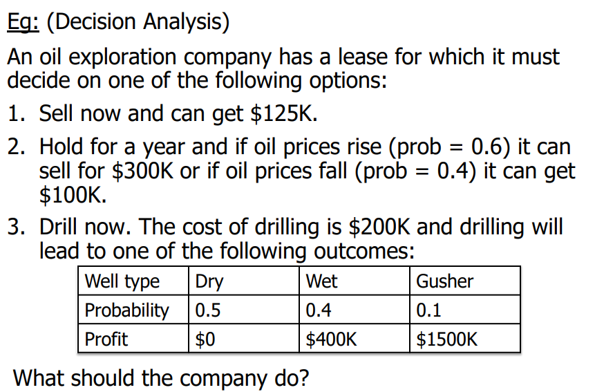

- Let $X$ be financial gain
    - Option 1: $X$ = $125k
    - Option 2: $E(X) = 300\times 0.6 + 100\times 0.4$ = $200k
    - Option 3: $E(X) = -200\times 0.5 + 200\times 0.4 + 1300\times 0.1$ = $110k
    - Option 2 is the best option

$E[Y] = E[(X-1)^2] = E[X^2] - 2E[X] + 1$
$X = 0\implies Y=1$
$X = 1\implies Y=0$
$X = 2\implies Y=1$
$\therefore E[Y] = 0.2(1) + 0.5(0) + 0.3(1)$

## Variance of R.V

- **sample variance**
    - $s^2 = \sum_{i=1}^{n}\frac{(x_i - \bar X)^2}{n-1} = \frac{1}{n-1}[\sum x^2 - \frac{(\sum x)^2}{n}]$

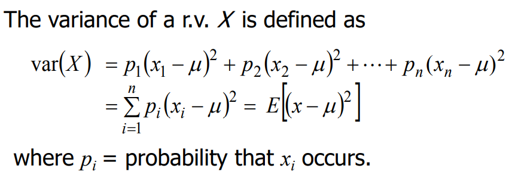

- var($X$) = expected value of variance
    - found by getting the sum of multiplying variance with the probability of each variance

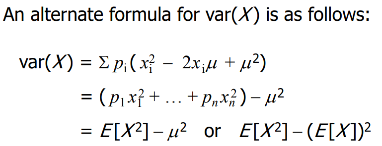

- **Var(X)** = sum of $(X_i^2 \times P(X_i))$ \- expected value$^2$ $E[X]^2$

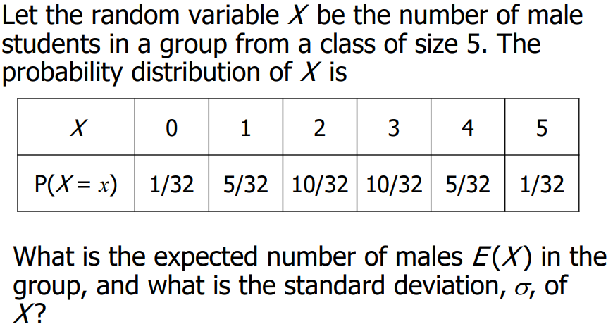

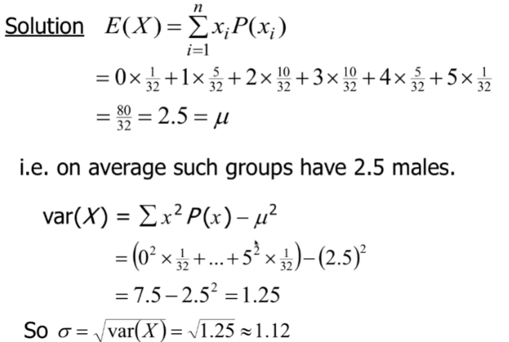 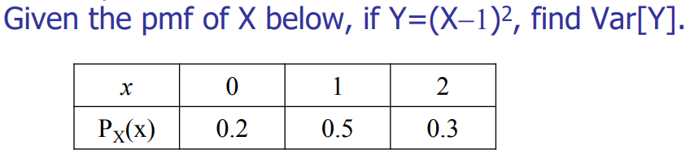

$Y=1,0,1$
$E[Y] = E[X^2-2x+1] = E[X^2] - 2E[X] + 1$
$E[Y^2] = 0.2(1) + 0.5(0) + 0.5(1)$
$Var[Y] = E[Y^2] - (E[Y])^2 = 0.5 - 0.5^2 = 0.25$

**Overall, there are two formulas to find the variance of a random variable X**

1.  $Var(X) = \sum_{i=1}^{n}p_i(x_i-\mu)^2$
2.  $Var(X) = E(X^2) - E(X) ^2 = \sum_{i=1}^{n}p_ix_i^2 - \mu^2$

# Discrete Variables

# Continuous Variables

# Probability Distribution of DRV (discrete)

- **probability mass function (discrete probablity distribution) is the list of possible values that a d.r.v. $X$ can take and their probabilities**

## Binomial Distribution

- 2 possible outcomes (Success or Failure) each having the same probability $\newline P(S) = p, \\ P(F) = 1-p$
- trials are independent, and probability for any given combination of successes and failures can be obtained by multiplying the probabilities for each trial outcome
- number of distinct 'arrangements' of $x$ successes and $n-x$ failures can be calculated using the binomial coefficient $\binom{n}{x} = ^nC_x = \frac{n!}{x!(n-x)!}$
    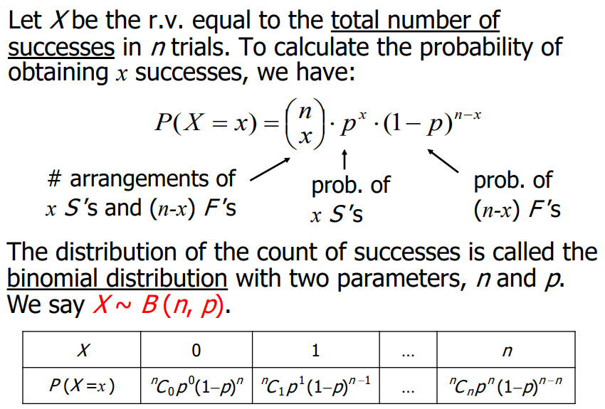
    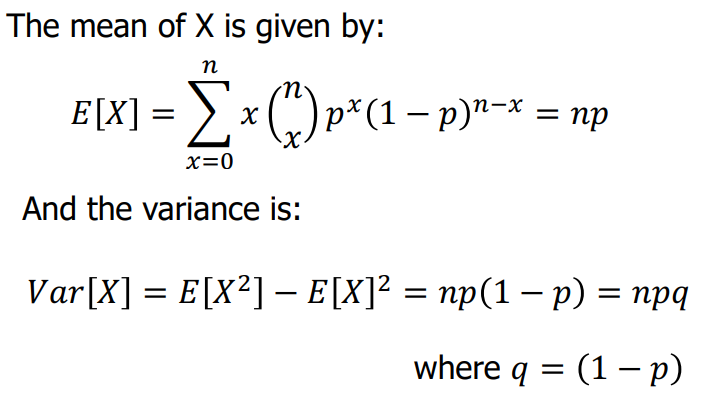
    proof not expected to remember:
    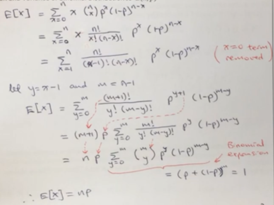
    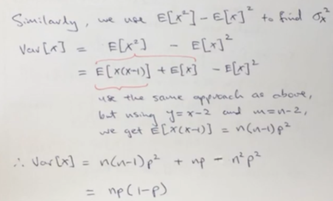
- **Important** Mean and Variance of the binomial distribution are given by:
    - $E[x] = np$
    - $Var[x] = npq, q=(1-p)$

## Poisson Distribution - Notation: $X\sim Pois(\mu)$

- r.v $X$ is the number of 'successes' in a given time interval where $X$ is a non-negative integer (only valid for $x \geq 0$, $x$ cannot be negative)
    - $P(X=x) = \frac{e^{-\mu}\mu^x}{x!}$ where $\mu$ is the average number of successes and $e$ is the constant value

### Approximation of Binomial Distribution

- For a binomial distribution $X\sim B(n,p)$ with a large $n$,
- i.e. $n\to \infty, p\to 0, np \to \text{a constant } \mu$
- Then it can be shown that:
    - $\frac{n!}{x!(n-x)!}p^x(1-p)^{n-x}\to\frac{e^{-\mu}\mu^x}{x!}$ (not expected to show proof)
    - $\therefore X\sim B(n,p) \approx Pois(\mu)$, where $\mu = np$, we have:
        - $P(X=x) = \frac{e^{-\mu}\mu^x}{x!}$
- **conditions for approximation**
    - large $n$ ( $n\geq 100$ )
    - small $p$ ( $p\leq 0.01$ )
    - constant $\mu = np(\mu \leq 20)$
- when $p\to 0$, $(1-p) \to 1 \implies$ the expected value and the variance of $X\sim B(n,p)$ are approximately equal
	- $\text{E[X]}: np = a, \text{Var[X]}: npq = a \times 1 = a$

## Geometric Distribution - Notation: $X\sim G(p)$

- Sequence of **independent** Bernoulli trials, P(success) is the same for all trials
    - outcome is bound to be successful one time
    - i.e. there will be X-1 failures before the 1st success is obtained where X = number of trials
- **Important Formulas**
    - $P(X=x) = (1-p)^{x-1}p$
        - i.e failing x-1 times $\times$ succeeding 1 time
    - $E[X] = \frac{1}{p}$
    - $Var[X] = \frac{1-p}{p^2}$

# Probability Distribution of a CRV (continuous)

- **probability density function is a function $f(X)$ used to describe the probability distribution for a continuous random variable $X$**
- $P(a<X<b)$ is the area under the curve between a and b
    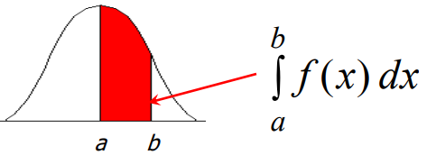
- **Cumulative density function of a probability density function**
    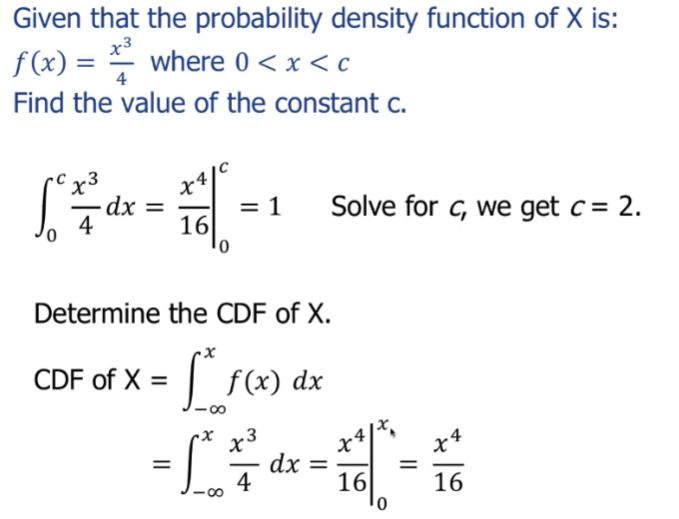
- the probability that X equals to an exact value is 0
    - $\therefore$ probabilities for continuous variables are always associated with a range of values. I.e. $P(X\geq2.00)$ or $P(X > 1.95)$
- **Important Formulas**
    - $E[X] = \int^{\infty}_{-\infty}xf(x)dx = \mu$
    - $Var[X] = \int^{\infty}_{-\infty}(x-\mu)^2f(x)dx = E[X^2] - E[X]^2$
  
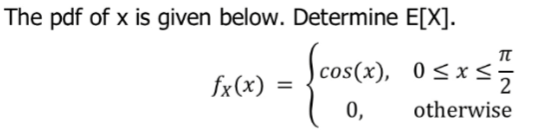
$E[x] = \int^{\pi/2}_{0}{xcos(x)dx} = xsinx|^{\pi/2}_{0} - \int^{\pi/2}_{0}{sin(x) dx} \newline= \frac{\pi}{2} - (-cos(x))|^{\pi/2}_{0} = \frac{\pi}{2} - 1$
## Determining $p^{th}$ percentile from the probability distribution

- $p^{th}$ percentile is the value $X_p$ such that the probability that $x < X_p$ is $p\%$
- i.e. $\int^{x_p}_{-\infty}f(x)dx = \frac{p}{100}$
- example:
	- Given that the PDF of x  is $f(x) = e^{-x}$, where $x>0$, determine the 25th percentile
	- $\int^{x_p}_{0}f(x)dx = \frac{25}{100}$
	- $\int^{x_p}_{0}e^{-x}dx = 0.25$
	- $-e^{-x}|^{x_p}_{0}=-e^{-x_p}+1 = 0.25 \to x_p = -\ln(0.25) = 0.288$

## Uniform Continuous Distribution - Notation: $X\sim U(a,b)$

- $X$ can take any real value between $a$ and $b$ with uniform probability over this interval
    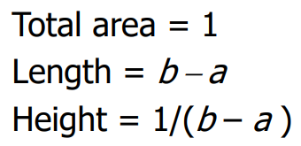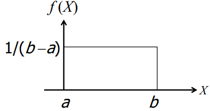
- $\therefore$ probability distribution function is $f(x) = \frac{1}{b-a}\text{ for } a \leq X\leq b$ otherwise, for any values $c$ and $d$ between $a$ and $b$
    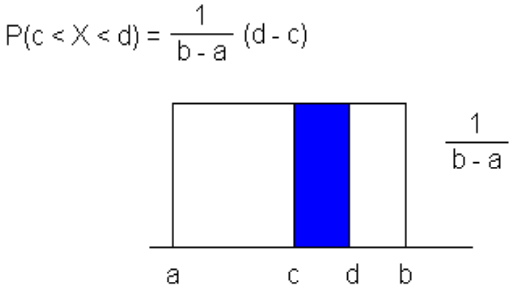
	- $E[X] = \int^{b}_{a}\frac{x}{b-a}dx = \frac{1}{b-a}\left[\frac{x^2}{2}\right]^b_a = \frac{b^2-a^2}{2(b-a)}=\frac{a+b}{2}$
	- $E[X^2] = \frac{1}{b-a}\int^b_a{x^2dx} = \frac{1}{b-a}\left[\frac{x^3}{3}\right]^b_a = \frac{b^3-a^3}{3(b-a)} = \frac{a^2+ab +b^2}{3}$
	- $Var[X] = E[X^2] - E[X]^2 = \frac{a^2+ab +b^2}{3} - \frac{(a+b)^2}{4} = \frac{(a-b)^2}{12}$
- **Important Formulas**
	- $E[X] = \int^{\infty}_{-\infty}{xf(x)}dx$
	- $Var[X] = \int^{\infty}_{-\infty}(x-\mu)^2f(x)dx = E[X^2] - E[X]^2$
## Exponential Continuous Distribution - Notation: $X\sim Exp(\lambda)$

- if the number of arrivals during an interval is **Poisson distributed**, then the interarrival times $x$ are exponentially distributed. The probability distribution function of $x$ is: $f(x) = \lambda e^{-\lambda x}$ where $\lambda$ is the mean arrival rate and the mean interarrival time is $\frac{1}{\lambda}$

**Proof:**
- $\text{let x = no. of arrivals in 1 unit interval} \to X\sim Pois(\mu),\newline \text{i.e. } P(X=x) = \frac{e^{-\mu}\mu^x}{x!} \newline \text{let w = first arrival time from ref t =0}\newline\text{w = interarrival time and we want to find the p.d.f. of w}\newline \text{C.D.F. of W:}\newline P(W\leq w) = 1-P(W>w) = 1-P(\text{no arrival in t} = (0, w]) = 1-e^{-\mu w}$
- $\therefore pdf = \frac{d}{dw}(1-e^{-\mu w}) = \mu e^{-\mu w}$ (pdf of r.v. with exponential distribution)
- **Important Formulas**
    - $E[X] = \frac{1}{\lambda}$
    - $Var[X] = \frac{1}{\lambda ^2}$

## Normal Continuous Distribution - Notation: $X\sim N(\mu, \sigma^2)$
- function is a bell-shaped (normal) curved), Probability Density Function depends on $\mu$ and $\sigma$ which is given by:
- $f(x) = \frac{1}{\sigma\sqrt{2\pi}}e^{-\frac{1}{2}\left(\frac{x-\mu}{\sigma}\right)^2},\text {where } -\infty<x<\infty$ (formula will be provided)
- $f(x)$ can also be written as $\frac{1}{\sigma\sqrt{2\pi}}e^{-\frac{1}{2}(Z)^2}$
- **the normal distribution has about 68% of the observations lying within one standard deviation ($\sigma$) of the mean, 95% within two standard deviations and 99.7% within 3 standard deviations**
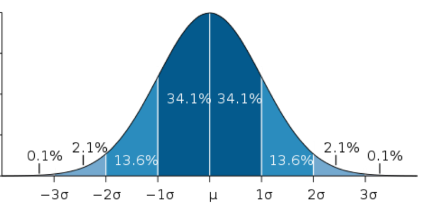

### Standard Normal Distribution
- to obtain the area under the density curve for a normal distribution, it is necessary to express any value of X in terms of the number of standard deviation units away from the mean, $\mu$.
	- i.e. $X = \mu + Z\sigma \to Z = \frac{X-\mu}{\sigma}$
	- $X$ is a random variable $\therefore Z$ is also a random variable
	- $\implies E[Z] = \frac{1}{\sigma}E[X] - \frac{1}{\sigma}\mu = \frac{1}{\sigma}\mu-\frac{1}{\sigma}\mu = 0$
	- $\implies Var[Z] = \frac{1}{\sigma^2}Var[X] = \frac{\sigma^2}{\sigma^2} = 1$
	- it can also be shown that $Z$ has a normal distribution and hence $Z\sim N(0,1)$ (standard normal distribution)
- to determine the probability of Z, we need to check the table given
	- table for $P(Z\leq z)$ is used for this course
	- area from $-\infty$ to $z$
- **$P(Z\geq 0)$ means probability of Z being greater than or equals to the mean**
	- for Z compared to negative values, we can do manipulation to find the area under the curve
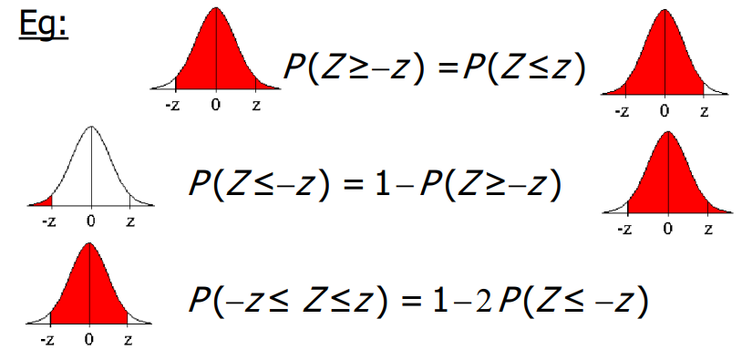

## Approximation to Binomial Distribution
- For a large n or p near 0.5, the binomial distribution approximately follows the normal distribution
- If $X\sim B(n,p)$ where $n$ is large and $p$ is not too near 0 or 1, then X can be approximated by a normal distribution with $E[x] = np$ and $var(X) = npq$
	- $Z = \frac{X-np}{\sqrt{npq}}$ is approximately $N(0,1)$
	- approximation is reasonably good when $np > 5$ and $n(1-p) > 5$
- **Continuity Correction** is required for more accurate values of binomial probabilities approximation
	- when an outcome $X$ is to be included in the probability calculation, the normal approximation uses either $(X-0.5)$ or $(X + 0.5)$
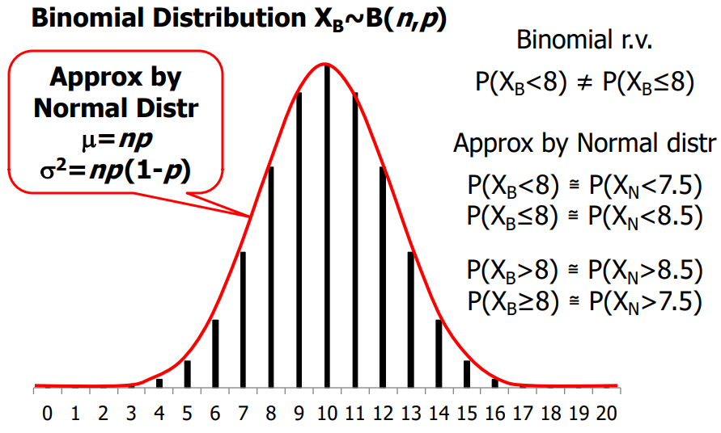
(for $P(X_B\leq 8)$ we want to include $X_N = 8$ so we use 8.5, similar for the others)