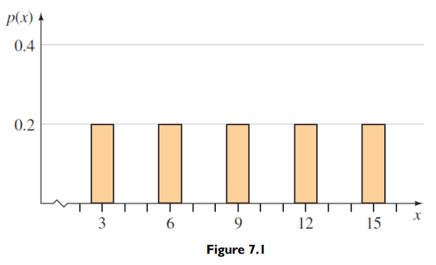
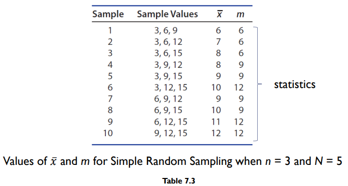
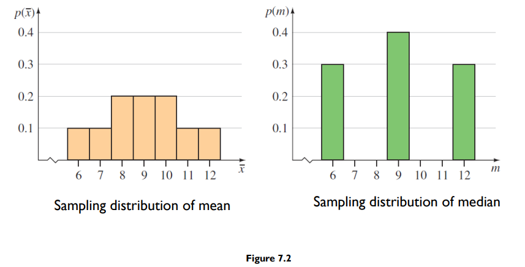
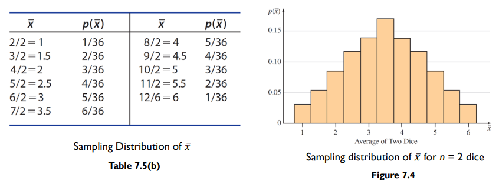
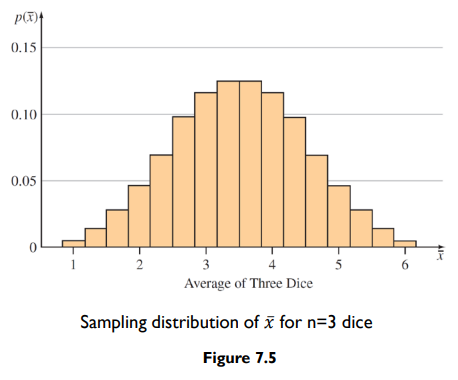
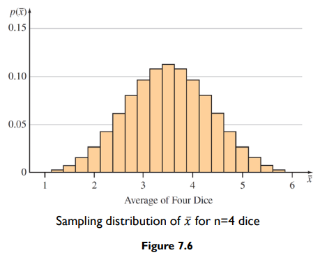

# Definition

- The sampling distribution of a statistics is the probability distribution for the possible values of the statistic that results when random samples of size n are repeatedly rawn from the population

# Sampling Distribution

- For the population above, we can get:
    - mean $\mu = \frac{3+6+9+12+15}{5} = 9$
    - median $M = 9$
- We can sample a size $n$ from the population to get the sample mean $\bar x$ and sample median $m$
    - e.g. taking a sample size of $n=3$ $10$ times, we can get the table of sampling statistics as shown
        
    - we can see that some values of $\bar x$ and $m$ appear more often compared to other values
    - sampling distribution of sampled values
        

# Central Limit Theorem

- Sums and means of random samples of measurement drawn from a population tend to have an approximately normal distribution (refer to the previous section where we see a close to normal distribution for sampling distribution)
    
- From dice sampling in lecture notes where we get two values from a fair dice and find the distribution (mean of both values) **we have 36 combinations for n = 2 which will result in the following distribution table (mean / probability)**
    
    
- When we increase n to 3 or 4, we get a sampling distribution graph which resembles closer to the normal distribution when n increases
    
    
- The Central Limit Theorem can be restated to apply to the **sum** of the sample measurements $\sum x_i$, which, as $n$ increases, also has an approximately normal distribution with mean $n\mu$ and standard deviation $\sigma\sqrt{n}$
    
- The Central Limit Theorem can be restated to apply to the **mean** of the sample measurements $\bar x$, which, as $n$ increases, also has an approximately normal distribution with mean $\mu$ and standard deviation $\frac{\sigma}{\sqrt{n}}$
    
- in both cases, mean($n\mu \text{ or } \bar x$) and variance ($\sigma ^2 n \text{ or } \frac{\sigma^2}{n}$) comes from the sample
    

## Sample Size required to use CLT

- For a **population following a normal distribution**
    - sampling distribution of $\bar x$ will always be normal no matter sample size $n$
- For a **population following a symmetric distribution**
    - sampling distribution of $\bar x$ is **approximately normal** for **relatively small values of $n$**
- For a **population following a skewed distribution**
    - **sampling size $n \geq 30$** before the sampling distribution becomes approximately normal

# Standard Error of Sample Mean

- Also called standard error of the estimator (SE) since it refers to the precision of the estimator,
    - $\text{SD of } \bar x \text{, given by } \sigma/\sqrt{n}$ is referred to as the standard error of the mean, $\text{SE}(\bar x), \text{ SEM, or SE}$

## Calculating Probabilities for the Sample Mean

- Assuming $\bar x$ is normal / approximately normal

1.  Find $\mu, \bar x, \sigma$ and calculate $\text{SE}(\bar x) = \sigma / \sqrt{n}$
2.  Compute z value
    - $z = \frac{\bar{x}-\mu}{\sigma / \sqrt{n}}$
3.  Using the normal table, get probability of $\bar x$

# Sample Distribution of Sample Proportion

- If a random sample of n observations is selected form a binomial population with a parameter $p$, then the sampling distribution of the sample proportion
    $\quad \hat{p}=\frac{x}{n}$
    will have a mean $p$ and standard deviation $\text{SE}(\hat p)=\sqrt{\frac{pq}{n}}\text{ where } q = 1-p$
    - $\hat{p}$ can be the percentage of success in sample while $p$ is the percentage success in population
    - when sample size $n$ is large enough such that $np > 5$ and $nq > 5$, the sampling distribution of $\hat{p}$ can be approximated by a normal distribution with mean $p$ and standard deviation $\sqrt{\frac{pq}{n}}$
    - if $np < 5$ or $nq < 5$, then it will be a right / left skewed distribution
    - difference of two normal distributions is also normal

## Calculating Probabilities for Sample Proportion $\hat{p}$

1.  Find values of $n$ and $p$
2.  Check whether the normal approximation to the binomial distribution is appropriate (recall $np > 5$ and $nq > 5$)
3.  Write down the event of interest in terms of $\hat{p}$ and locate the appropriate area on the normal curve
4.  Convert necessary values of $\hat{p}$ to z values using $z = \frac{\hat{p}-p}{SE(\hat{p})}$
5.  Use normal distribution table to calculate the probability