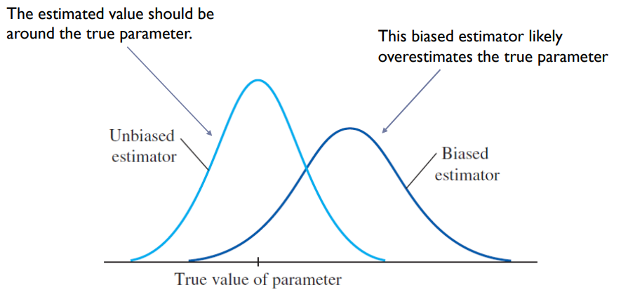
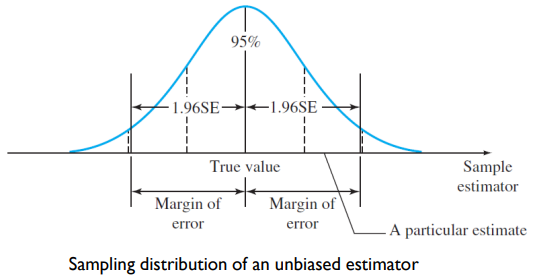
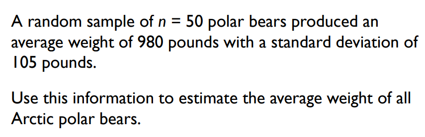
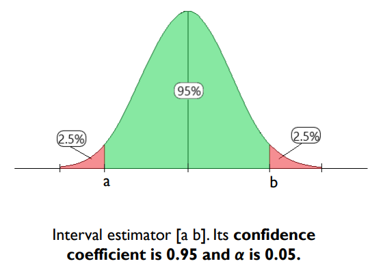
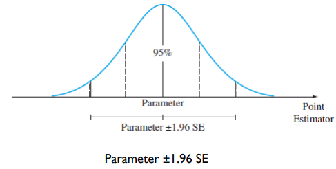
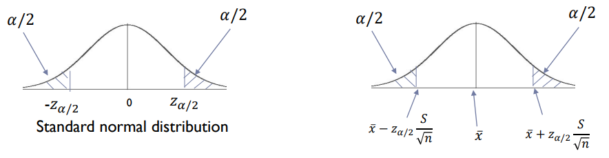
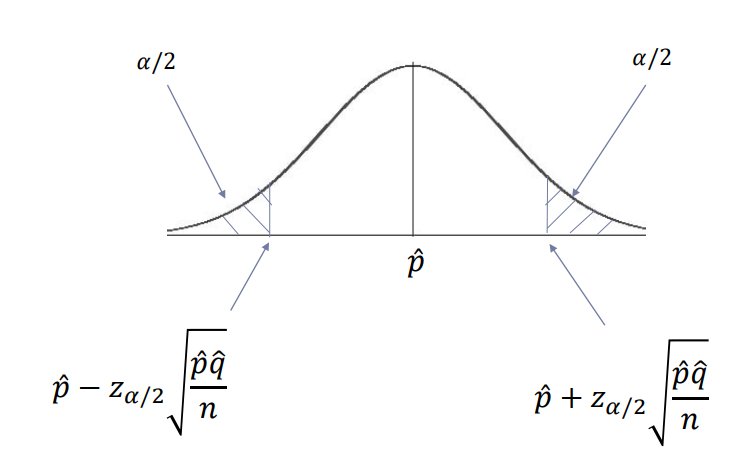

# 1\. Point Estimation

- An estimator is said to be unbiased if the mean of its distribution is equal to the true value of the parameter being estimated
    
    - variance of estimator's sampling should be as small as possible (i.e. the peak should be as sharp as possible)
- distance between estimate and the true value of the parameter is called the error of estimation (SE)
- **Margin of Error (95% margin of error)** provides a practical upper bound for the error of estimation (1.96 $\times$ SE of estimator)
    

## Estimation of population mean $\mu$ (quantitative population)

- point estimator $\bar x$ is unbiased with SE estimated as $SE=\frac{s}{\sqrt{n}}$ with the 95% margin of error when **n $\geq 30$** is estimated as $\pm1.96\left(\frac{s}{\sqrt{n}}\right)$

## Estimation of population proportion $p$ (binomial population)

- point estimator $\hat p = x/n$ is unbiased with SE estimated as
    $SE = \sqrt{\frac{\hat p\hat q}{n}} \text{ (note: }\hat p\text{ not } p)$ with the 95% margin of error estimated as $\pm1.96\sqrt{\frac{\hat p\hat q}{n}}$ when **$n\hat p>5$ and $n\hat q > 5$**.

$\bar x = 980\quad n=50\quad s=105\\\text{margin of error is estimated as } 1.96\text{SE}=1.96\left(\frac{105}{\sqrt{50}}\right) = 29.10\approx 29\text{pounds}$

- we can be fairly confident that the sample estimate of 980 pounds is within $\pm29$ pounds of the population mean
- **$\bar x$ is always unbiased**

# 2\. Interval Estimation

- A rule for calculating two numbers to create an interval that has a high probability of containing the parameter of interest measured using the **confidence coefficient**
- **Confidence Coefficient** is the probability that a confidence interval will contain the estimated parameter and is designated by $1-\alpha$
    

## Generating Confidence Interval

- Can be constructed when sampling distribution of a point estimator is approximately normal
    
- In the previous section we know that selecting random values of the point estimator has a 95% chance of lying in the interval 'Parameter $\pm 1.96$ SE'
- Since we do not know the value of the parameter, we instead use the term 'Point Estimator $\pm 1.96$ SE' which has the same width as the first interval but has a center that can be varied
- To generate the lower confidence limit (LCL) and upper confidence limit (UCL)
    - $\text{(Point Estimator)}\pm z_{\alpha/2}\times\text{(Standard Error of the Estimator)}$
    - where $z_{\alpha/2}$ is the z-value with an area $\alpha/2$ in the right tail of the standard normal distribution

# 3\. Interpreting Confidence Level \[a,b\]

- A good confidence interval
    - **is as narrow as possible** \- implies how close the estimated parameter is (i.e. how spread out the values are for the confidence level)
    - **has a large confidence coefficient ($1-\alpha$) (near 1)** \- larger coefficient implies interval contains the estimated parameter

## Large Sample Confidence Interval for a Population Mean $\mu$

### Method 1

- Use sample mean $\bar{x}$ as point estimator for the population mean $\mu$ when sample size is large
    - sampling distribution is approximately normal $\therefore$ can be used to construct a confidence interval according to the previous sections
- To generate LCL and UCL
    - $\bar{x}\pm z_{\alpha/2}\frac{\sigma}{\sqrt{n}}$
    - where $n$ is the sample size and $\sigma$ = S.D. of the sampled **population**
    - if $\sigma$ is unknown, it can be approximated by the **sample S.D** $s$ when the sample size is large enough **$n \geq 30$** with the formula $\bar{x}\pm z_{\alpha/2}\frac{s}{\sqrt{n}}$

### Method 2

- begin with the statistic $z = \frac{\bar x-\mu}{\sigma/\sqrt{n}}$ which has a standard normal distribution
    - we can then infer that $P\left(-z_{\alpha/2}<\frac{\bar x-\mu}{\sigma/\sqrt{n}}<z_{\alpha/2}\right) = 1-\alpha$
    - rewriting, we get $P\left(\bar x-z_{\alpha/2}\frac{\sigma}{\sqrt{n}}<\mu<\bar x+z_{\alpha/2}\frac{\sigma}{\sqrt{n}}\right) = 1-\alpha$
- $\bar x-z_{\alpha/2}\frac{\sigma}{\sqrt{n}}$ and $\bar x+z_{\alpha/2}\frac{\sigma}{\sqrt{n}}$, are random quantities that depend on the sample mean $\bar x$
    - in repeated sampling, the random interval, $\bar x \pm z_{a/2}(\sigma/\sqrt{n})$ will contain the population mean $\mu$ with probability $(1-\alpha)$

## Large Sample Confidence Interval for a Population Proportion $p$

- When the sample size $n$ is large, the sample proportion $\hat p = \frac{\text{total no. of successes }(x)}{\text{total no. of trials }(n)}$ is the best point estimator for the population proportion $p$
    - sampling distribution is approximately normal with mean $p$ and $SE = \sqrt{\frac{pq}{n}}$ so we can use $\hat p$ to construct a confidence interval
- To generate LCL and UCL
    - $\hat p \pm z_{\alpha/2}\sqrt{\frac{pq}{n}}$
    - since $p$ and $q$ are unknown, they are estimated using the (best) point estimators $\hat p$ and $\hat q$, assuming $n\hat p > 5$ and $n\hat q>5$
        