# 1\. Statistical Test of Hypothesis

1.  Null Hypothesis ($H_0$)
2.  Alternative hypothesis ($H_a$)
3.  Test statistic and $p$-value
4.  Significance level and rejection region
5.  Conclusion

- Two competing hypotheses are the alternative hypothesis (hypothesis that researcher wishes to support) and the null hypothesis (contradiction of alternative hypothesis)

## Steps to test hypothesis

1.  Begin by assuming $H_0$ is true
2.  Try to show $H_0$ is false to show support for $H_a$ using sample data
3.  Draw one of the conclusion:
    - reject $H_0$ and conclude $H_a$ is true
    - do not reject $H_0$

For example:
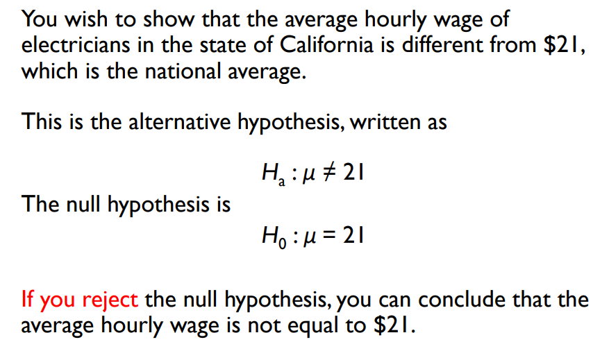

- To decide whether to reject $H_0$, we can use two pieces of information calculated from a sample, drawn from the population of interest
    - test statistic - single number calculated from sample data (based on best estimator for parameter to be tested)
    - $p$-value - **probability value** calculated from test statistic

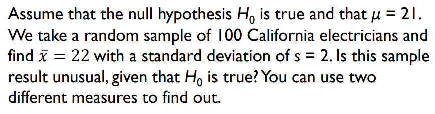
$\text{we see that }\bar x\text{ follows a normal distribution (CLT, n > 30)}\\\therefore SE(\bar x) = \frac{\sigma}{\sqrt{n}} = \frac{2}{\sqrt{100}} = 0.2\\\text{doing the z test, we see that } z=\frac{22-21}{0.2}=5\\\implies\bar x\text{ lies 5 standard deviations above the mean hypothesised by } H_0 = 21$
$\text{We can also conduct the } p\text{-value test which is calculated by}\\p\text{-value} = P(z>5) + P(z<-5) \approx 0 \\\implies \text{assumption that }H_0\text{ is true should be rejected}$
i.e. if null hypothesis is true, then it is very unlikely that we get $\bar x= 22$ for a random sample of 100 California electricians

## Level of Significance $\alpha$

$\alpha = \text{P(falsely rejecting } H_0)$

- represents the maximum tolerable risk of incorrectly rejecting $H_0$, with $\alpha$, the rejection region can be set to allow researcher to reject $H_0$ with a fixed degree of confidence in the decision

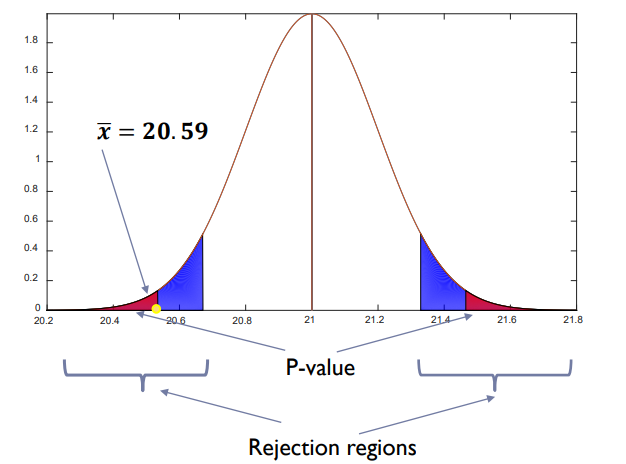

- $\alpha$ gives the blue regions in the above graph, for a two-tailed test, alpha will be split into half
- if $p\text{-value} < \alpha$ we reject null hypothesis $H_0$

## Test Essentials

- $\bar x$ is the best estimate of actual $\mu$ which is given in the question. If $H_0$ is true and $\mu = \mu_0$ then $\bar x$ should be close to $\mu_0$ otherwise $H_a$ might be true
    - i.e. reject $H_0$ for $H_a$
- when $n$ is large, $\bar x$ follows a normal distribution
- number of standard deviations that $\bar x$ lies from $\mu_0$ can be measured using the formula $z = \frac{\bar x - \mu_0}{s/\sqrt n}$ which is approximately normal when $H_0$ is true and $\mu = \mu_0$
- **rejected region** consists of values of z which are larger / smaller than desired
    - this value of z is called the critical value

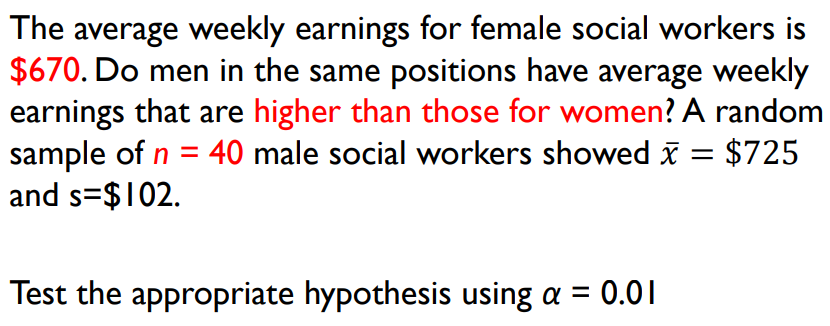
$H_0 : \mu = 670,\quad H_a:\mu>670\\z \approx \frac{\bar x - 670}{s/\sqrt{n}} = \frac{725-670}{102/\sqrt{40}} = 3.41\\\text{Rejection region: When }\alpha = 0.01, z_{0.01} = 2.33 \therefore \text{ Reject when z > 2.33}\\\because z = 3.41, H_0 \text{ is rejected.}$
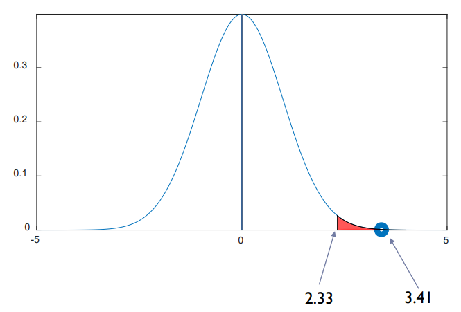
(this is a one tail test so we take $\alpha / 2 = 0.01$ from the table (appendix B)
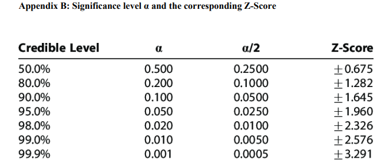
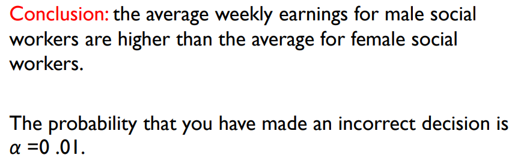

## Calculating p value

- Whether we reject null hypothesis depends on what the acceptable region $\alpha$ is given
- $p$-value (observed significance level) is instead used to prevent ambiguity in conclusion
    - smallest value of $\alpha$ for which $H_0$ can be rejected
- if $p$-value $\leq \alpha$ then null hypothesis can be rejected, and you can report that the results are statistically significant at level $\alpha$

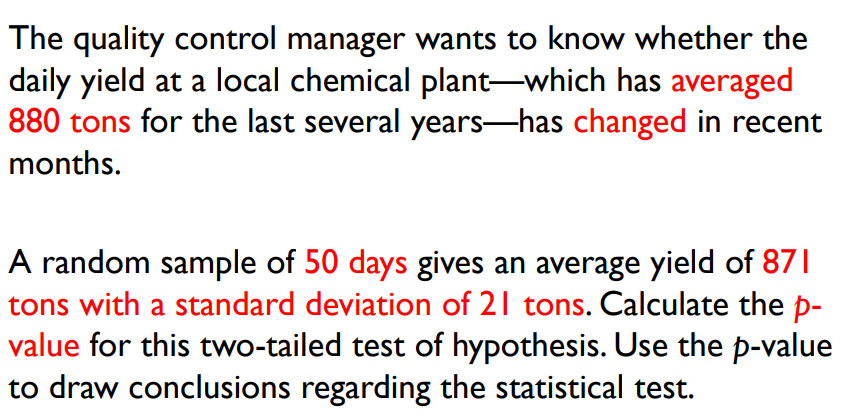
$\bar x \text{ follows approximately a normal distribution since n > 30 (CLT)} \\z = \frac{\bar x - \mu}{s/\sqrt{n}} = \frac{871-880}{21/\sqrt{50}} = -3.03\\\therefore\text{the smallest rejection region is } z < -3.03 \text{ or } z > 3.03\\p\text{-value} = P(z > 3.03) + P(z < -3.03) = 1.-0.9988 + 0.0012 = 0.0024\\\text{if this p-value} \leq \alpha, H_0 \text{ can be rejected}$

- we can reject the null hypothesis if $\alpha = 0.01$ or $\alpha = 0.05$

## Error Types

### Type 1: reject $H_0$ when it is true

- probability of making a type 1 error is denoted by $\alpha$

### Type 2: accept $H_0$ when it is false

- probability of making a type 2 error is denoted by $\beta$

# 2\. Hypothesis for the Difference between two population means

- If n is large, $\bar x_1 - \bar x _2$ follows an approximate normal distribution (CLT) with mean $(\mu_1 - \mu_2)$ and standard error $\sqrt{\frac{\sigma_1 ^2}{n_1} + \frac{\sigma_2 ^2}{n_2}}$ estimated by $\sqrt{\frac{s_1 ^2}{n_1} + \frac{s_2 ^2}{n_2}}$

### Testing procedure

1.  Null hypothesis $H_0 : (\mu_1 - \mu_2) = D_0$ (some specified difference you wish to test, usually 0)
2.  Alternative hypothesis
    - One-Tailed Test - $H_a : (\mu_1 - \mu_2) > D_0$ or $H_a : (\mu_1 - \mu_2) < D_0$
    - Two-Tailed Test - $H_a : (\mu_1 - \mu_2) \neq D_0$
3.  Test statistic
    - $z \approx \frac{(\bar x_1 - \bar x_2) - D_0}{SE} = \frac{(\bar x_1 - \bar x_2) - D_0}{\sqrt{\frac{s_1 ^2}{n_1} + \frac{s_2 ^2}{n_2}}}$
4.  Rejection region
    - One-Tailed Test - $z > z_a$ or $z < -z_a$ depending on $H_a$ or when $p$-value $< \alpha$
    - Two-Tailed Test - $z > z_{a/2}$ or $z < -z_{a/2}$

**Assumption:** sample size $n_1$ and $n_2$ are $\geq 30$
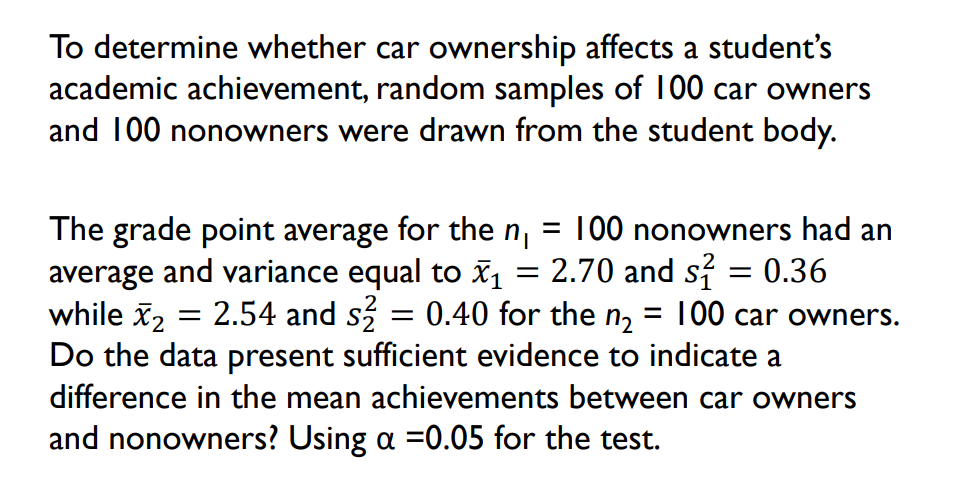
$H_a \neq 0 \quad H_0 = 0, \\\frac{(\bar x_1 - \bar x_2) - D_0}{\sqrt{\frac{s_1 ^2}{n_1} + \frac{s_2 ^2}{n_2}}} = \frac{(2.70 - 2.54) - 0}{\sqrt{\frac{0.36}{100} + \frac{0..40}{100}}} = 1.84$

- **Two approaches to continue**
    - critical value: using a two-tailed test with significance level $\\\alpha = 0.05, \to \alpha/2 = 0.025.$ From table we see that critical value is 1.96 so we reject $H_0$ if $|z| > 1.96 \\\because 1.84 < 1.96,$ we do not reject $H_0$
    - $p$-value: calculate the $p$-value which is equals to $\\P(z>1.84) + P(z<-1.84)\\=(1-0.9671) + 0.0329 = 0.0658 > \alpha = 0.05$ so we cannot reject $H_0$

# 3\. Hypothesis Testing and Confidence Intervals

- If hypothesised values lies outside of the confidence limits (confidence interval) $1.96SE$, then the null hypothesis is rejected at the $\alpha$ level of significance

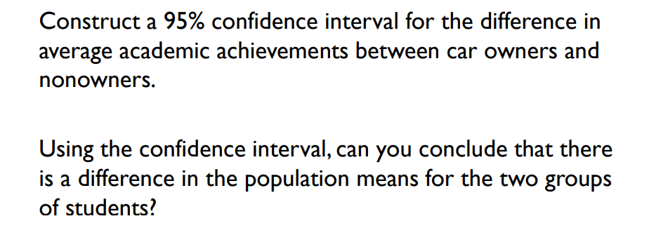

- from large sample estimation we know that the difference in two population means will have its confidence interval approximated as
    $(\bar x_1 - \bar x_2) \pm 1.96SE = (\bar x_1 - \bar x_2) \pm 1.96\sqrt{\frac{s_1 ^2}{n_1} + \frac{s_2 ^2}{n_2}}\\e.g.\quad (2.70-2.54) \pm 1.96\sqrt{\frac{0.6 ^2}{100}+ \frac{0.2 ^2}{100}} = 0.16 \pm 0.17\\i.e. \quad -0.01 < (\mu_1-\mu_2) < 0.33\\ \text{since hypothesised difference = 0 is contained in the range (confidence interval), }\\ H_0 \text{ should not be rejected.}\\\text{since the confidence interval contains -ve, +ve, and 0, there is not enough evidence}\\\text{to indicate that there is a difference.}$

# 4\. Hypothesis Testing for Binomial Proportion

- we have learnt that if n is large enough such that $np_0 > 5$ and $nq_0 > 5$, $\hat p$ follows an approximate normal distribution (CLT) with mean $p$ and standard error
    $\quad SE = \sqrt{\frac{p(1-p)}{n}}$

### Testing Procedure

1.  Null hypothesis $H_0 : p = p_0$
2.  Alternative hypothesis
    - One-Tailed Test - $H_a : p > p_0$ or $H_a : p < p_0$
    - Two-Tailed Test - $H_a : p \neq p_0$
3.  Test statistic
    - $z = \frac{\hat p - p _0}{SE} = \frac{\hat p - p_0}{\sqrt{\frac{p_0q_0}{n}}}\text{ with } \hat p = \frac{x}{n}$ where x = number of successes in n trials
4.  Rejection region
    - One-Tailed Test - $z > z_a$ or $z < z_a$ depending on $H_a$ or when $p$-value $< \alpha$
    - Two-Tailed Test - $z > z_{a/2}$ or $z < -z_{a/2}$

**Assumption:** \- sampling satisfies assumption of binomial experiment and $n$ is large enough such that distribution of $\hat p$ can be approximated by a normal distribution

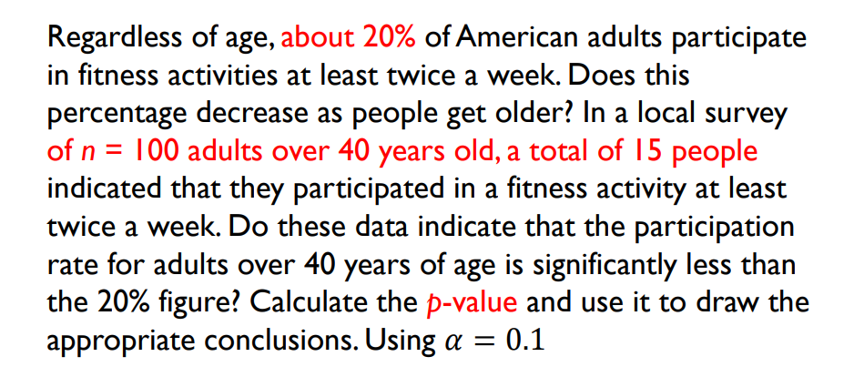
$\text{assume true value of p is } p_0 = 0.2\\\text{from text, } H_0:p =0.2, H_a:p < 0.2, \hat p = \frac{15}{100} = 0.15\\\text{test statistic : } \frac{\hat p - p_0}{\sqrt{\frac{p_0q_0}{n}}} = \frac{0.15-0.20}{\sqrt{\frac{(0.20)(0.80)}{100}}} = -1.25\\\text{from standard normal distribution table, } P(z < -1.25) = 0.1056 > \alpha = 0.1$

- therefore we do not reject the null hypothesis since there is insufficient evidence to conclude that the percentage of adults over age 40 who participate in fitness activities twice a week is less than 20%

# 5\. Statistical Significance and Practical Importance

- when sample size used for hypothesis testing is changed, the standard error will change accordingly
- e.g. for the previous question if sample size n = 400 instead of n = 100, $p$-value will be calculated as 0.0062 < $\alpha = 0.1$
    - there is sufficient evidence to indicate that percentage of adults aged $\geq 40$ who participate in physical fitness is less than 20%
- however in practical sense, it would only be a concern if there is a drop of more than 10% in physical activity, which would imply that the true value of $p$ was less than 0.10
    - to find the largest value of $p$, we use a 95% confidence interval
    - $\hat p \pm z_{a/2}\sqrt{\frac{\hat p\hat q}n} = 0.15 + 1.645\sqrt{\frac{0.15\times 0.85}{400}} = 0.15 \pm 0.029\\\text{confidence range of p-value = } [0.121, 0.179] > 0.10$
    - physical activity for adults aged $\geq 40$ has dropped from 20% but you cannot say that it has dropped more than 10%. Even though results are statistically significant, they are not practically important