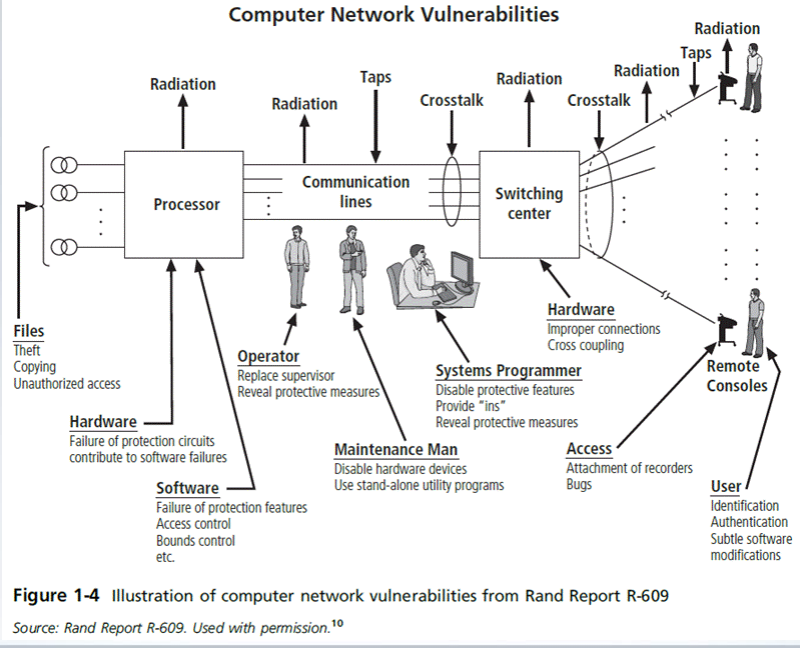
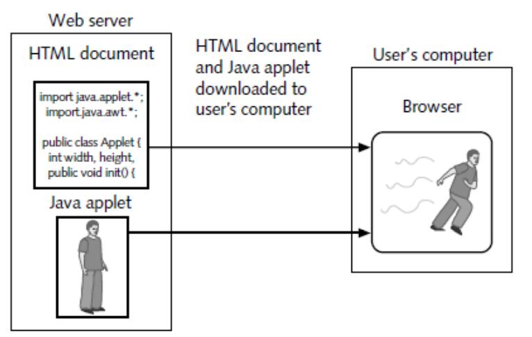
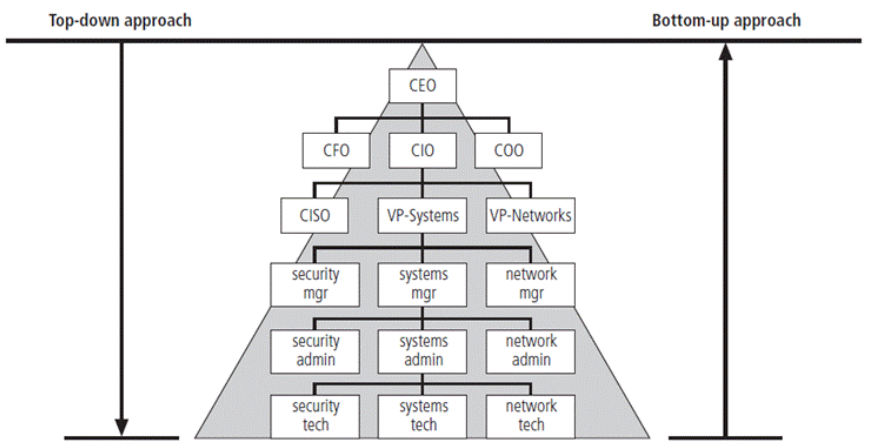

# Information Security

## Definition (Important!!!)

- Defending information from unauthorized access, use, disclosure, disruption, modification, or destruction.

## History of Information Security

- Cybersecurity began after the first mainframes were developed
- Early example: Enigma used in WW2 (Nazi)
- Physical Security was the most important in the past
- Fundamental problems with ARPANET
    - No safety procedures for dial-up connections to ARPANET
    - Non-existent user identification and authorization to system (anyone can use)
- Rand Report R-609: identified the role of management and policy issues in computer security
- Computer Security grew from physical security to include:
    - Securing the data
    - Limiting random and unauthorized access to data
    - Involving personnel from multiple levels of the organization in information security
        

## MULTICS (Multiplexed Information and Computing Sevice)

- First OS created with security integrated into core functions
- Several MULTICS key players created UNIX (primary purpose = text processing)

## History of InfoSec (cont)

- Security was of low priority during the 1990s to 2000s when the Internet became a network connecting people together
- Security of data in a computer was affected by security of every computer to which it is connected (present)
- Growing threat of cyber attacks
    - Increased awareness of need for improved security
    - Nation-states engaging in information warfare

## Components of an Information System

- Information System is an entire set of components necessary to use information as a resource in the organization
- Software (OS/App)
- Hardware
- Data (Information)
- People (logic bomb (insider), hackers, users)
- Procedures (backups, patches)
- Networks (server, routers, DNS, NAT, access points)

## Security Layers

1.  Operations (outermost)
2.  Physical infrastructure
3.  People
4.  Functions
5.  Communications
6.  Information (innermost)

## Definition of Security (Important!!!)

- Protection of information and its critical elements, including systems and hardware that use, store, and transmit that information.
- Covers information security management, data security, and network security
- **C.I.A. triangle (Will be tested!!!)**
    - Confidentiality - student grades
        - Quality or state of preventing disclosure or
            exposure to unauthorized individuals or systems.
    - Integrity - patient information
        - Quality or state of being whole, complete, and
            uncorrupted. The integrity of information is threatened when the
            information is exposed to corruption, damage, destruction, or other
            disruption of its authentic state.
    - Availability (of Server / disrupted with DDOS) - authentication services
        - Enables users who need to access information to do so
            without interference or obstruction and to retrieve that information in the
            required format.
    - Expanded model consists of a list of critical characteristics of information
- Objective is to preserve the C.I.A. of information system resources:
    - Software
    - Firmware
    - Information/data
    - Telecommunications

## Threats and Attacks

- Intentional (Hackers)
- Unintentional (Natural Causes)
- Passive (Snooping/eavesdropping/server traffic analysis)
- Active (modification, masquerading, replaying or repudiation)
- Direct (Hacker PC)
- Indirect (DDoS)
- Confidentiality threat
    - Snooping/Eavesdropping
    - Server Traffic Analysis
- Integrity threat
    - Modification
    - Masquerading
    - Replaying
    - Repudiation
- Availability threat
    - DDoS
- A **repudiation attack** happens when an application or system does not adopt controls to properly track and log users’ actions, thus permitting malicious manipulation or forging the identification of new actions. This attack can be used to change the authoring information of actions executed by a malicious user in order to log wrong data to log files. Its usage can be extended to general data manipulation in the name of others, in a similar manner as spoofing mail messages. If this attack takes place, the data stored on log files can be considered invalid or misleading.

# Internet

## How it works

1.  Client makes a query (eg search for something on google)
2.  Query gets sent to the server for handling
3.  Server will run query against a database
4.  Database will respond to server with required data from query
5.  Server will render result and display to the Client

## Packets

- TCP (Transmission Control Protocol) - resends if lost
- UDP (User Datagram Protocol) - will not resend even if lost

## Webpage programming security (important)

1.  Client sends requests to server
2.  Server responds and Client downloads all the webpages (/index, etc) into cache
3.  Active programs (applets) downloaded together with data gets run Client-side
    

## Information Security Implementation (important)

- Bottom-Up (not preferred)
    - Begins at grassroot level where sys admins attempt to improve security of their systems
    - Main advantage is the ability to tap on the technical expertise of individual admins
    - Seldom works because does not have: Participant Support & Organization Staying Power
- Top-Down (preferred)
    - Begins at upper management level
    - Issue policy, procedures, processes
    - Dictate goals and expected outcomes of projects
    - Determine accountability for each required action
        

## Data Responsibilities

- Data Owner - senior management responsible for the security and use of a particular set of information (data)
- Data Custodian - responsible for information and systems that process, transmit, and store it
- Data Users - individuals with an information security role

## Important stuff for Exams

- CIA
- Threats and attacks
- Fine balance
- Bottom Up vs Top-Down
- Art, Science or Social Science