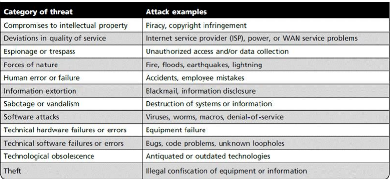

# The Need for Security (A lot of Questions from this Chapter)

- Primary aim is to ensure the safety and usefulness of information assets (information and systems that house the information)
- Performs four important functions (Business Needs First; Human Lives still above all)
    - Protecting the functionality of an organisation
    - Protecting data and information an organisation collects and uses
    - Enabling the safe operation of applications running on the organisation's IT systems
    - Safeguarding the organisation's technology assets

### Protecting the Functionality of an Organization

- Management is responsible for facilitating security program
- Implementing info sec is more a management issue than technology
- Info sec should be addressed in terms of business impact and the cost of business interruption

### Protecting Data that Organizations Collect and Use

- When an organization loses its data, it loses transactions and ability to deliver value to customers
- Critical aspect of info sec is to protect data in transmission, processing, and at rest

### Enabling the safe operation of applications

- Orgs. need an environment that safeguards the operation of applications
- Management oversees the infrastructure once in place

### Safeguarding Tech Assets in Orgs.

- Secure infrastructure hardware must be appropriate to size and scope of org.
    - more services may be needed as the org grows

## Threats

- Potential risk to an asset's loss of value
- Management must stay informed about various threats to an organization's people, applications, data and information systems
    

## Intellectual Property Breach

- Intellectual Property refers to the **creation, ownership, and control** of original ideas as well as the representation of those ideas
    - Software piracy is the most common Intellectual Property breach

## Quality of Service

- Depends on the successful operation of many interdependent support systems
- Availability greatly affected by internet service, communications, and power irregularities
- Internet service issues
    - Outsourced host provider responsible for all Internet services as well as for the hardware and website OS software
- Other service provider issues
    - Utility - telephone, water etc
    - Loss of these services can affect ability to function
- Power irregularities
    - fluctuations - power excesses/shortages/loss
    - sensitive electronic equipment vulnerable easily damaged/destroyed

## Espionage (spying) / Trespass

- Unauthorized access of protected information
- Competitive intelligence (**legal**) vs Industrial espionage (**illegal**)
- Shoulder surfing
- Controls let trespassers know they are encroaching
    - hackers use skill, guile, fraud to bypass such controls
- Expert hacker (**Tested in exams**)
    - Develop software scripts and program exploits
    - A master of many skills, especially in programming
    - Create attack software (malware) and share with others
- Unskilled hacker / Script kiddies (**Tested in exams**)
    - Many more unskilled hackers than expert hackers
    - Use expertly written software to exploit a system
    - Do not usually fully understand the systems they hack
- Other terms:
    - Crackers - crack/remove software protection designed to prevent unauthorized duplication
    - Phreaker - hacks the public telephone system to make free calls / disrupt services
- Password attacks
    - Cracking, Brute-force, Dictionary, Rainbow tables, Social engineering

## Human Error or Failure

- Acts performed by employees without malicious intent or in ignorance
- Caused by **inexperience, improper training, incorrect assumptions**

## Social Engineering (important)

- Social engineering uses social skills to convince people to reveal access credentials or other valuable information to an attacker
- Advance-fee fraud
- Phishing
- Network intrusion technique based on trickery
- Victims tricked into revealing access codes, passwords or other confidential information and break into a system
- Elaborate term for fraudulently obtaining information to gain access
- Human tendencies manipulated (greed and trust)

## Information Extortion

- Steal information from a computer system and then demands compensation for its return or nondisclosure (wannacry / ransomware)

## Sabotage / Vandalism

- Petty vandalism / website defacing / organized sabotage
- Erodes consumer confidence $\to$ diminishing organization's net worth and reputation

## Software Attacks (important)

- Malicious software (**Malware**) used to overwhelm processing capabilities of a system or to gain access to protected systems
- Occurs when an individual / group designs and deploys malwares to attack a system
- **Virus** \- Code segments that attach to existing program and take control of access to the targeted computer.
    - a program that piggybacks on other executable programs
    - not structured to exist by itself (needs a host)
        - Virus is executed together with the host
    - Spread to other programs/disks; delete files; cause systems to become unusable
    - **Ways of transport** \- Contaminated Media, Email / Peer-to-Peer sites, part of another program
    - Types
        - Armoured (**Urgent Detection Required**)
            - difficult to detect / analyse
            - shielded behind protective code that prevents debuggers / disassemblers from examining critical elements of the virus
            - some parts of the code may act as decoy
        - Companion
            1.  attaches itself to legitimate program then creates another program with a different filename extension
                - user executes the virus instead of legitimate program accidentally
            2.  makes changes to program pointers in the registry so the pointer points to the infected program
                - infected program will execute the virus before running the real program
        - Macro
            - exploits the enhancements made to many applications
            - infects macros of programs such that the related documents are infected and spread to other system when attached as documents in emails
        - Multipartite
            - attacks system in multiple ways (infecting boot sector, executable files, destroy application files at the same time)
            - victim unable to correct all the problems and infestation will continue
        - Phage
            - modifies other programs and databases
            - need to reinstall to remove virus
        - Polymorphic
            - changes form in order to avoid detection
            - changes signature / encrypts / mutate itself to hide from antivirus programs
        - Retro
            - bypasses the antivirus program
            - directly attack the antivirus program
            - destroy the virus definition database file
            - leave you with a false sense of security
        - Stealth
            - hides from antivirus program by masking itself from application
            - may attach to boot sector
            - redirect commands to avoid detection
            - move around from file to file during a virus scan to avoid detection
    - some viruses destroy the target system immediately
    - some uses the victim system as a carrier to infect other servers, shared files and other resources in a network before infecting the original victim's system and destroying it completely
- **Worms** \- Replicate themselves until they completely fill available resources such as memory and hard drive space
    - program that crawls itself from system to system without any assistance of its victims
    - spreads and replicates on its own
    - **system vulnerabilities** get the worm started
- **Trojan** \- Disguised as helpful, interesting or necessary pieces of software
    - program that hides malicious nature behind a façade of something useful
    - complete and self-contained program
    - may contain mechanism to spread itself
- **Logic Bomb (not a virus) (insider job)**
    - Program of snippet of codes that execute when a certain predefined event occurs
        - certain dates / set of circumstances
        - sends a message back to the attacker / launch an attack such as DDoS / grant access to the victim system
- **Polymorphic Threat**
    - evolves to elude detection
- **Virus and Worm hoaxes**
    - non-existent malware that gets spread around, creating panic and wasting time
- **Back-door**
    - gaining access to system or network known or previously unknown
- **DDoS**
    - attacker sends a large number of connections / requests to a target which overloads it and disable its ability to respond to legitimate requests for service
    - coordinated stream of requests launched against a target from many locations simultaneously
- **Mail Bombing**
    - attacker routes large quantities of e-mail to target to overwhelm the receiver
- **Spam**
    - more of a nuisance than an attack, used as a vector for some attacks
- **Packet sniffer**
    - monitors data travelling over network
    - used for both legitimate management purpose and for stealing information from a network
- **Spoofing**
    - technique used to gain unauthorized access
- **Pharming**
    - attacks a browser's address bar to redirect users to illegitimate sites for the purpose of obtaining private information
- **Man-in-the-Middle**
    - attacker monitors the network packets, modifies them and inserts them back into the network

## Technical Hardware Failures / Errors

- Occurs when a manufacturer distributes equipment containing a known / unknown flaw
- Errors can be terminal and intermittent
- **Mean time between failure measures the amount of time between hardware failures**

## Technical Software Failures / Errors

- Large quantities of software and published etc before all bugs are detected and resolved.
- Combination of certain software and hardware can reveal new software bugs

## Software Vulnerability (Important)

- Attacker finds the vulnerability before developer finds / fixes it
    - or is aware of but neglected (due to an internal assessment of the threat's potential damage costs being lower than the costs of developing a fix)
    - or is unable to fix
- Attacker writes/uses/distributes exploit
- Dev / public becomes aware of the exploited vulnerability and the dev is forced to start working on a fix (**patch**)
- **Zero Day** (or zero-hour / day zero) attack
    - developers had zero day to patch
    - once a patch is available, no longer a 'zero-day exploit'
- Many victims did not install patches even though it was made known
    - patches cannot be installed without first verifying that the 'fix' won't cause more damage than hackers
    - patches can destroy important computer applications

### Vulnerability Window

- average vulnerability window of a zero-day exploit is about 10months
- analysing the patch just released, attackers can more easily figure out how to exploit the underlying vulnerability, and attack the systems that have not yet been patched
- some vulnerability windows may never be closed
    - requires replacement or installation of additional hardware

## Problem areas in Software Dev

- Trusting network address resolution
- Unauthenticated key exchange
- Use of magic URL

## Other types of attacks

- **Spyware** \- gathering information about a person or organization without their knowledge
    - may send information to another entity without consent
    - may assert control over a computer without the owner's knowledge
    - **4 types**: system monitors, trojans, adware, cookies
- **Computer and Network Surveillance** \- monitoring of computer activity, data stored on hard drive, or data being transferred over networks
    - recognize and monitor threats
    - maintain social stability
    - prevent and investigate criminal activity
- **Browser Hijacking** \- modification of web browser's settings without the user's permissions
    - some can be easily reversed by reinstalling the browser
- **Theft** \- illegal taking of another's physical, electronic, or intellectual property
    - physical theft is easily controlled, electronic theft is more complex

## Antivirus

**2 common methods (important)**

- **Signature** \- unique string of program that cannot be found in other legitimate programs
    - protected only from viruses / worms in the antivirus signature list in their most recent virus / worm definition update
    - need to constantly update antivirus software (not protected by new viruses / worms)
- **Heuristic algorithms** \- using artificial intelligence on common virus / worm behaviours
    - False positives can be disruptive, especially in a commercial environment

### How the antivirus works

- If possible, cleaning the virus from the file without damaging the file (ideal)
- Quarantine the infected file
- If above options cannot work, then file has to be deleted