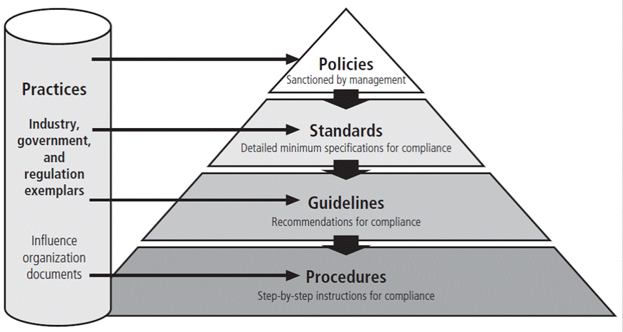
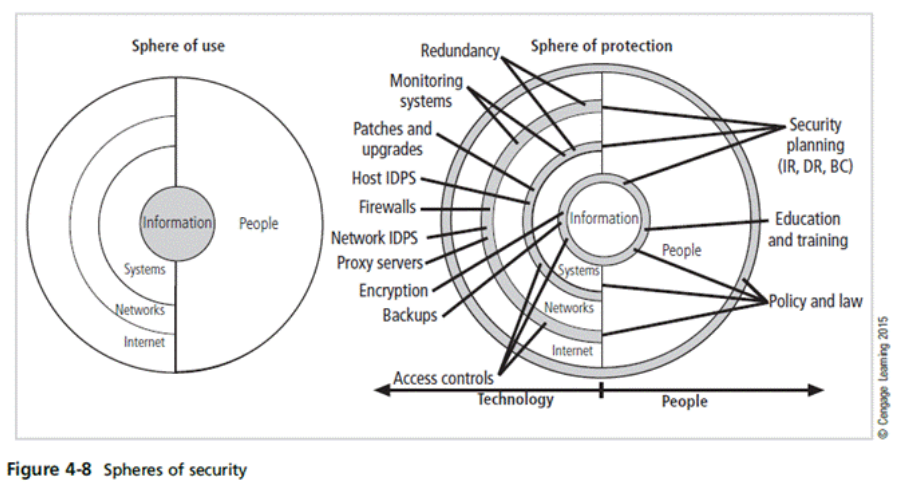
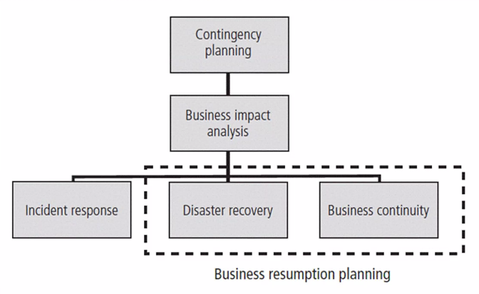
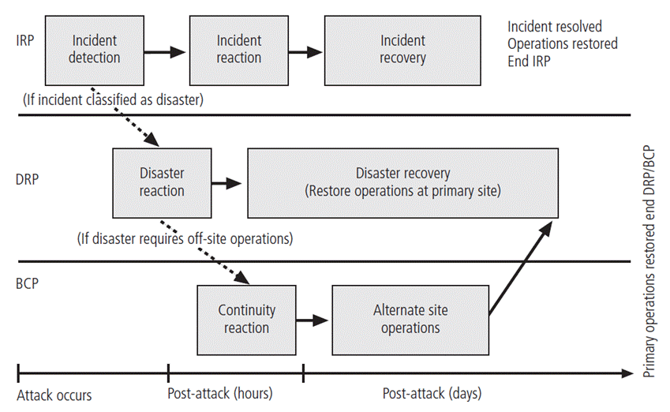

# Introduction

Must understand the scope of an organization's legal and ethical responsibilities

- to minimize liabilities, information security practitioner must:
    - understand the current legal environment
    - stay current with law and regulations
    - watch for new and emerging issues

# Threats from Lawyers (Important)

**Lawyers take legal action against an individual or organization**

- Legal action may be on behalf of employees, customers, business partners, shareholders, or government
- Risks result from
    - failure to protect customer data
    - illegal/irresponsible/ignorant/unethical behavior of employees
- Even though the potential for damage from hackers is more evident, **victims do not file lawsuits for**
    - harassment / discrimination
    - privacy invasion
    - disclosure of confidential information
    - copyright infringement
    - investment fraud

# Liability Exposure

Unnecessary risk that an organization exposes itself to when it fails to take action to prevent harm

## Sources of Liability Exposure

• networked computers
• email and instant messaging
• ecommerce websites
• client records on databases
• automated transactions
• digital signatures
• electronic contracting

# Law and Ethics in InfoSec

**Laws** \- rules that mandate or prohibit certain behaviour and are enforced by the state
**Ethics** \- regulate and define socially acceptable behaviour
**Cultural mores** \- fixed moral attitudes or customs of a particular group

# Policy vs Law

**Policies** \- managerial directives that specify acceptable and unacceptable employee behaviour in the workplace
Another word for 'organizational laws' (law within the organization)
**Difference** \- ignorance of a policy is an acceptable defence

# Privacy

- Rights of individuals or groups to protect themselves and personal information from unauthorized access
- Ability to aggregate data from multiple sources allows creation of information databases previously impossible

# Deterring Unethical and Illegal Behaviour

Causes of unethical and illegal behaviour are **ignorance, accident, intentional**
**Deterrence** \- best method for preventing an illegal or unethical activity (law, policies)
\- **Laws and Policies** only deter if these conditions are present
\- fear of penalty
\- probability of being apprehended
\- probability of penalty being applied

# Planning for Security

Policies, standards and practices are the foundation for information security architecture and blueprint (**top-down approach**)

- Coordinated planning is required to create and maintain these elements
- Strategic planning for the management of allocation of resources
- Contingency planning for the preparation of uncertain business environment

**Standard is based on policies** \- detailed statements of what must be done to comply with policy
**Policy effective only if** properly disseminated, read, understood, and agreed to by all
members of the organization, and uniformly enforced.

# Policy Management

- Policies must be managed as they constantly change
- To remain viable, security policies must have
    - A responsible manager
    - A schedule of reviews
    - A method for making recommendations for reviews
    - A policy issuance and revision date
    - Automated policy management

# Design of Security Architecture

- Sphere of Security
    
- Levels of control:
    - **Management control** \- set the direction and scope of the security processes and provide detailed instructions for its conduct
    - **Operational controls** \- address personnel and physical security, and the protection of production inputs/outputs
    - **Technical controls** \- are the tactical and technical implementations related to designing and integrating security in the organization.
- Defence in Depth
    - implementation of security in layers
    - organization establish multiple layers of security controls and safeguards
- Security Perimeter
    - border of security protecting internal systems from outside threats
    - does not protect against internal attacks from employee threats or onsite physical threats
- Security Education, Training and Awareness Program (SETA)
    - control measure designed to reduce accidental security breaches
    - enhances security by improving awareness, developing skills, and knowledge, and building in-depth knowledge

# Continuity Strategies (important)

- **Incident Response Plans (IRP); Disaster Recovery Plans (DRP); Business Continuity Plans (BCP)**
    
    - IRP focuses on immediate response; if attack escalates / becomes disastrous, process changes to disaster recovery and BCP
    - DRP focuses on restoring systems after disasters occur $\to$ closely associated with BCP
    - BCP occurs concurrently with DRP when damage is major / ongoing, requiring more than simple restoration of information
        
- Before planning can actually begin, a team has to start the process
    
    - Champion - high-level manager support, promote, and endorse findings of the project
    - Project Manager - leads project and ensures sound project planning process is used, a complete and useful project plan is developed, and project resources are prudently managed
    - Members - managers / representatives, from various communities of interest

# Contingency Planning (CP) Process

- Develop CP policy statement
- Conduct business impact analysis
    - investigation and assessment of various adverse events that can affect organization
    - assumes security controls have been bypassed / failed / proven ineffective
    - three stages
        1.  determine mission / business processes and recovery criticality
        2.  identify recovery priorities for system resources
        3.  identify resource requirements
- Identify preventive controls
    - **IRP** \- identification / classification / response to incident
        - attacks directed against information
        - has a chance of success
        - threatens confidentiality, integrity, availability of information resources
    - **DRP** \- preparation for and recovery from a disaster
        - planning team must decide which actions constitute disasters and which constitute incidents
        - strives to re-establish operations at the primary site
    - **BCP** \- prepares the organization to re-establish or relocate critical business operations during a disaster that affects operations at the primary site
    - development of BCP is simpler than IRP & DRP
- Create contingency strategies
- Develop contingency plan (consolidated)
    - Single document set approach combines all aspects of contingency policy and plan, incorporating IR, DR, and BC plans.
    - Should be easily accessible by employees in times of need (stored electronically)
        - small / medium companies may store it in hardware
- Ensure plan testing, training, and exercises
- Ensure plan maintenance