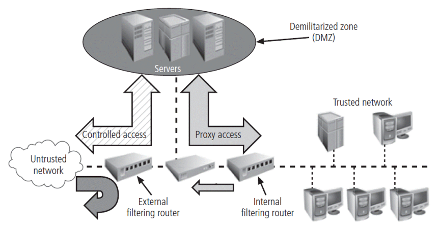

# CyberSec Services

- Authentication
    - assurance that communicating entity is the one claimed
    - determination of the **identity** that someone has given by the combination of:
        - something the person **has** (smart card)
        - something the person **knows** (password)
        - something the person **is** (fingerprint)
    - needs at least 2 authentication method for security
- Access Control
    - prevention of the unauthorised use of online resource
        
- Data Confidentiality
    - protection of data from unauthorised disclosure
- Data Integrity
    - assurance that data received is as sent by an authorised entity
    - **Backups** \- period archiving
    - **Checksums** \- function that depends on the entire contents of a file, designed in such a way that any change to the file will result in a different output value
    - **Data Correcting Codes** \- small changes can be easily detected and automatically corrected
- Non-repudiation
    - protection against denial by one of the parties in a communication
- Availability
    - resource accessible / usable
    - **Physical Protections** \- infrastructure meant to keep information available even in the event of physical challenges
    - **Computational Redundancies** \- computers / storage devices that serve as fall-backs in the case of failures
- Security Mechanism
    - feature designed to detect, prevent, or recover from a security attack

# Firewalls

- Prevent specific types of information from moving between an untrusted network and a trusted network
    - May be separate computer system
    - May be software service running on existing router or server
    - May be separate network containing supporting devices
- **Five processing modes**
    - Packet Filtering
    - Application Gateways
    - Circuit Gateways
    - MAC layer firewalls
    - Hybrids

## Packet Filtering

- Examine the header information of data packets
    - header often based on the combination of
        - IP source and destination address
        - direction
        - TCP or UDP source and destination port requests
- simple firewall models enforce rules designed to prohibit packets with certain addresses or partial addresses from passing through device
- Three subsets of packet-filtering firewalls
    - **Static Filtering**
        - requires that filtering rules be developed and installed within the firewall
    - **Dynamic Filtering**
        - allows firewall to react to emergent event and update or create rules to deal with event
    - **Stateful packet inspection**
        - firewalls that keep track of each network connection between internal and external systems using a state table

## Application Layer Firewall

- installed on a dedicated computer (proxy server)
- proxy server is exposed to higher levels of risk from less trusted networks
- additional filtering routers can be implemented behind the proxy server

## MAC layer firewalls

- designed to operate at media access control sub-layer of network's data link layer
- make filtering decisions based on specific host computer's identity
- MAC addresses of specific host computers are linked to access control list entries that identify specific types of packets that can be sent to each host; all other traffic is blocked

## Hybrid Firewalls

- combine elements of other types of firewalls
- may consist of two separate firewall devices each with a separate firewall system
- enables an organisation to make security improvement without completely replacing existing firewalls

# Firewall Architecture

- Firewall devices can be configured in several network connection architectures based on three factors
    - **Objectives of network**
    - **Organisation's ability to develop and implement architectures**
    - **Budget available for function**
- Four common architectural implementations:
    - **Packet Filtering routers**
    - **Dual-homed firewalls (bastion hosts)**
    - **Screened host firewalls**
    - **Screened subnet firewalls**

## Packet filtering routers

- organisations have routers at the boundary between internal networks and external service provider
- routers can be configured to reject packets
- drawbacks include a lack of auditing and lack of strong authentication

## Dual-homed firewalls

- referred to as a sacrificial host, stands as sole defender on the network perimeter
- contains two network interface cards (one connected to external network, the other connected to internal network)
- Implementation of this architecture often makes use of network address translation, creating another barrier to intrusion from external attackers

## Screened host firewalls

- combines packet-filtering router with separate dedicated firewall such as an application proxy server
- allows router to pre-screen packets to minimise traffic/load on internal proxy
- requires external attack to compromise two separate systems before attack can access internal data

## Screen subnet firewalls with DMZ

- dominant architecture used today
- consists of two or more internal bastion hosts (dual-homed) behind packet-filtering router, with each host protecting a trusted network
- protects DMZ systems and information from outside threats
- protects the internal networks by limiting how external connections can gain access to internal systems

# Configuring and Managing Firewalls

- Organisation must provide for the initial configuration and ongoing management of firewall(s) with each device having its own set of configuration rules regulating its actions
- **Policy configuration is complex and difficult** (is both an art and a science)
- Security often loses when conflicted with performance for business (i.e. business usually comes first)
- Best practices for firewalls:
    - all traffic from trusted network is allowed out
    - firewall device is never directly accessed from public network
    - SMTP data are allowed to pass through firewall
    - ICMP data are denied
    - Telnet access to internal severs should be blocked
    - When web services are offered outside the firewall, HTTP traffic should be blocked form reaching internal networks
    - all data not verifiably authentic should be denied
- Firewall rules
    - firewalls operate by examining data packets and performing comparison with predetermined logical rules
    - logic is based on a set of guidelines

# Content Filter (NOT FIREWALL)

- Software filter - allows administrators to restrict content access from within a network
- A set of script or programs restricting user access to certain networking protocols / Internet locations
- primary purpose to restrict internal access to external materials
- most common content filters restrict users from accessing non-business websites or denying incoming spam

# Remote Connections

- When individuals seek to connect to an organisation's network, they can use options such as VPN to establish a secure connection with the network.

# Virtual Private Networks (important)

- Private and secure network connection between system; uses data communication capability of unsecured and public network
- Securely extends organisation's internal network connections to remote locations
- **Three VPN technologies**
    - Trusted VPN - private circuits leased from a trusted communications provider
    - Secure VPN - send encrypted traffic over the public internet
    - Hybrid VPN - using a secure VPN on top of a trusted VPN
- **VPNs must accomplish**
    - encapsulation of incoming and outgoing data
    - encryption of incoming and outgoing data
    - authentication of remote computer and perhaps remote user as well
- Transport Mode VPN (only needs 1 VPN server)
    - data within IP packet is encrypted but header information is not
    - allows user to establish secure link directly with remote host, encrypting only data contents of packet
    - two popular uses:
        - E2E transport of encrypted data
        - Remote access worker connects to office network over Internet by connecting to a VPN server on the perimeter
- Tunnel Mode VPN (needs 2 VPN server)
    - establishes two perimeter tunnel servers to encrypt all traffic that will traverse unsecured network
    - entire client package encrypted and added as data portion of packet from one tunnelling server to another
    - an intercepted packet reveals nothing about the true destination system