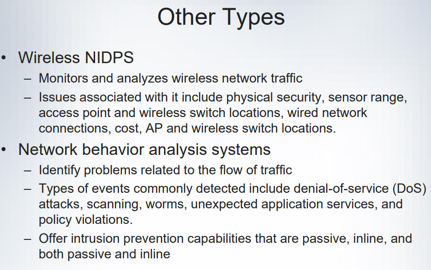
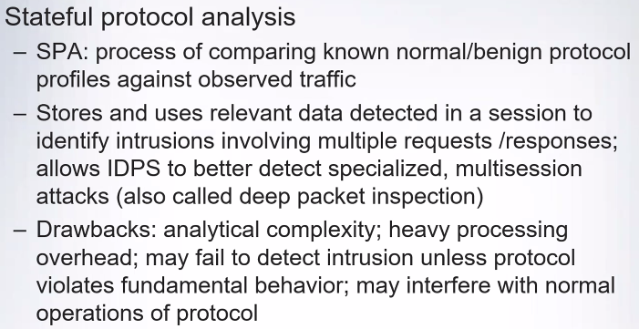
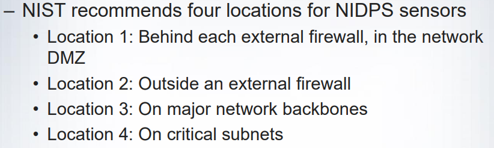
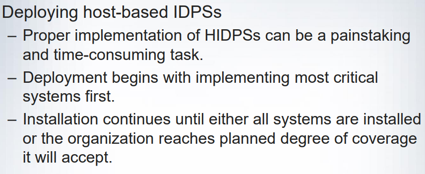

# 1\. Intrusion Detection and Prevention Systems

- Intrusion occurs when an attacker attempts to gain entry into or disrupt the normal operations of an information system
- Intrusion **prevention** consists of activities that deter an intrusion
- Intrusion **detection** consists of procedures and systems that identify system intrusions
- Intrusion **reaction** encompasses actions undertaken when intrusion event is detected
- Intrusion **correction** is the complete restoration of operations to a normal state and seek to identify source and method of intrusion
- ID systems detect a violation of its configuration and activates alarm (sent via email / external security service organisation)

## Why use IDPS

- **Main Purpose**
    - identify and report an intrusion
    - quickly contain attack and prevent / mitigate loss or damage
    - detect and deal with preambles to attacks
- data collection to examine what happened after an intrusion and why
- serves as deterrent by increasing fear of detection
- helps management with quality assurance and continuous improvement

# 2\. Types of IDPS (Important)

## Network-based systems (NIDPS)

- **very good against DoS and worms**
- focus on protecting network information assets
- resides on a computer or an appliance connected to a segment of an organisation's network; looks for indications of attacks
- when examining packets, a NIDPS looks for attack patterns within network traffic
    - compares measured activity to known signatures in knowledge base
- installed at specific place in the network where it can monitor traffic going into and out of a particular network segment
- done by using special implementation of TCP/IP stack
    - **stack verification** \- looks for invalid data packets
    - **application verification** \- higher-order protocols examined for unexpected packet behaviour

### Advantages (important)

- enables organisation to monitor a large network with few devices
- usually passive and can be deployed into existing networks with little disruption to normal network operations
- **not susceptible to direct attack and may not be detectable by attackers**

### Disadvantages

- overwhelmed by network volume $\to$ fails to recognise attacks
- require access to all traffic to be monitored
- cannot analyse encrypted packets
- cannot be sure if attack was successful or not
- fragmented packets hard to monitor (discerned)

## Host-based systems (HIDPS)

- resides on a particular computer / server (host) and monitors activity only on that system)
- detects when intruder creates / modifies / deletes files
- **can access encrypted information travelling over network and make decision about potential actual attacks**
- works on the principle of configuration or change management

### Advantages (important)

- can detect local events on host systems and detect attacks that may elude a NIDPS
- functions on host system where encrypted traffic will have been decrypted
    - available for processing
- not affected by us of switched network protocols
- examines records stored in audit logs to detect inconsistencies in how applications and system programs were used

### Disadvantages

- more management issues
- vulnerable to direct attacks and attacks against host operating system
- does not detect multi host scanning / scanning of non-host network devices
- susceptible to DoS attacks
- uses large amount of disk space
- inflicts performance overhead on host systems

# 3\. IDPS Detection Methods

## Signature-based (important)

- Examines network traffic in search of patterns that match known signatures
- Widely used because many attacks have clear and distinct signatures
- Problem with this approach is that new attack patterns must continually be added to IDPS's database of signature
    - slow / methodical attack involving multiple events might escape detection
- **needs to be attacked first** to have a database of signatures

## Anomaly/Behaviour-based (important)

- collects statistical summaries by observing traffic known to be normal
- measured activity is outside baseline parameters, IDPS sends alert to administrators
- **IDPS can detect new types of attacks**
- requires much more overhead and processing capacity than signature based detection
- **may generate false positives**

## Stateful protocol analysis (not tested)

## Log file monitors (not tested)

- **usually after an attack**
- similar to NIDPS
- reviews log files generated by servers, network devices and even other IDPSs for patterns and signatures
- patterns that signify attack may be much easier to identify when entire network and its systems are viewed as a whole
- requires considerable resources since it involves the collection, movement, storage and analysis of large quantities of log data

# 4\. IDPS Response Behaviour

- IDPS response to external stimulation depends on the configuration and function (many response options are available)
- **Active Response** \- collecting additional information about the intrusion, modifying the network environment, taking action against the intrusion
- **Passive Response** \- setting off alarms or notifications, collecting passive data through SNMP traps
- Many IDPS generate routine reports and other detailed documents
- Failsafe features protect IDPS from being circumvented (not tested)

## Alert Types

- **True Positive** \- legitimate attack triggering IDPS alarm
- **False Positive** \- IDPS alarm triggered even when no attack took place
- **False Negative** \- IDPS alarm not triggered even when attack took place
- **True Negative** \- IDPS alarm not triggered when no attack takes place
- FP and FN usually caused by lack of knowledge
    - incorporate context to reduce rate of occurrence
    - context - additional security event data and information in relation to the environment

## Strengths of IDPS (Performs well in)

- Monitoring and analysis of system events and user behaviours
- Testing security states of system configurations
- Base-lining security state or system and tracking changes
- Recognising patterns of system events corresponding to known attacks
- Recognising activity patterns that vary from normal activity
- Managing OS audit and logging mechanisms + data they generate
- Alerting appropriate staff when attacks are detected
- Managing enforcement of security policies encoded in analysis engine
- Providing default information on security policies
- Allowing non-security experts to perform important security monitoring functions

## Limitations of IDPS

- Compensating for weak / missing security mechanisms in protection infrastructure
- Instantaneously detecting, reporting, responding to attack when there is heavy network or processing load
- Detecting new attacks or variants of existing attacks
- Effectively responding to attacks by sophisticated attackers
- Automatically investigating attacks without human intervention
- Resisting attacks intended to defeat or circumvent them
- Compensating for problems with fidelity of information sources
- Dealing effectively with switched networks

# 5\. Implementation of IDPS (Important)

- **Centralised** \- all IDPS control functions are implemented and managed in a central location
- **Fully distributed** \- all control functions are applied at the physical location of each IDPS component
- **Partially distributed** \- combination of centralised + fully distributed
    - while individual agents can still analyse and respond to local threats, they report to a hierarchical central facility to enable organisation to detect widespread attacks

# 6\. Deployment of IDPS (not important)

- Great care must be taken when deciding where to locate components
- Planners must select deployment strategy that is based on careful analysis of organisation's information security requirements and causes minimal impact
- **NIDPS and HIDPS can be used in tandem to cover individual systems that connect to an organisation's network and networks themselves**
- **Guidelines for NIDPS**
    
- **Guidelines for HIDPS**
    
- **Firewalls limit access between networks to prevent intrusion and do not signal an attack from inside network but an IDPS evaluates a suspected intrusion and signals and alarm**

# 7\. Honeypots / Honeynets / Padded Cell Systems

- **Honeypots** \- decoy systems designed to lure potential attackers away from critical systems
    - diverts attackers from accessing critical systems
    - collect information about attackers' activity
    - encourage attacker to stay on a system long enough for administrators to document the event and perhaps respond
- **Honeynets** \- several honeypots connected together on a network segment
- **Padded Cell Systems** \- protected honeypot that cannot be easily compromised
    - operates in tandem with a traditional IDPS, triggered attack signal will transfer attackers to a special simulated environment where attackers cannot cause harm

## Advantages of HP, HN, PCS

- Attackers can be diverted to targets they cannot damage
- Administrators have time to decide how to respond to an attacker
- Attackers' actions can be easily and more extensively monitored, and records can be used to refine threat models and improve system protections
- May be effective at catching insiders who are snooping around a network

## Disadvantages

- Legal implications not well understood
- Not yet shown to be generally useful security technologies
- **Expert** attacker diverted into decoy system may become angry and launch a more aggressive attack against victim's systems
- Administrators and security managers need high level of expertise to use these systems

## Trap-and-Trace Systems

- Uses a combination of techniques to detect intrusion and trace it back to its source
- Usually consists of a honeypot or a padded cell and alarm (**Trap**)
- Legal drawbacks
    - Enticement (bait)
    - Entrapment (luring individual into committing a crime)
    - Enticement is legal and ethical, entrapment is not

# 8\. Scanning and Analysis Tools

- Scanning tools - used to collect information that an attackers needs to launch a successful attack
- Attack Protocol - logical sequence of steps or processes used by an attacker to launch an attack against a target system or network
- Foot-printing - process of collecting publicly available information about a potential target
- Fingerprinting - systematic survey of target organisation's internet addresses collected during the foot-printing phase to identify network services offered by hosts in that range
    - reveals useful information about the internal structure and nature of the target system or network to be attacked

## Port Scanners

- used by both attackers and defenders to identify / fingerprint computers active on a network and other useful information
- more specific = more useful information generated from scans

## Firewall Analysis Tools

- automates remote discovery of firewall rules, assisting the administrator / attacker in analysis
- administrators who feel wary of using the same tools attackers use would remember
    - user intent dictates how gathered information will be used
    - to defend a computer / network well, administrators must understand ways it can be attacked

## OS Detection Tools

- ability to detect a target computer's OS is valuable
    - attacker can easily determine the vulnerabilities to which it is susceptible
- uses networking protocols to determine a remote computer's OS

## Vulnerability Scanners

- Active - examine networks for highly detailed information and initiate traffic to determine security holes
- Passive - listen in on network and identify the vulnerable versions of both server and client software
    - able to find client-side vulnerabilities typically not found in active scanners

## Packet Sniffers

- network tool that captures copies of packets from network and analyses them
- can be used to eavesdrop on network traffic
- administrators must have direct authorisation and knowledge + consent of content's creator to use packet sniffers legally

## Wireless Security Tools

- organisations must spend its time securing both wired and wireless network to prevent a security breach
- toolkit should include the ability to sniff wireless traffic, scan wireless hosts, and assess the level of privacy / confidentiality afforded on the wireless network