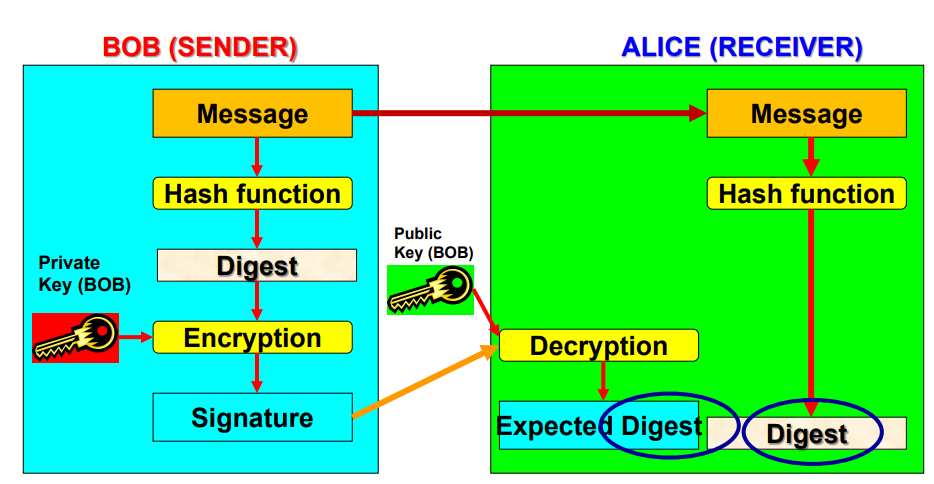

# 1\. Cryptography

- The study of ways to hide or obscure information, making it unreadable without secret knowledge
- Makes use of mathematical operations to protect messages travelling between parties or stored on a computer

### Plaintext

- piece of data that is not encrypted

### Ciphertext

- the output of an encryption algorithm

### Cipher

- cryptographic algorithm

### Key

- sequence of characters or bits used by an algorithm to encrypt or decrypt a message

# 2\. Encryption and Decryption Process

- M = message, C = ciphertext, E = encryption, D = decryption
- **Secret-Key (Symmetric) cryptosystem - one key**
    - $\text{E}_k(\text{M) = C, D}_k(\text{C) = M}$
- **Public-key (Asymmetric) cryptosystem - two keys**
    - encrypt data using public key
    - receiver decrypt using private key
    - $\text{E}_\text{pub}(\text{M) = C, D}_\text{priv}(\text{C) = M}$

## Cryptographic algorithms

- Made up of mathematical steps for encrypting and decrypting information
- Substitution ciphers (replacement)
- Transposition ciphers (rearrangement)
- Product ciphers (substitution, permutation, and modular arithmetic)
- Vigenere
- One time pad

## Keys

- Keys are special pieces of data used in both encryption and decryption processes
- Algorithms stay the same, but different keys are used
- More complex keys = greater security

### Security = Strength of algorithm + length of key

- Key of 8 bits has $2^8 = 256$ possible combinations
- If a computer tries 1,000,000 keys a second, it would take 2285 years to find the correct key for a key of 56 bits (**computers in real life are much faster than 1million keys / s**)

## Stream / Block cipher

- Plaintext can be encrypted through **stream cipher or block cipher method**
- **Stream Cipher** encrypts plaintext one byte at a time, may be designed to operate on one bit at a time or on units larger than a byte at a time
    - processes the input elements continuously
    - produces output one element at a time
    - **Advantage** \- almost always faster and use far less code
    - RC4 is the most widely used of all stream ciphers
- **Block Cipher** processes the input one block of elements at a time, producing an output block for each input block
    - more appropriate for applications that deal with blocks of data (e.g. file transfer, e-mail, databases)
    - **Electronic Code Book:** each block encrypted separately
    - **Cipher Block Chaining:** next input depends on previous output

# 3\. Cryptosystem

- Package of all procedures, protocols, cryptographic algorithms and instructions used for enciphering and deciphering messages using cryptography

## How to choose

- **Symmetric: best for data on hard drive**
- **Asymmetric: good for messages sent over internet**
- Cryptography ensures **Confidentiality, Integrity, Authentication (not availability)** as well as **non-repudiation** \- originator of information cannot deny content or transmission

# 4\. Shift / Caesar Cipher

- Uses algorithm and a key
    - algorithm specifies that you offset the alphabet either to right or left
    - key specifies how many letters the offset should be

# 5\. Substitution Ciphers

- Substitution ciphers are more complex - works on the principle of substituting a different letter for every letter
- **mono alphabetic substitution** (one to one relationship)
- **poly alphabetic substitution** (one to many relationship)
- alphabets may be shifted, reverse, or scrambled
- shifted - Caesar cipher
- reversed - Atbash cipher (simple substitution cipher for Hebrew Alphabet)
- scrambled - creating a mixed alphabet
    - mixed alphabets may be created by first writing out a keyword, removing repeated letters in it, then writing all the remaining letters in the alphabet in the usual order
    - **e.g. 'zebra' is keyword**
        

# 6\. Transposition Cipher

- order of letters are changed, can be done at the bit level or at byte (character) level
- e.g. plaintext = "The unexamined life is not worth living" written top down
    

# 7\. Vigenere Cipher

- Corrects the issues with more simplistic keys, works as a poly-alphabetic substitution cipher that depends on a password
    - keys are rather complex, **best keys comprise of long and random data**
- Done by setting up a substitution table
- password (key) is matched up to the text it is meant to encrypt
- cipher letter is determined by the use of the grid (substitution table)
    - matching the **plaintext character's column** with the **password character's row**
        

# 8\. XOR

- Function of Boolean Algebra; two bits are compared, and binary result is generated
- simple to implement and simple to break, should not be used by itself especially when storing sensitive data

# 9\. One Time Pads (Vernam Cipher)

- Substitution Cipher that is **unbreakable**
- uses a block of shiftkeys (k1, k2, k3, .. kn) to encrypt a plaintext, M of length n, which each shift key chosen at random
- key has to be as long as plaintext and cannot be reused

# 10\. Modern Ciphers

- Operate on binary plaintext and uses binary keys of fixed length
- **Symmetric Ciphers**
    - Stream Ciphers (RC4, etc)
    - Block Ciphers (DES, Triple DES, AES, etc)
- **Asymmetric ciphers**
    - Diffie-hellman, RSA etc
- Two basic operations are **substitution** (shifts, xor) and **permutation** (transposes or re-orders symbols present in code)

# 11\. Secret-Key Cryptography

## Advantages

- Designed to have high rates of data throughput
- Some hardware and software implementations achieve encryption rates of hundreds of megabytes per second
- Keys for symmetric-key ciphers are relatively short

## Disadvantages

- key must remain secret at both ends
- many key pairs need to be managed in a large network, requires use of a trusted third party

## Data Encryption Standard (DES)

- first crypto system to have been used in commercial applications
- makes use of block cipher with 64-bit block size and 56-bit key
- algorithm takes plain text in 64-bit blocks and converts them into 64-bit blocks of ciphertext using **56-bit keys**
- employs same key in both encrypting and decrypting the data

## Triple Data Encryption Standard (3DES)

- applies DES cipher in triplicate, encrypts the first key (k1), decrypts using the second key (k2), then encrypts with the third key (k3). Usually 2-key variant is used where k1 and k3 are the same keys
- extremely slow DES, therefore not adopted

## Advanced Encryption Standard (AES)

- Block size is **always 128 bits** and key size varies according to the version
- 3 versions: **AES-128, AES-192, AES-256**

# 12\. Public Key Cryptography

- Main weakness of symmetric algorithms is two geographically distant parties both need to have a key that matches the other key exactly, securing key exchange can also be an issue
- Symmetric key is not practical when two parties want to securely communicate, gave rise to public cryptosystem
- uses two different but related keys
    - if Key A encrypts message, only Key B can decrypt
- Public Key cannot be used to find Private Key
- public keys can be used for encryption (Alice encrypts message for Bob with Bob's public key) and authentication (Alice encrypts message for Bob with her private key, and then Bob uses Alice's public key to check for authenticity) (digital signature)

# 13\. Hybrid (public + symmetric)

- Sender generates random symmetric session key
- Sender encrypts session key using receivers' public key
- Receiver decrypts it using his/her private key and now both have the shared session key
- **Combines Advantage of symmetric and asymmetric ciphers**
    - throughput of symmetric cipher
- **Two-stage approach is used**
    1.  Public key cryptography is used to derive a session key
    2.  session key is used to encrypt the actual message

# 14\. Digital Signatures

- A digital signature is a message digest used to cryptographically sign a message
    - relies on asymmetric (public key) cryptography
- sign the message with private key (digital signature)
    - any changes to the message can be detected, due to message digest algorithm
    - cannot deny signing the message because it was signed with private key
- ensures **message integrity and non-repudiation**
- can be used in all electronic communications

## Key Size

- Strength of many encryption applications and cryptosystems is measured by key size
    - security is not dependent on keeping the encrypting algorithm secret
- Private and Public Keys are used to exchange the symmetric key (RSA key size of 2048 bits is considered safe)
- Session key is used during communication between client and server (size of 128 or more is reasonable, 256 is considered very safe but will be slower than using key size of 128)

## Properties

- Only private-key holders can compute signatures
- Holder of matching public key can verify signature
- Digital signature schemes work with **two major steps**
    - prepare a message representative
    - apply a signature transform
- Verifying Method:
    - undo signature transformation
    - check message digest for issues

## Hashing

- A hashing algorithm is applied to a bit string of any length and is designed in a way that every bit in the message has some effect on the resulting message digest
    - message digest can then be input to the Digital Signature Algorithm (DSA) which generates or verifies the signature for the message
- **The output of a hashing algorithm is a bit string of small fixed length**

## Digital Signature without message protection

## Digital Signature with message protection

# 15\. Digital Certificates

- An electronic document, similar to a digital signature, attached to a file certifying that the file is from the organisation it claims to be and has not been modified from the original format
- Certificate Authority is an agency that manages the issuance of certificates and serves as the electronic notary public to verify their worth and integrity
- Each Digital Certificate includes:
    - Name of subject / company
    - Subject / company's public key
    - Serial Number
    - Expiration date, issuance date
    - Digital Signature of Certificate Authority

# 16\. Public-Key Infrastructure

- Integrated system of software, encryption methodologies, protocols, legal agreements and third-party services enabling users to communicate securely
- based on public key cryptosystems
- protects information assets through
    - authentication
    - integrity
    - privacy
    - authorisation
    - non-repudiation
- integrates:
    - certificate authority
    - registration authority
    - certificate directories
    - management protocols
    - policies and procedures

# 17\. Web Security

- HTTP is not a secure protocol (simple and stateless client application running over TCP/IP)
- Threats include
    - integrity - data modification, insertion
    - confidentiality - eavesdropping on the net and theft from server machine
    - authentication - impersonation, data forgery
    - denial of service - hacked web servers
- HTTPS is a more secure version using HTTP + SSL

# 18\. Secure Socket Layer / Transport Layer Security

- Provide server authentication with digital certificate
- Authenticate client
- Provide privacy by encryption
- Can be used with any TCP application (HTTP and email)
    

## Key issues

- slows down servers
- protects data in transit but not in databases
- cannot authenticate actual operator of computer
- cannot authenticate merchant
- cannot authenticate consumer
- cannot authenticate other parties involved in online payment system
- cannot protect the use of stolen credit cards online

# 19\. Summary

- Cryptography and encryption provide sophisticated approach to security.
- Many security-related tools use embedded encryption technologies.
- Encryption converts a message into a form that is unreadable by the unauthorised.
- Many tools are available and can be classified as symmetric or asymmetric, each having advantages and special capabilities.
- Strength of encryption tool is dependent on the key size but even more dependent on following good management practices.
- Cryptography is used to secure most aspects of Internet and Web
    today