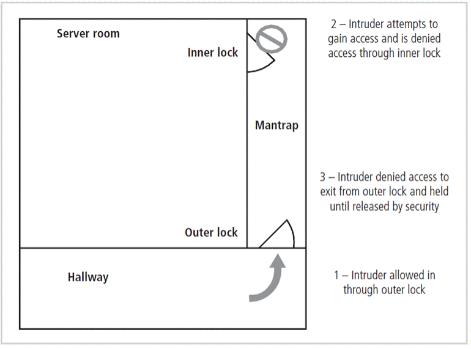
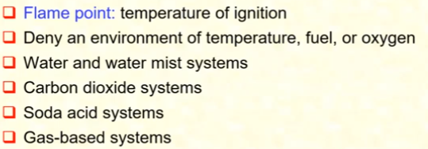
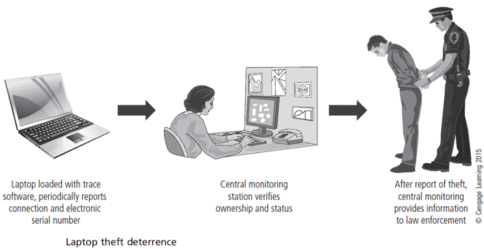

# 1\. Computer Hardware

- Memory
- Motherboard
- Sound + Video Card
- Power Supply Unit
- Network Card
- BIOS
- Hard Disk Drive

## How files are created, deleted, restored

### Creation

- Three things occur
    - Entry is made into File Allocation Table to indicate where the actual data is stored in the Data Area
    - Directory entry is made to indicate file name, size, link to FAT and other information
    - Data is written to Data Area

### Deletion

- Two things occur
    - FAT entry for the file is zeroed out and space on hard drive becomes available for use by new file
    - First character of the Directory entry file name is changed to a special character
    - **Nothing is done to Data Area**

### Restoration

- Two things occur
    - FAT entry for the file is linked gain to the location in the Data Area where file **is** stored (recall nothing was done to Data Area during deletion)
    - First character of the Directory entry is changed to a legal character
    - **Nothing is done to Data Area**
- Disk wiping / sanitizing (overwriting with random bits) is important to ensure hard drive is completely free of your data

# 2\. Physical / Infrastructure Security

- Protects the information systems that contain data and the people who use, operate, and maintain the systems
- Involves two complementary requirements
    - must prevent any type of physical access or intrusion that can compromise security
    - protect physical assets that support the storage and processing of information examples include:
        - **information system hardware** \- data processing and storage equipment, networking facilities and offline storage media
        - **physical facility** \- buildings and other structures housing the system and network components
        - **supporting facilities** \- electrical power, communication services, environmental controls
        - **personnel** \- humans involved in the control, maintenance and use of information systems

## Threats

- types of physical situations and occurrences that can constitute a threat to information systems
- can be categorised into
    - environmental threats
    - technical threats
    - human-caused threats

### Environment Threats

- includes natural disasters, water damage caused by water sources in proximity to computer equipment, chemical/biological hazards, dust and infestation

### Technical Threats

- **Under voltage** \- Information Systems equipment receives less voltage than is required for normal operation (most computers can only withstand prolonged voltage reductions of 20%)
- **Overvoltage** \- more serious than under voltage, can destroy silicon-based components
- **Noise** \- due to electromagnetic interference, causes intermittent problems with computers

### Human-caused Threats

- **Unauthorised Physical Access** \- should not be allowed access unless accompanied
- **Theft** \- theft of equipment / data, eavesdropping and wiretapping is included
- **Vandalism** \- destruction of equipment and data
- **Misuse** \- improper use of resources by authorised and unauthorised personnel

## Secure Facilities

- Locations with controls implemented to minimise risk of attacks from physical threats
- Walls, fencing and gates
    - essential starting point for perimeter control
- Guards
    - evaluate situation as it arises to make reasoned responses according to SOP
- Dogs
- ID Cards / Badges
    - simple form of biometrics
    - should not be the only means of control (can be easily duplicated / stolen / modified)
    - chance of tailgating
- Locks and Keys
    - sometimes fail and alternative procedures for controlling access must be implemented
- Mantraps
    - small enclosure that has an entry point and a different exit point (2 door enclosure)
        
- Electronic Monitoring
    - CCTV to record events where other types of physical controls are impractical
    - **Does not prevent access / prohibited activities, recordings often not monitored in real time**
- Alarm Systems
    - notify people / systems when event occurs
    - rely on sensors that detect an event
- Computer Rooms & Wiring Closets
    - require special attention to ensure confidentiality, integrity, availability of information
    - logical access controls easy defeated if hacker gains access to computing equipment
    - custodial staff (least scrutinized people) given greatest degree of unsupervised access
- Interior Walls & Doors
    - high security areas must have firewall-grade walls to provide physical security against potential intruders and fires

# 3\. Fire Security and Safety

- Fire is the most serious threat to safety of people who work in an organisation
    - accounts for more property damage / personal injury / death than any other threat
- **Fire detection and response**
    - Fire suppression systems are devices installed and maintained to detect and respond to a fire, potential fire, or combustion danger
    - 
    - **Fire Detection**
        - Manual (floor monitors)
        - Automatic (thermal / smoke / flame detectors)
    - **Fire Suppression**
        - Portable + Manual (Fire extinguishers)
        - Automatic (Sprinklers / Gaseous systems)

# 4\. Heating, Ventilation, Air Conditioning (HVAC)

- Temperature, Filtration, Humidity, Static Electricity can cause damage to information systems
- **Ventilation Shafts**
    - can be large enough for individuals to climb through (security can install wire mesh grids at various points to compartmentalize the runs)
- **Power management and conditioning**
    - power systems must be properly installed and grounded
    - electronic noise can result in inaccurate time clocks or unreliable clocks inside CPU
- **Grounding**
    - ensures returning flow of current is properly discharged to ground
    - overloading a circuit increases the risk of overheating and fire
- **Uninterruptible power supply**
    - UPS is backup power source in case of power outages
    - Configurations
        - standby
        - line-interactive
        - standby online hybrid
        - double conversion online
        - data conversion online
        - emergency shutoff (if current represents risk to human / machine safety 
- **Water Problems**
	- lack of water is a problem (fire suppression and air conditioning)
    - surplus of water is also a problem (flooding / leaks)
    - important to integrate detection systems into alarm systems
- **Structural Collapse**
    - unavoidable environmental factors / forces that cause failures
    - overloading structural limits results in structural failure
    - periodic inspections by qualified civil engineers required

# 5\. Securing Mobile and Portable Systems

- mobile computing requires more security
    - have corporate information stored within them
    - configured to facilitate user's access into organization's secure computing facilities
- controls support security and retrieval of lost or stolen laptops
- CompuTrace stored on laptop reports to central monitoring centre
- Burglar alarms made up of PC card that contains motion detector
    

# 6\. Considerations for Physical Security Threats

- **Outsourcing vs In-house**
    - **Benefits** include gaining experience and knowledge of agencies
    - **Downsides** include high expenses, loss of control over individual components and level of trust that must be placed in another company
- Social Engineering - should train staff so they don't release information via social engineering attacks
- Inventory Management
    - computing equipment should be inventoried and inspected on a regular basis
    - classified information should be inventoried and managed
    - physical security varies for each organization