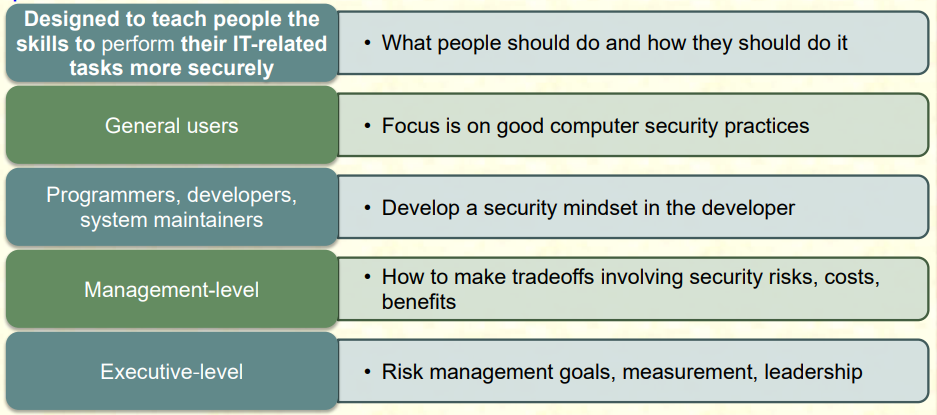

# 1\. Human Factors

- Employee behaviour is a critical concern in ensuring the security of computer systems and information assets
- Employee actions (malicious and unintentional) cause considerable computer related loss and security compromises
- problems associated with employee behaviour are
    - errors and omissions
    - fraud
    - actions by disgruntled employees
- Security awareness, training and education can assist in reducing incidences of such problems
    - serves as a deterrent to fraud and actions by disgruntled employees by increasing knowledge of their accountability and of potential penalties
- Employees cannot be expected to follow policies and procedures of which they are unaware
- Enforcement difficult if employees claim ignorance
- Security awareness, training, education programs are important in limiting an organization's liabilities
    - bolster organisation's claims that due care has been taken in protecting information
    - may be needed to comply with regulations and contractual obligations

## Awareness

- Benefits from security awareness
    - Employees aware of responsibilities for maintaining security and are motivated to act accordingly
    - Users understand the importance of security for well-being of organisation
- Organisations should have a security awareness policy provided to **all employees**
    - Participation is required for every employee (orientation program and periodic awareness activities)
    - Everyone is given sufficient time to participate in awareness activities
    - Responsibilities for managing and conducting awareness activities is clearly spelled out

## Training

- Designed to teach people the skills to perform IT-related tasks more securely
- Teaches what people should do and how they should do it
- Encompasses a spectrum of skills (basic to advance)
    

## Education

- Targeted at security professionals
- Usually outside the scope of most organisation's awareness and training programs
- Fits into the category of employee career development programs
- Provided by outside sources
    - college courses
    - specialised training programs
    - inhouse / industry practical training

# 2\. Employment Practices and Policies

- Deals with personnel security
    - hiring
    - training
    - monitoring behaviour
    - handling departure
- Majority of perpetrators are individuals who have legitimate access now or who have recently had access
- Employees can be involved in security violations in two ways
    - unwittingly aid in commission of security violation by failure to follow proper procedures
        - forgetting security considerations
        - not realising that they are creating a vulnerability
    - knowingly violate controls or procedure to cause / aid security violation
- **Threats from internal users**
    - gaining unauthorised access / enabling others to gain unauthorised access
    - altering data
    - deleting production and backup data
    - crashing systems
    - destroying systems
    - misusing systems for personal gain or to damage the organisation
    - holding data hostage
    - stealing strategic / customer data for corporate espionage or fraud schemes

## Security in the hiring process

- Objective is to ensure employees, contractors and 3rd party users
    - understand their responsibilities
    - suitable for the roles they are considered for
    - reduce risk of theft, fraud or misuse of facilities
- Need appropriate background checks and screening
    - details about employment and educational history
    - accuracy of details
    - experienced staff members to interview candidates
- For more sensitive positions
    - more intensive investigation required
    - investigation agency hired to do background / criminal record / credit check
- Terms and condition of employment contract should include
    - employee and organisation responsibilities for cyber security
    - confidentiality and non disclosure agreement
    - reference to organisation's security policy
    - acknowledgement that employee has reviewed and agrees to abide by the the policy

## Positioning and Staffing the Security Function

- Security function can be placed within
    - IT function
    - Physical Security function
    - Admin Services function
    - Insurance and Risk Management functions
    - Legal department
- Organisations balance needs of enforcement with needs for education, training, awareness and customer service
- Selecting based on many criteria, including supply and demand

## Qualifications and Requirements

- Factors that must be addressed
    - General management should learn more about skills and qualifications for positions
    - Upper management should learn about budgetary needs for information security function
    - IT and general management must learn more about level of influence and prestige the information security function should be given to be effective
    - Organisations typically look for technically qualified information security generalist
    - Organisations look for information security professionals who understands
        - how organisation operates at all levels
        - information security is usually a management problem not a technical problem
        - strong communications and writing skills
        - role of policy in guiding security efforts
        - mainstream IT technologies
        - terminology of IT and information security
        - threats facing and organisation and how they can become attacks
        - how to protect organisation's assets from information security attacks
        - how business solutions can be applied to solve specific information security problems
- Many information security professionals enter the field through
    - law enforcement and military
    - technical, working on security applications and processes
- Organisations can foster greater professionalism by matching candidates to clearly defined expectations and position descriptions

# 2\. Positions in Information Security

## Chief Information Security Officer

- Top information security officer in the organisation
- Not usually executive position, frequently reports to Chief Information Officer
- Manages overall information security program
- Drafts / approves security policies
- Works with CIO on strategic plans
- Develops security budgets
- Set priorities for security projects
- Makes recruiting / hiring / firing decisions or recommendations
- Spokesperson for security team
- Graduate degree in one of
    - criminal justice
    - business
    - technology

## Chief Security Officer

- May be combined with CISO
- Knowledgeable in both Information Security and **guards, gates, guns**

## Security Manager

- Accountable for day-to-day operations of InfoSec program
- Accomplish objectives as identified by CISO and resolves issues identified by technicians
- **Qualifications** \- not uncommon to have accreditation
    - draft middle and lower level policies
    - standards and guidelines
    - budgeting
    - project management
    - hiring and firing
- Manage technicians both in assignment and supervision of tasks

## Security Technician

- Qualified individuals tasked to configure security hardware and software
- Usually specialised
- **Qualifications**
    - Varied; organisations prefer expert, certified, proficient technicians
    - Experience with particular hardware and software package
    - Experience in using a technology usually required

## Advice for InfoSec professionals

- Business before technology
    - Technology provides elegant solutions for some problems but adds to difficulties for others
- Never lose sight of protection
- Education is never complete

# 3\. Employment Policies and Practices

- Solid InfoSec concepts should be integrated into organisation's employment policies and practices
- InfoSec should be made a documented part of every employee's job description
- Hiring of employees is a responsibility loaded with potential security pitfalls
- CISO and InfoSec manager should provide human resources with information security input to personnel hiring guidelines

## Job Descriptions

- Hiring process begins with reviewing and updating all job descriptions
- Avoid revealing access privileges to prospective employees when advertising open positions

## Interviews

- Opportunity for security manager to educate HR on certifications, experience, and qualifications of a good candidate
- advise HR to limit information provided to candidate on the responsibilities and access rights the new hire would have
- Important to use caution when showing candidates around facility if on-site visits are part of interviews

## Background Checks

- Investigation into a candidate's past
- Conducted before organisation extends offer to candidate
- Checks differ in level of detail and depth
- Identity
- Education and Credential
- Previous employment verification
- References
- Worker's compensation history
- Motor vehicle record
- Drug history
- Credit history

## Employment Contracts

- Employment contract is a important security instrument once a candidate has accepted the job offer
- Many policies require an employee to agree in writing
- New employees should not be offered the position unless binding organisational policies are agreed to

## New Hire Orientation

- New employees should receive extensive information security briefing on policies, procedures, level of authorised access, training
- Should be thoroughly briefed and ready to perform duties securely by the time they start

## On the Job Training

- Periodic security awareness training should be conducted by organisations
- Minimises employee mistakes and is an important part of information security security awareness mission
- External and internal seminars also increase level of security awareness

## Evaluating Performance

- Incorporate information security components into employee performance evaluations
- If InfoSec is included in evaluations, employees are more motivated to perform these tasks at a satisfactory level

## Termination

- When employee leaves organisation, there are a number of security-related issues
    - **Important to protect all information employee had access to**
- Former employee should be escorted from premises
- **Hostile departures**
    - all logical and key card access is terminated
    - employee collects all belongings and surrenders all keys, key cards, and company property
    - employee is then escorted out of building
- **Friendly departures**
    - may be notified well in advance of departure date
    - more difficult for security to maintain positive control over employee's access and information usage
    - access usually continues with new expiration date
    - come and go at will, collect own belongings and leave on their own
- Office and information used by employee must be inventoried; files stored / destroyed, property returned to organisational stores
- Employees may collect organisational information for future employment well ahead of departure
    - need to scrutinise system logs after employee has departed to determine if there is a breach of policy / loss of information

## Temporary Employees

- Serves in temporary positions or to supplement existing workforce
- Not subject to contractual obligations / general policies
- Access to information should be limited to that necessary to perform duties

## Contract Employees

- Hired to perform specific services for organisation
- Company often makes contract with parent organisation rather than individual
- All contract employees should be escorted from room to room as well as into and out of facility
- Restrictions or requirements need to be negotiated into contract agreements when they are activated

## Consultants

- Should be handled like contract employees
- Must be pre-screened, escorted and subjected to NDA to protect organisation
- Consultant's priority is not the protection organisation's information

## Business Partners

- In strategic alliances with other organisations, desiring to exchange information / integrate systems
- Must be meticulous, deliberate process of determining what information is to be exchanged, in what format and to whom
- NDA and level of security of both systems must be examined before any physical integration takes place

## Privacy and Security of Personnel Data

- Organisations required by law to protect sensitive / personal employee information
    - Address, Phone Numbers, Social Security / NRIC number, Medical Conditions, Family Names and Addresses
    - PDPA governs the **Collection, Use, Disclosure, Handling of personal data**